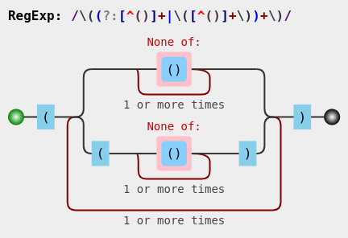

# Preface

Scripting and automation tasks often need to extract particular portions of text from input data or modify them from one format to another. This book will help you learn Regular Expressions, a mini-programming language for all sorts of text processing needs.

The book heavily leans on examples to present features of regular expressions one by one. It is recommended that you manually type each example and experiment with them. Understanding both the nature of sample input string and the output produced is essential. As an analogy, consider learning to drive a bike or a car — no matter how much you read about them or listen to explanations, you need to practice a lot and infer your own conclusions. Should you feel that copy-paste is ideal for you, [code snippets are available chapter wise on GitHub](https://github.com/learnbyexample/Ruby_Regexp).

The examples presented here have been tested with **Ruby version 2.5.0** and may include features not available in earlier versions. Unless otherwise noted, all examples and explanations are meant for *ASCII* characters only. The examples are copy pasted from `irb --simple-prompt` shell, but modified slightly for presentation purposes (like adding comments, blank lines, removing `nil` return value, shortened error messages, etc).

## Prerequisites

You should have prior experience working with Ruby, should know concepts like blocks, string formats, string methods, Enumerable, etc.

If you have prior experience with a programming language, but new to Ruby, check out my GitHub repository on [Ruby Scripting](https://github.com/learnbyexample/Ruby_Scripting) before starting this book. That repository also includes a chapter on Regular Expressions which has been edited and expanded to create this book.

## Acknowledgements

* [ruby-lang documentation](https://www.ruby-lang.org/en/documentation/) — manuals and tutorials
* [/r/ruby/](https://www.reddit.com/r/ruby/) — helpful forum for beginners and experienced programmers alike
* [stackoverflow](https://stackoverflow.com/) — for getting answers to pertinent questions on Ruby and regular expressions
* [tex.stackexchange](https://tex.stackexchange.com/) — for help on `pandoc` and `tex` related questions
* Cover image:
    * [draw.io](https://about.draw.io/)
    * [tree icon](https://www.iconfinder.com/icons/3199231/ellipse_green_nature_tree_icon) by [Gopi Doraisamy](https://www.iconfinder.com/gopidoraisamy) under [Creative Commons Attribution 3.0 Unported](https://creativecommons.org/licenses/by/3.0/)
    * [wand icon](https://www.iconfinder.com/icons/1679640/design_magic_magician_tool_wand_icon) by [roundicons.com](https://www.iconfinder.com/roundicons)
* [Warning](https://commons.wikimedia.org/wiki/File:Warning_icon.svg) and [Info](https://commons.wikimedia.org/wiki/File:Info_icon_002.svg) icons by [Amada44](https://commons.wikimedia.org/wiki/User:Amada44) under public domain
* [softwareengineering.stackexchange](https://softwareengineering.stackexchange.com/questions/39/whats-your-favourite-quote-about-programming) and [skolakoda](https://skolakoda.org/programming-quotes) for programming quotes

Special thanks to Allen Downey, an attempt at translating his book [Think Python](https://greenteapress.com/wp/think-python-2e/) to [Think Ruby](https://github.com/learnbyexample/ThinkRubyBuild) gave me the confidence to publish my own book.

## Feedback and Errata

I would highly appreciate if you'd let me know how you felt about this book, it would help to improve this book as well as my future attempts. Also, please do let me know if you spot any error or typo.

Issue Manager: [https://github.com/learnbyexample/Ruby_Regexp/issues](https://github.com/learnbyexample/Ruby_Regexp/issues)

Goodreads: https://www.goodreads.com/book/show/48641238-ruby-regexp

E-mail: learnbyexample.net@gmail.com

Twitter: https://twitter.com/learn_byexample

## Author info

Sundeep Agarwal is a freelance trainer, author and mentor. His previous experience includes working as a Design Engineer at Analog Devices for more than 5 years. You can find his other works, primarily focused on Linux command line, text processing, scripting languages and curated lists, at [https://github.com/learnbyexample](https://github.com/learnbyexample). He has also been a technical reviewer for [Command Line Fundamentals](https://www.packtpub.com/application-development/command-line-fundamentals) book and video course published by Packt.

List of books: https://learnbyexample.github.io/books/

## License

This work is licensed under a [Creative Commons Attribution-NonCommercial-ShareAlike 4.0 International License](https://creativecommons.org/licenses/by-nc-sa/4.0/)

Code snippets are available under [MIT License](https://github.com/learnbyexample/Ruby_Regexp/blob/master/LICENSE)

Resources mentioned in Acknowledgements section above are available under original licenses.

## Book version

2.1

See [Version_changes.md](https://github.com/learnbyexample/Ruby_Regexp/blob/master/Version_changes.md) to track changes across book versions.

# Why is it needed?

Regular Expressions is a versatile tool for text processing. You'll find them included as part of standard library of most programming languages that are used for scripting purposes. If not, you can usually find a third-party library. Syntax and features of regular expressions vary from language to language. Ruby's offering is based upon the [Onigmo regular expressions library](https://github.com/k-takata/Onigmo/blob/master/doc/RE).

The `String` class comes loaded with variety of methods to deal with text. So, what's so special about regular expressions and why would you need it? For learning and understanding purposes, one can view regular expressions as a mini programming language in itself, specialized for text processing. Parts of a regular expression can be saved for future use, analogous to variables and functions. There are ways to perform AND, OR, NOT conditionals. Operations similar to range and string repetition operators and so on.

Here's some common use cases:

* Sanitizing a string to ensure that it satisfies a known set of rules. For example, to check if a given string matches password rules.
* Filtering or extracting portions on an abstract level like alphabets, numbers, punctuation and so on.
* Qualified string replacement. For example, at the start or the end of a string, only whole words, based on surrounding text, etc.

**Further Reading**

* [The true power of regular expressions](https://nikic.github.io/2012/06/15/The-true-power-of-regular-expressions.html) — it also includes a nice explanation of what *regular* means
* [softwareengineering: Is it a must for every programmer to learn regular expressions?](https://softwareengineering.stackexchange.com/questions/133968/is-it-a-must-for-every-programmer-to-learn-regular-expressions)
* [softwareengineering: When you should NOT use Regular Expressions?](https://softwareengineering.stackexchange.com/questions/113237/when-you-should-not-use-regular-expressions)
* [codinghorror: Now You Have Two Problems](https://blog.codinghorror.com/regular-expressions-now-you-have-two-problems/)
* [wikipedia: Regular expression](https://en.wikipedia.org/wiki/Regular_expression) — this article includes discussion on regular expressions as a formal language as well as details on various implementations

# Regexp literal and operators

It is always a good idea to know where to find the documentation. Visit [ruby-doc: Regexp](https://ruby-doc.org/core-2.5.0/Regexp.html) for information on `Regexp` class, available methods, syntax, features, examples and more. Here's a quote:

>Regular expressions (*regexps*) are patterns which describe the contents of a string. They're used
>for testing whether a string contains a given pattern, or extracting the portions that match. They
>are created with the `/pat/` and `%r{pat}` literals or the `Regexp.new` constructor.

In this chapter, you'll get to know how to declare and use regexps. For some examples, the equivalent normal string method is shown for comparison. Regular expression features will be covered next chapter onwards.

## match? method

First up, a simple example to test whether a string is part of another string or not. Normally, you'd use the `include?` method and pass a string as argument. For regular expressions, use the `match?` method, where the search string is enclosed within `//` (regexp literal).

```ruby
>> sentence = 'This is a sample string'
=> "This is a sample string"

# check if 'sentence' contains the given string argument
>> sentence.include?('is')
=> true
>> sentence.include?('z')
=> false

# check if 'sentence' matches the pattern as described by the regexp argument
>> sentence.match?(/is/)
=> true
>> sentence.match?(/z/)
=> false
```

The `match?` method accepts an optional second argument which specifies the index to start searching from.

```ruby
>> sentence.match?(/is/, 2)
=> true
>> sentence.match?(/is/, 6)
=> false
```

## Regexp literal reuse and interpolation

The regexp literal can be saved in a variable. This helps to improve code clarity, pass around as method argument, enable reuse, etc.

```ruby
>> pet = /dog/
=> /dog/

>> 'They bought a dog'.match?(pet)
=> true
>> 'A cat crossed their path'.match?(pet)
=> false
```

Similar to double quoted string literals, you can use interpolation and escape sequences in a regexp literal. See [ruby-doc: Strings](https://ruby-doc.org/core-2.5.0/doc/syntax/literals_rdoc.html#label-Strings) for syntax details on string escape sequences. Regexp literals have their own special meanings too, which will be explained later on.

```ruby
>> "cat\tdog".match?(/\t/)
=> true
>> "cat\tdog".match?(/\a/)
=> false

>> greeting = 'hi'
=> "hi"
>> /#{greeting} there/
=> /hi there/
>> /#{greeting.upcase} there/
=> /HI there/
>> /#{2**4} apples/
=> /16 apples/
```

## Regexp operators

Ruby also provides operators for regexp matching.

* `=~` match operator returns index of first match and `nil` if match is not found
* `!~` match operator returns `true` if string *doesn't* contain the given regexp and `false` otherwise
* `===` match operator returns `true` or `false` similar to the `match?` method

```ruby
>> sentence = 'This is a sample string'
=> "This is a sample string"

# can also use: /is/ =~ sentence
>> sentence =~ /is/
=> 2
>> sentence =~ /z/
=> nil

# can also use: /z/ !~ sentence
>> sentence !~ /z/
=> true
>> sentence !~ /is/
=> false
```

Just like `match?` method, both `=~` and `!~` can be used in a conditional statement:

```ruby
>> puts 'hi' if sentence =~ /is/
hi
=> nil

>> puts 'hi' if sentence !~ /z/
hi
=> nil
```

The `===` operator comes in handy with Enumerable methods like `grep`, `grep_v`, `all?`, `any?`, etc.

```ruby
>> sentence = 'This is a sample string'
=> "This is a sample string"

# regexp literal has to be on LHS and string on RHS
>> /is/ === sentence
=> true
>> /z/ === sentence
=> false

>> words = %w[cat parrot whale]
=> ["cat", "parrot", "whale"]
>> words.all?(/a/)
=> true
>> words.none?(/w/)
=> false
```

> A key difference from `match?` method is that these operators will also set regexp related [global variables](#regexp-global-variables) (links in this color takes you to the relevant section within this book).

## Cheatsheet and Summary

| Note    | Description |
| ------- | ----------- |
| [ruby-doc: Regexp](https://ruby-doc.org/core-2.5.0/Regexp.html) | Ruby Regexp documentation |
| [Onigmo doc](https://github.com/k-takata/Onigmo/blob/master/doc/RE) | Onigmo library documentation |
| `/pat/` or `%r{pat}` | regexp literal |
|  | interpolation and escape sequences can also be used |
| `var = /pat/` | save regexp literal in a variable |
| `s.match?(/pat/)` | check if string `s` matches the pattern `/pat/` |
| | returns `true` or `false` |
| `s.match?(/pat/, 3)` | optional 2nd argument changes starting index of search |
| `s =~ /pat/` or `/pat/ =~ s` | returns index of first match or `nil` |
| `s !~ /pat/` or `/pat/ !~ s` | returns `true` if no match or `false` |
| `/pat/ === s` | returns `true` or `false` similar to `match?` |
| | these operators will also set regexp global variables |

You might wonder why there are so many ways to test matching condition with regexps. The most common approach is to use `match?` method in a conditional statement. If you need position of match, use `=~` operator or `index` method. The `===` operator is usually relevant in Enumerable methods. Usage of global variables will be covered in later chapters. The `=~` and `!~` operators are also prevalent in command line usage (see my [Ruby one liners](https://github.com/learnbyexample/Command-line-text-processing/blob/master/ruby_one_liners.md) tutorial for examples).

## Exercises

> Refer to [exercises folder](https://github.com/learnbyexample/Ruby_Regexp/tree/master/exercises) for input files required to solve the exercises.

**a)** For the given input file, print all lines containing the string `two`

```ruby
# note that expected output shown here is wrapped to fit pdf width
>> filename = 'programming_quotes.txt'
>> word = //    ##### add your solution here

>> puts File.foreach(filename).grep(word)
"Some people, when confronted with a problem, think - I know, I'll use regular
expressions. Now they have two problems" by Jamie Zawinski
"So much complexity in software comes from trying to make one thing do two
things" by Ryan Singer
```

**b)** For the given input string, print all lines NOT containing the string `2`

```ruby
>> purchases = %q{items qty
apple 24
mango 50
guava 42
onion 31
water 10}
>> num = //     ##### add your solution here

>> puts purchases.each_line.grep_v(num)
items qty
mango 50
onion 31
water 10
```

# Anchors

In this chapter, you'll be learning about qualifying a pattern. Instead of matching anywhere in the given input string, restrictions can be specified. For now, you'll see the ones that are already part of regular expression features. In later chapters, you'll get to know how to define your own rules for restriction.

These restrictions are made possible by assigning special meaning to certain characters and escape sequences. The characters with special meaning are known as **metacharacters** in regexp parlance. In case you need to match those characters literally, you need to escape them with a `\` (discussed in [Escaping metacharacters](#escaping-metacharacters) chapter).

## String anchors

This restriction is about qualifying a regexp to match only at start or end of an input string. These provide functionality similar to the string methods `start_with?` and `end_with?`. There are three different escape sequences related to string level regexp anchors. First up is `\A` which restricts the matching to the start of string.

```ruby
# \A is placed as a prefix to the pattern
>> 'cater'.match?(/\Acat/)
=> true
>> 'concatenation'.match?(/\Acat/)
=> false

>> "hi hello\ntop spot".match?(/\Ahi/)
=> true
>> "hi hello\ntop spot".match?(/\Atop/)
=> false
```

To restrict the match to the end of string, `\z` is used.

```ruby
# \z is placed as a suffix to the pattern
>> 'spare'.match?(/are\z/)
=> true
>> 'nearest'.match?(/are\z/)
=> false

>> words = %w[surrender unicorn newer door empty eel pest]
=> ["surrender", "unicorn", "newer", "door", "empty", "eel", "pest"]
>> words.grep(/er\z/)
=> ["surrender", "newer"]
>> words.grep(/t\z/)
=> ["pest"]
```

There is another end of string anchor `\Z`. It is similar to `\z` but if newline is last character, then `\Z` allows matching just before the newline character. For this illustration, `sub` method is used — both `sub` and `gsub` string methods allow regexp to be used for search and replace.

```ruby
# same result for both \z and \Z
# as there is no newline character at the end of string
>> 'dare'.sub(/are\z/, 'X')
=> "dX"
>> 'dare'.sub(/are\Z/, 'X')
=> "dX"

# different results as there is a newline character at the end of string
>> "dare\n".sub(/are\z/, 'X')
=> "dare\n"
>> "dare\n".sub(/are\Z/, 'X')
=> "dX\n"
```

Combining both the start and end string anchors, you can restrict the matching to the whole string. Similar to comparing strings using the `==` operator.

```ruby
>> 'cat'.match?(/\Acat\z/)
=> true
>> 'cater'.match?(/\Acat\z/)
=> false
>> 'concatenation'.match?(/\Acat\z/)
=> false
```

The anchors can be used by themselves as a pattern. Helps to insert text at the start or end of string, emulating string concatenation operations. These might not feel like useful capability, but combined with other regexp features they become quite a handy tool.

```ruby
>> 'live'.sub(/\A/, 're')
=> "relive"
>> 'send'.sub(/\A/, 're')
=> "resend"

>> 'cat'.sub(/\z/, 'er')
=> "cater"
>> 'hack'.sub(/\z/, 'er')
=> "hacker"
```

## Line anchors

A string input may contain single or multiple lines. The newline character `\n` is used as the line separator. There are two line anchors, `^` metacharacter for matching the start of line and `$` for matching the end of line. If there are no newline characters in the input string, these will behave same as the `\A` and `\z` anchors respectively.

```ruby
>> pets = 'cat and dog'
=> "cat and dog"

>> pets.match?(/^cat/)
=> true
>> pets.match?(/^dog/)
=> false

>> pets.match?(/dog$/)
=> true

>> pets.match?(/^dog$/)
=> false
```

Here's some multiline examples to distinguish line anchors from string anchors:

```ruby
# check if any line in the string starts with 'top'
>> "hi hello\ntop spot".match?(/^top/)
=> true

# check if any line in the string ends with 'er'
>> "spare\npar\ndare".match?(/er$/)
=> false

# filter all lines ending with 'are'
>> "spare\npar\ndare".each_line.grep(/are$/)
=> ["spare\n", "dare"]

# check if any complete line in the string is 'par'
>> "spare\npar\ndare".match?(/^par$/)
=> true
```

Just like string anchors, you can use the line anchors by themselves as a pattern. `gsub` and `puts` will be used here to better illustrate the transformation. The `gsub` method returns an Enumerator if you don't specify a replacement string nor pass a block. That paves way to use all those wonderful Enumerator and Enumerable methods.

```ruby
>> str = "catapults\nconcatenate\ncat"
=> "catapults\nconcatenate\ncat"

>> puts str.gsub(/^/, '1: ')
1: catapults
1: concatenate
1: cat
>> puts str.gsub(/^/).with_index(1) { |m, i| "#{i}: " }
1: catapults
2: concatenate
3: cat

>> puts str.gsub(/$/, '.')
catapults.
concatenate.
cat.
```

> If you are dealing with Windows OS based text files, you'll have to convert `\r\n` line endings to `\n` first. Which is easily handled by many of the Ruby methods. For example, you can specify which line ending to use for `File.open` method, the `split` string method handles both by default and so on. Or, you can handle `\r` as optional character with quantifiers (see [Greedy quantifiers](#greedy-quantifiers) section).

## Word anchors

The third type of restriction is word anchors. Alphabets (irrespective of case), digits and the underscore character qualify as word characters. You might wonder why there are digits and underscores as well, why not only alphabets? This comes from variable and function naming conventions — typically alphabets, digits and underscores are allowed. So, the definition is more oriented to programming languages than natural ones.

The escape sequence `\b` denotes a word boundary. This works for both start of word and end of word anchoring. Start of word means either the character prior to the word is a non-word character or there is no character (start of string). Similarly, end of word means the character after the word is a non-word character or no character (end of string). This implies that you cannot have word boundary `\b` without a word character.

```ruby
>> words = 'par spar apparent spare part'
=> "par spar apparent spare part"

# replace 'par' irrespective of where it occurs
>> words.gsub(/par/, 'X')
=> "X sX apXent sXe Xt"
# replace 'par' only at the start of word
>> words.gsub(/\bpar/, 'X')
=> "X spar apparent spare Xt"
# replace 'par' only at the end of word
>> words.gsub(/par\b/, 'X')
=> "X sX apparent spare part"
# replace 'par' only if it is not part of another word
>> words.gsub(/\bpar\b/, 'X')
=> "X spar apparent spare part"
```

You can get lot more creative with using word boundary as a pattern by itself:

```ruby
# space separated words to double quoted csv
# note the use of 'tr' string method
>> puts words.gsub(/\b/, '"').tr(' ', ',')
"par","spar","apparent","spare","part"

>> '-----hello-----'.gsub(/\b/, ' ')
=> "----- hello -----"

# make a programming statement more readable
# shown for illustration purpose only, won't work for all cases
>> 'foo_baz=num1+35*42/num2'.gsub(/\b/, ' ')
=> " foo_baz = num1 + 35 * 42 / num2 "
# excess space at start/end of string can be stripped off
# later you'll learn how to add a qualifier so that strip is not needed
>> 'foo_baz=num1+35*42/num2'.gsub(/\b/, ' ').strip
=> "foo_baz = num1 + 35 * 42 / num2"
```

The word boundary has an opposite anchor too. `\B` matches wherever `\b` doesn't match. This duality will be seen with some other escape sequences too. Negative logic is handy in many text processing situations. But use it with care, you might end up matching things you didn't intend!

```ruby
>> words = 'par spar apparent spare part'
=> "par spar apparent spare part"

# replace 'par' if it is not start of word
>> words.gsub(/\Bpar/, 'X')
=> "par sX apXent sXe part"
# replace 'par' at the end of word but not whole word 'par'
>> words.gsub(/\Bpar\b/, 'X')
=> "par sX apparent spare part"
# replace 'par' if it is not end of word
>> words.gsub(/par\B/, 'X')
=> "par spar apXent sXe Xt"
# replace 'par' if it is surrounded by word characters
>> words.gsub(/\Bpar\B/, 'X')
=> "par spar apXent sXe part"
```

Here's some standalone pattern usage to compare and contrast the two word anchors:

```ruby
>> 'copper'.gsub(/\b/, ':')
=> ":copper:"
>> 'copper'.gsub(/\B/, ':')
=> "c:o:p:p:e:r"

>> '-----hello-----'.gsub(/\b/, ' ')
=> "----- hello -----"
>> '-----hello-----'.gsub(/\B/, ' ')
=> " - - - - -h e l l o- - - - - "
```

## Cheatsheet and Summary

| Note    | Description |
| ------- | ----------- |
| `\A` | restricts the match to start of string |
| `\z` | restricts the match to end of string |
| `\Z` | restricts the match to end or just before newline at end of string |
| `s.sub(/pat/, 'replace')` | search and replace first matching occurrence |
| | use `gsub` to replace all occurrences |
| `\n` | line separator, dos-style files need special attention |
| metacharacter | characters with special meaning in regexp |
| `^` | restricts the match to start of line |
| `$` | restricts the match to end of line |
| `\b` | restricts the match to start/end of words |
|  | word characters: alphabets, digits, underscore |
| `\B` | matches wherever `\b` doesn't match |

In this chapter, you've begun to see building blocks of regular expressions and how they can be used in interesting ways. But at the same time, regular expression is but another tool in the land of text processing. Often, you'd get simpler solution by combining regular expressions with other string and Enumerable/Enumerator methods. Practice, experience and imagination would help you construct creative solutions. In coming chapters, you'll see more applications of anchors as well as `\G` anchor which is best understood in combination with other regexp features.

## Exercises

**a)** For the given **url**, count the total number of lines that contain `is` or `the` as whole words.

```ruby
>> require 'open-uri'
>> scarlet_pimpernel_link = 'https://www.gutenberg.org/cache/epub/60/pg60.txt'
>> word1 = //       ##### add your solution here
>> word2 = //       ##### add your solution here

>> cnt = 0
>> open(scarlet_pimpernel_link) do |ip_file|
?>   ip_file.each do |line|
?>     cnt += 1 if line.match?(word1) || line.match?(word2)
>>   end
>> end

>> puts cnt
3737
```

**b)** For the given input string, change only whole word `red` to `brown`

```ruby
>> words = 'bred red spread credible'

>> words.gsub()     ##### add your solution here
=> "bred brown spread credible"
```

**c)** For the given input list, filter all elements that contains `42` surrounded by word characters.

```ruby
>> words = ['hi42bye', 'nice1423', 'bad42', 'cool_42a', 'fake4b']

>> words.grep()     ##### add your solution here
=> ["hi42bye", "nice1423", "cool_42a"]
```

**d)** For the given input list, filter all elements that start with `den` or end with `ly`

```ruby
>> foo = ['lovely', '1 dentist', '2 lonely', 'eden', 'fly away', 'dent']

>> foo.select {}    ##### add your solution here
=> ["lovely", "2 lonely", "dent"]
```

**e)** For the given input string, change whole word `mall` only if it is at start of line.

```ruby
>> para = %q{ball fall wall tall
mall call ball pall
wall mall ball fall}

>> puts para.gsub()     ##### add your solution here
ball fall wall tall
1234 call ball pall
wall mall ball fall
```

# Alternation and Grouping

Many a times, you'd want to search for multiple terms. This chapter will discuss various ways to build a single regexp to match an input string against multiple conditions.

## OR conditional

In a conditional expression, you can use the logical operators to combine multiple conditions. With regular expressions, the `|` metacharacter is similar to logical OR. The regexp will match if any of the expression separated by `|` is satisfied. These can have their own independent anchors as well.

```ruby
# match either 'cat' or 'dog'
>> 'I like cats'.match?(/cat|dog/)
=> true
>> 'I like dogs'.match?(/cat|dog/)
=> true
>> 'I like parrots'.match?(/cat|dog/)
=> false

# replace either 'cat' at start of string or 'cat' at end of word
>> 'catapults concatenate cat scat'.gsub(/\Acat|cat\b/, 'X')
=> "Xapults concatenate X sX"

# replace either 'cat' or 'dog' or 'fox' with 'mammal'
>> 'cat dog bee parrot fox'.gsub(/cat|dog|fox/, 'mammal')
=> "mammal mammal bee parrot mammal"
```

## Regexp.union method

You might infer from above examples that there can be cases where lots of alternation is required. The `Regexp.union` method can be used to build the alternation list automatically. It accepts an array as argument or a list of comma separated arguments. In either case, each element will be attempted to be converted as regexp literal first (the significance of this will be covered in later chapters).

```ruby
>> Regexp.union('car', 'jeep')
=> /car|jeep/

>> words = %w[cat dog fox]
=> ["cat", "dog", "fox"]
>> pat = Regexp.union(words)
=> /cat|dog|fox/
>> 'cat dog bee parrot fox'.gsub(pat, 'mammal')
=> "mammal mammal bee parrot mammal"
```

## Grouping

Often, there are some common things among the regexp alternatives. It could be common characters or regexp qualifiers like the anchors. In such cases, you can group them using a pair of parentheses metacharacters. Similar to `a(b+c)d = abd+acd` in maths, you get `a(b|c)d = abd|acd` in regular expressions.

```ruby
# without grouping
>> 'red reform read arrest'.gsub(/reform|rest/, 'X')
=> "red X read arX"
# with grouping
>> 'red reform read arrest'.gsub(/re(form|st)/, 'X')
=> "red X read arX"

# without grouping
>> 'par spare part party'.gsub(/\bpar\b|\bpart\b/, 'X')
=> "X spare X party"
# taking out common anchors
>> 'par spare part party'.gsub(/\b(par|part)\b/, 'X')
=> "X spare X party"
# taking out common characters as well
# you'll later learn a better technique instead of using empty alternate
>> 'par spare part party'.gsub(/\bpar(|t)\b/, 'X')
=> "X spare X party"
```

## Regexp.source method

There's lot more features to grouping than just forming terse regexps. For now, this is a good place to introduce `Regexp.source` method, which will help to interpolate a regexp literal inside another regexp. For example, adding anchors to alternation list created using the `Regexp.union` method.

```ruby
>> words = %w[cat par]
=> ["cat", "par"]
>> alt = Regexp.union(words)
=> /cat|par/
>> alt_w = /\b(#{alt.source})\b/
=> /\b(cat|par)\b/

>> 'cater cat concatenate par spare'.gsub(alt, 'X')
=> "Xer X conXenate X sXe"
>> 'cater cat concatenate par spare'.gsub(alt_w, 'X')
=> "cater X concatenate X spare"
```

> The above example will work without `Regexp.source` method too, but you'll see that `(?-mix:cat|par)` is inserted instead of `cat|par`. Their meaning will be explained in [Modifiers](#modifiers) chapter.

## Precedence rules

There's some tricky situations when using alternation. If it is used for testing a match to get `true/false` against a string input, there is no ambiguity. However, for other things like string replacement, it depends on a few factors. Say, you want to replace either `are` or `spared` — which one should get precedence? The bigger word `spared` or the substring `are` inside it or based on something else?

In Ruby, the regexp alternative which matches earliest in the input string gets precedence.

```ruby
>> words = 'lion elephant are rope not'
=> "lion elephant are rope not"
>> words =~ /on/
=> 2
>> words =~ /ant/
=> 10

# starting index of 'on' < index of 'ant' for given string input
# so 'on' will be replaced irrespective of order of regexp
>> words.sub(/on|ant/, 'X')
=> "liX elephant are rope not"
>> words.sub(/ant|on/, 'X')
=> "liX elephant are rope not"
```

So, what happens if two or more alternatives match on same index? The precedence is then left to right in the order of declaration.

```ruby
>> mood = 'best years'
=> "best years"
>> mood =~ /year/
=> 5
>> mood =~ /years/
=> 5

# starting index for 'year' and 'years' will always be same
# so, which one gets replaced depends on the order of regexp
>> mood.sub(/year|years/, 'X')
=> "best Xs"
>> mood.sub(/years|year/, 'X')
=> "best X"
```

Another example with `gsub` to drive home the issue:

```ruby
>> words = 'ear xerox at mare part learn eye'
=> "ear xerox at mare part learn eye"

# this is going to be same as: gsub(/ar/, 'X')
>> words.gsub(/ar|are|art/, 'X')
=> "eX xerox at mXe pXt leXn eye"
# this is going to be same as: gsub(/are|ar/, 'X')
>> words.gsub(/are|ar|art/, 'X')
=> "eX xerox at mX pXt leXn eye"
# phew, finally this one works as you wanted
>> words.gsub(/are|art|ar/, 'X')
=> "eX xerox at mX pX leXn eye"
```

If you do not want substrings to sabotage your replacements, a robust workaround is to sort the alternations based on length, longest first.

```ruby
>> words = %w[hand handy handful]
=> ["hand", "handy", "handful"]
>> alt = Regexp.union(words.sort_by { |w| -w.length })
=> /handful|handy|hand/

>> 'hands handful handed handy'.gsub(alt, 'X')
=> "Xs X Xed X"
# without sorting, order will come into play
>> 'hands handful handed handy'.gsub(Regexp.union(words), 'X')
=> "Xs Xful Xed Xy"
```

## Cheatsheet and Summary

| Note    | Description |
| ------- | ----------- |
| `\|` | multiple regexp combined as conditional OR |
|   | each alternative can have independent anchors  |
| `Regexp.union(array)` | programmatically combine multiple regexps  |
| `()` | group pattern(s) |
| `a(b\|c)d` | same as `abd\|acd` |
| `/#{pat1.source}/` | interpolate a regexp literal inside another regexp |
| Alternation precedence | pattern which matches earliest in the input gets precedence |
|   | tie-breaker is left to right if patterns have same starting location |
|   | robust solution: sort the alternations based on length, longest first |
|   | for ex: `Regexp.union(words.sort_by { \|w\| -w.length })` |

So, this chapter was about specifying one or more alternate matches within the same regexp using `|` metacharacter. Which can further be simplified using `()` grouping if there are common aspects among the alternations. Among the alternations, earliest matching pattern gets precedence. Left to right ordering is used as a tie-breaker if multiple alternations match starting from same location. You also learnt couple of `Regexp` methods that help to programmatically construct a regexp literal.

## Exercises

**a)** For the given input list, filter all elements that start with `den` or end with `ly`

```ruby
>> foo = ['lovely', '1 dentist', '2 lonely', 'eden', 'fly away', 'dent']
>> foo.grep()       ##### add your solution here
=> ["lovely", "2 lonely", "dent"]
```

**b)** For the given **url**, count the total number of lines that contain `removed` or `rested` or `received` or `replied` or `refused` or `retired` as whole words.

```ruby
>> require 'open-uri'
>> scarlet_pimpernel_link = 'https://www.gutenberg.org/cache/epub/60/pg60.txt'
>> words = //       ##### add your solution here

>> cnt = 0
>> open(scarlet_pimpernel_link) do |ip_file|
?>   ip_file.each do |line|
?>     cnt += 1 if line.match?(words)
>>   end
>> end

>> puts cnt
83
```

# Escaping metacharacters

You have seen a few metacharacters and escape sequences that help to compose a regexp literal. To match the metacharacters literally, i.e. to remove their special meaning, prefix those characters with a `\` character. To indicate a literal `\` character, use `\\`.

To spice up the examples a bit, block form has been used below to modify the matched portion of string with an expression. In later chapters, you'll see more ways to work directly with matched portions.

```ruby
# even though ^ is not being used as anchor, it won't be matched literally
>> 'a^2 + b^2 - C*3'.match?(/b^2/)
=> false
# escaping will work
>> 'a^2 + b^2 - C*3'.gsub(/(a|b)\^2/) { |m| m.upcase }
=> "A^2 + B^2 - C*3"

>> '(a*b) + c'.gsub(/\(|\)/, '')
=> "a*b + c"

>> '\learn\by\example'.gsub(/\\/, '/')
=> "/learn/by/example"
```

As emphasized earlier, regular expression is just another tool to process text. Some examples and exercises presented in this book can be solved using normal string methods as well. For real world use cases, ask yourself first if regexp is needed at all?

```ruby
>> eqn = 'f*(a^b) - 3*(a^b)'
=> "f*(a^b) - 3*(a^b)"
# straightforward search and replace, no need regexp shenanigans
>> eqn.gsub('(a^b)', 'c')
=> "f*c - 3*c"
```

## Regexp.escape method

Okay, what if you must construct a regexp literal dynamically — how to escape all the metacharacters? Relax, `Regexp.escape` method has got you covered. No need to manually take care of all the metacharacters or worry about changes in future versions. What's more, the `Regexp.union` method automatically applies escaping for string arguments!

```ruby
>> expr = '(a^b)'
=> "(a^b)"
>> puts Regexp.escape(expr)
\(a\^b\)
>> Regexp.union('foo_baz', expr)
=> /foo_baz|\(a\^b\)/

# replace only at end of string
>> eqn.sub(/#{Regexp.escape(expr)}\z/, 'c')
=> "f*(a^b) - 3*c"
```

## Escaping delimiter

Another character to keep track for escaping is the delimiter used to define the regexp literal. Or, you can use a different delimiter than `/` to define a regexp literal using `%r` to avoid escaping. Also, you need not worry about unescaped delimiter inside `#{}` interpolation.

```ruby
>> path = '/foo/123/foo/baz/ip.txt'
=> "/foo/123/foo/baz/ip.txt"

# this is known as 'leaning toothpick syndrome'
>> path.sub(/\A\/foo\/123\//, '~/')
=> "~/foo/baz/ip.txt"
# a different delimiter improves readability and reduces typos
>> path.sub(%r#\A/foo/123/#, '~/')
=> "~/foo/baz/ip.txt"
```

## Cheatsheet and Summary

| Note    | Description |
| ------- | ----------- |
| `\` | prefix metacharacters with `\` to match them literally |
| `\\` | to match `\` literally |
| `Regexp.escape(s)` | automatically escape all metacharacters for string `s` |
| `%r` | helps to avoid/reduce escaping delimiter character |

## Exercises

**a)** Transform given input strings to expected output using same logic on both strings.

```ruby
>> str1 = '(9-2)*5+qty/3'
>> str2 = '(qty+4)/2-(9-2)*5+pq/4'

##### add your solution here for str1
=> "35+qty/3"
##### add your solution here for str2
=> "(qty+4)/2-35+pq/4"
```

**b)** Replace any matching item from given list with `X` for given input strings.

```ruby
>> items = ['a.b', '3+n', 'x\y\z', 'qty||price', '{n}']
>> alt_re =     ##### add your solution here

>> '0a.bcd'.gsub(alt_re, 'X')
=> "0Xcd"
>> 'E{n}AMPLE'.gsub(alt_re, 'X')
=> "EXAMPLE"
>> '43+n2 ax\y\ze'.gsub(alt_re, 'X')
=> "4X2 aXe"
```

# Dot metacharacter and Quantifiers

This chapter introduces several more metacharacters. Similar to string repetition operator, quantifiers allow to repeat a portion of regular expression pattern and thus make it compact and improve readability. Quantifiers can also be specified as both bounded and unbounded ranges to match varying quantities of the pattern. Previously, you used alternation to construct conditional OR. Adding dot metacharacter and quantifiers to the mix, you can construct conditional AND.

## Dot metacharacter

The dot metacharacter serves as a placeholder to match any character except the newline character. In later chapters, you'll learn how to include the newline character and define your own custom placeholder for limited set of characters.

```ruby
# matches character 'c', any character and then character 't'
>> 'tac tin cat abc;tuv acute'.gsub(/c.t/, 'X')
=> "taXin X abXuv aXe"

# matches character 'r', any two characters and then character 'd'
>> 'breadth markedly reported overrides'.gsub(/r..d/) { |s| s.upcase }
=> "bREADth maRKEDly repoRTED oveRRIDes"

# matches character '2', any character and then character '3'
>> "42\t33".sub(/2.3/, '8')
=> "483"
```

## Greedy quantifiers

Quantifiers have functionality like the string repetition operator and range function. They can be applied to both characters and groupings. Apart from ability to specify exact quantity and bounded range, these can also match unbounded varying quantities. If the input string can satisfy a pattern with varying quantities in multiple ways, you can choose among three types of quantifiers to narrow down possibilities. In this section, **greedy** type of quantifiers is covered.

First up, the `?` metacharacter which quantifies a character or group to match `0` or `1` times. This helps to define optional patterns and build terser regexps.

```ruby
# same as: /ear|ar/
>> 'far feat flare fear'.gsub(/e?ar/, 'X')
=> "fX feat flXe fX"

# same as: /\bpar(t|)\b/
>> 'par spare part party'.gsub(/\bpart?\b/, 'X')
=> "X spare X party"

# same as: /\b(re.d|red)\b/
>> %w[red read ready re;d redo reed].grep(/\bre.?d\b/)
=> ["red", "read", "re;d", "reed"]

# same as: /part|parrot/
>> 'par part parrot parent'.gsub(/par(ro)?t/, 'X')
=> "par X X parent"
# same as: /part|parrot|parent/
>> 'par part parrot parent'.gsub(/par(en|ro)?t/, 'X')
=> "par X X X"
```

The `*` metacharacter quantifies a character or group to match `0` or more times. There is no upper bound, more details will be discussed later in this section.

```ruby
# match 't' followed by zero or more of 'a' followed by 'r'
>> 'tr tear tare steer sitaara'.gsub(/ta*r/, 'X')
=> "X tear Xe steer siXa"
# match 't' followed by zero or more of 'e' or 'a' followed by 'r'
>> 'tr tear tare steer sitaara'.gsub(/t(e|a)*r/, 'X')
=> "X X Xe sX siXa"
# match zero or more of '1' followed by '2'
>> '3111111111125111142'.gsub(/1*2/, 'X')
=> "3X511114X"
```

Time to introduce more string methods that support regexp.

```ruby
>> '3111111111125111142'.partition(/1*2/)
=> ["3", "11111111112", "5111142"]
>> '3111111111125111142'.rpartition(/1*2/)
=> ["311111111112511114", "2", ""]

# note how '25' and '42' gets split, there is '1' zero times in between them
>> '3111111111125111142'.split(/1*/)
=> ["3", "2", "5", "4", "2"]
# and here, note how there is '1' zero times at end of string
>> '3111111111125111142'.split(/1*/, -1)
=> ["3", "2", "5", "4", "2", ""]
```

The `+` metacharacter quantifies a character or group to match `1` or more times. Similar to `*` quantifier, there is no upper bound. More importantly, this doesn't have surprises like matching empty string in between patterns or at end of string.

```ruby
>> 'tr tear tare steer sitaara'.gsub(/ta+r/, 'X')
=> "tr tear Xe steer siXa"
>> 'tr tear tare steer sitaara'.gsub(/t(e|a)+r/, 'X')
=> "tr X Xe sX siXa"

>> '3111111111125111142'.gsub(/1+2/, 'X')
=> "3X5111142"
>> '3111111111125111142'.split(/1+/)
=> ["3", "25", "42"]
```

You can specify a range of integer numbers, both bounded and unbounded, using `{}` metacharacters. There are four ways to use this quantifier as listed below:

| Pattern | Description |
| ------- | ----------- |
| `{m,n}` | match `m` to `n` times |
| `{m,}`  | match at least `m` times |
| `{,n}`  | match up to `n` times (including `0` times) |
| `{n}`   | match exactly `n` times |

```ruby
>> demo = %w[abc ac adc abbc xabbbcz bbb bc abbbbbc]
=> ["abc", "ac", "adc", "abbc", "xabbbcz", "bbb", "bc", "abbbbbc"]

>> demo.grep(/ab{1,4}c/)
=> ["abc", "abbc", "xabbbcz"]
>> demo.grep(/ab{3,}c/)
=> ["xabbbcz", "abbbbbc"]
>> demo.grep(/ab{,2}c/)
=> ["abc", "ac", "abbc"]
>> demo.grep(/ab{3}c/)
=> ["xabbbcz"]
```

> The `{}` metacharacters have to be escaped to match them literally. However, unlike `()` metacharacters, these have lot more leeway. For example, escaping `{` alone is enough, or if it doesn't conform strictly to any of the four forms listed above, escaping is not needed at all. Also, if you are applying `{}` quantifier to `#` character, you need to escape the `#` to override interpolation.

Next up, how to construct AND conditional using dot metacharacter and quantifiers.

```ruby
# match 'Error' followed by zero or more characters followed by 'valid'
>> 'Error: not a valid input'.match?(/Error.*valid/)
=> true

>> 'Error: key not found'.match?(/Error.*valid/)
=> false
```

To allow matching in any order, you'll have to bring in alternation as well. That is somewhat manageable for 2 or 3 patterns. [Lookarounds](#and-conditional) provide a comparatively easier approach.

```ruby
>> seq1, seq2 = ['cat and dog', 'dog and cat']
=> ["cat and dog", "dog and cat"]
>> seq1.match?(/cat.*dog|dog.*cat/)
=> true
>> seq2.match?(/cat.*dog|dog.*cat/)
=> true

# if you just need true/false result, this would be a scalable approach
>> patterns = [/cat/, /dog/]
=> [/cat/, /dog/]
>> patterns.all? { |re| seq1.match?(re) }
=> true
>> patterns.all? { |re| seq2.match?(re) }
=> true
```

So, how much do these greedy quantifiers match? When you are using `?` how does Ruby decide to match `0` or `1` times, if both quantities can satisfy the regexp? For example, consider the expression `'foot'.sub(/f.?o/, 'X')` — should `foo` be replaced or `fo`? Ruby will always replace `foo`, because these are **greedy** quantifiers, meaning longest match wins.

```ruby
>> 'foot'.sub(/f.?o/, 'X')
=> "Xt"

# a more practical example
# prefix '<' with '\' if it is not already prefixed
>> puts 'blah \< foo < bar \< blah < baz'.gsub(/\\?</, '\<')
blah \< foo \< bar \< blah \< baz

# say goodbye to /handful|handy|hand/ shenanigans
>> 'hand handy handful'.gsub(/hand(y|ful)?/, 'X')
=> "X X X"
```

But wait, then how did `/Error.*valid/` example work? Shouldn't `.*` consume all the characters after `Error`? Good question. The regexp engine actually does consume all the characters. Then realizing that the regexp fails, it gives back one character from end of string and checks again if regexp is satisfied. This process is repeated until a match is found or failure is confirmed. In regular expression parlance, this is called **backtracking**.

```ruby
>> sentence = 'that is quite a fabricated tale'
=> "that is quite a fabricated tale"

# /t.*a/ will always match from first 't' to last 'a'
>> sentence.sub(/t.*a/, 'X')
=> "Xle"
>> 'star'.sub(/t.*a/, 'X')
=> "sXr"

# matching first 't' to last 'a' for t.*a won't work for these cases
# the regexp engine backtracks until .*q matches and so on
>> sentence.sub(/t.*a.*q.*f/, 'X')
=> "Xabricated tale"
>> sentence.sub(/t.*a.*u/, 'X')
=> "Xite a fabricated tale"
```

> Backtracking can be quite time consuming for certain corner cases (see [ruby-doc: Regexp Performance](https://ruby-doc.org/core-2.5.0/Regexp.html#class-Regexp-label-Performance)). Or even catastrophic (see [cloudflare: Details of the Cloudflare outage on July 2, 2019](https://blog.cloudflare.com/details-of-the-cloudflare-outage-on-july-2-2019/)).

## Non-greedy quantifiers

As the name implies, these quantifiers will try to match as minimally as possible. Also known as **lazy** or **reluctant** quantifiers. Appending a `?` to greedy quantifiers makes them non-greedy.

```ruby
>> 'foot'.sub(/f.??o/, 'X')
=> "Xot"

>> 'frost'.sub(/f.??o/, 'X')
=> "Xst"

>> '123456789'.sub(/.{2,5}?/, 'X')
=> "X3456789"
```

Like greedy quantifiers, lazy quantifiers will try to satisfy the overall regexp.

```ruby
>> sentence = 'that is quite a fabricated tale'
=> "that is quite a fabricated tale"

# /t.*?a/ will always match from first 't' to first 'a'
>> sentence.sub(/t.*?a/, 'X')
=> "Xt is quite a fabricated tale"

# matching first 't' to first 'a' for t.*?a won't work for this case
# so, regexp engine will move forward until .*?f matches and so on
>> sentence.sub(/t.*?a.*?f/, 'X')
=> "Xabricated tale"
```

## Possessive quantifiers

Appending a `+` to greedy quantifiers makes them possessive. These are like greedy quantifiers, but without the backtracking. So, something like `/Error.*+valid/` will never match because `.*+` will consume all the remaining characters. If both greedy and possessive quantifier versions are functionally equivalent, then possessive is preferred because it will fail faster for non-matching cases. In later chapters, you'll see examples where a regexp will only work with possessive quantifier, but not if greedy quantifier is used.

```ruby
# functionally equivalent greedy and possessive versions
>> %w[abc ac adc abbc xabbbcz bbb bc abbbbbc].grep(/ab*c/)
=> ["abc", "ac", "abbc", "xabbbcz", "abbbbbc"]
>> %w[abc ac adc abbc xabbbcz bbb bc abbbbbc].grep(/ab*+c/)
=> ["abc", "ac", "abbc", "xabbbcz", "abbbbbc"]

# different results
>> 'feat ft feaeat'.gsub(/f(a|e)*at/, 'X')
=> "X ft X"
# (a|e)*+ would match 'a' or 'e' as much as possible
# no backtracking, so another 'a' can never match
>> 'feat ft feaeat'.gsub(/f(a|e)*+at/, 'X')
=> "feat ft feaeat"
```

The effect of possessive quantifier can also be expressed using **atomic grouping**. The syntax is `(?>pat)`, where `pat` is an abbreviation for a portion of regular expression pattern. In later chapters you'll see more such special groupings.

```ruby
# same as: /(b|o)++/
>> 'abbbc foooooot'.gsub(/(?>(b|o)+)/, 'X')
=> "aXc fXt"

# same as: /f(a|e)*+at/
>> 'feat ft feaeat'.gsub(/f(?>(a|e)*)at/, 'X')
=> "feat ft feaeat"
```

## Cheatsheet and Summary

| Note    | Description |
| ------- | ----------- |
| `.` | match any character except the newline character |
| greedy | match as much as possible |
| `?` | greedy quantifier, match `0` or `1` times |
| `*` | greedy quantifier, match `0` or more times |
| `+` | greedy quantifier, match `1` or more times |
| `{m,n}` | greedy quantifier, match `m` to `n` times |
| `{m,}`  | greedy quantifier, match at least `m` times |
| `{,n}`  | greedy quantifier, match up to `n` times (including `0` times) |
| `{n}`   | greedy quantifier, match exactly `n` times |
| `pat1.*pat2` | any number of characters between `pat1` and `pat2` |
| `pat1.*pat2\|pat2.*pat1` | match both `pat1` and `pat2` in any order |
| non-greedy | append `?` to greedy quantifier |
| | match as minimally as possible |
| possessive | append `+` to greedy quantifier |
| | like greedy, but no backtracking |
| `(?>pat)` | atomic grouping, similar to possessive quantifier |
| `s.partition(/pat/)` | returns array of 3 elements based on first match of `pat` |
| | portion before match, matched portion, portion after match |
| `s.rpartition(/pat/)` | returns array of 3 elements based on last match of `pat` |
| `s.split(/pat/)` | split a string based on `pat` |

This chapter introduced the concept of specifying a placeholder instead of fixed string. Combined with quantifiers, you've seen a glimpse of how a simple regexp can match wide range of text. In coming chapters, you'll learn how to create your own restricted set of placeholder characters.

## Exercises

> Some exercises are intentionally designed to be complicated to solve with regular expressions alone. Try to use normal string methods, break down the problem into multiple steps, etc. Some exercises will become easier to solve with techniques presented in chapters to come. Going through the exercises a second time after finishing entire book will be fruitful as well.

**a)** Use regular expression to get the output as shown for the given strings.

```ruby
>> eqn1 = 'a+42//5-c'
>> eqn2 = 'pressure*3+42/5-14256'
>> eqn3 = 'r*42-5/3+42///5-42/53+a'

>> expr =       ##### add your solution here
##### add your solution here for eqn1
=> ["a+", "-c"]
##### add your solution here for eqn2
=> ["pressure*3+", "-14256"]
##### add your solution here for eqn3
=> ["r*42-5/3+42///5-", "3+a"]
```

**b)** For the given strings, construct a regexp to get output as shown.

```ruby
>> str1 = 'a+b(addition)'
>> str2 = 'a/b(division) + c%d(#modulo)'
>> str3 = 'Hi there(greeting). Nice day(a(b)'
>> remove_parentheses = //      ##### add your solution here

>> str1.gsub(remove_parentheses, '')
=> "a+b"
>> str2.gsub(remove_parentheses, '')
=> "a/b + c%d"
>> str3.gsub(remove_parentheses, '')
=> "Hi there. Nice day"
```

**c)** Remove leading/trailing whitespaces from all the individual fields of these csv strings.

```ruby
>> csv1 = ' comma  ,separated ,values '
=> " comma  ,separated ,values "
>> csv2 = 'good bad,nice  ice  , 42 , ,   stall   small'
=> "good bad,nice  ice  , 42 , ,   stall   small"

##### add your solution here for csv1
=> "comma,separated,values"
##### add your solution here for csv2
=> "good bad,nice  ice,42,,stall   small"
```

**d)** Correct the given regexp to get the expected output.

```ruby
>> words = 'plink incoming tint winter in caution sentient'

# wrong output
>> change = /int|in|ion|ing|inco|inter|ink/
=> /int|in|ion|ing|inco|inter|ink/
>> words.gsub(change, 'X')
=> "plXk XcomXg tX wXer X cautX sentient"

# expected output
>> change = //      ##### add your solution here
>> words.gsub(change, 'X')
=> "plX XmX tX wX X cautX sentient"
```

**e)** For the given greedy quantifiers, what would be the equivalent form using `{m,n}` representation?

* `?` is same as
* `*` is same as
* `+` is same as

**f)** `(a*|b*)` is same as `(a|b)*` — true or false?

# Working with matched portions

Having seen a few regexp features that can match varying text, you'll learn how to extract and work with those matching portions in this chapter.

## match method

First up, the `match` method which is similar to `match?` method. Both these methods accept a regexp and an optional index to indicate the starting location. Furthermore, these methods treat a string argument as if it was a regexp all along (which is not the case with other string methods like `sub`, `split`, etc). The `match` method returns a `MatchData` object from which various details can be extracted like the matched portion of string, location of matched portion, etc. See [ruby-doc: MatchData](https://ruby-doc.org/core-2.5.0/MatchData.html) for details.

```ruby
# only the first matching portion is considered
>> 'abc ac adc abbbc'.match(/ab*c/)
=> #<MatchData "abc">

# string argument is treated same as a regexp
>> 'abc ac adc abbbc'.match('a.*d')
=> #<MatchData "abc ac ad">

# second argument specifies starting location to start the matching
>> 'abc ac adc abbbc'.match(/ab*c/, 7)
=> #<MatchData "abbbc">
```

The regexp grouping inside `()` is also known as a **capture group**. It has multiple uses, one of which is the ability to work with matched portions of those groups. When capture groups are used with `match` method, they can be retrieved using array index slicing on the `MatchData` object. The first element is always the entire matched portion and rest of the elements are for capture groups if they are present. The leftmost `(` will get group number `1`, second leftmost `(` will get group number `2` and so on.

```ruby
>> 'abc ac adc abbbc'.match(/a.*d/)
=> #<MatchData "abc ac ad">
# retrieving entire matched portion
>> 'abc ac adc abbbc'.match(/a.*d/)[0]
=> "abc ac ad"

# capture group example
>> 'abc ac adc abbbc'.match(/a(.*)d(.*a)/).to_a
=> ["abc ac adc a", "bc ac a", "c a"]
>> 'abc ac adc abbbc'.match(/a(.*)d(.*a)/)[1]
=> "bc ac a"
```

The `match` method also supports block form, which is executed only if the regexp matching succeeds.

```ruby
>> 'abc ac adc abbbc'.match(/a(.*)d(.*a)/) { |m| puts m[2], m[1] }
c a
bc ac a
=> nil
>> 'abc ac adc abbbc'.match(/xyz/) { 2 * 3 }
=> nil
```

If you are a fan of code golfing, you can use a regexp inside `[]` on a string object to replicate some features of the `match` and `sub!` methods.

```ruby
# same as: match(/c.*d/)[0]
>> 'abc ac adc abbbc'[/c.*d/]
=> "c ac ad"

# same as: match(/a(.*)d(.*a)/)[1]
>> 'abc ac adc abbbc'[/a(.*)d(.*a)/, 1]
=> "bc ac a"

# same as: match(/ab*c/, 7)[0]
>> 'abc ac adc abbbc'[7..-1][/ab*c/]
=> "abbbc"

>> word = 'elephant'
=> "elephant"
# same as: word.sub!(/e.*h/, 'w')
>> word[/e.*h/] = 'w'
=> "w"
>> word
=> "want"
```

## scan method

The `scan` method returns all the matched portions as an array.

```ruby
>> 'abc ac adc abbbc'.scan(/ab*c/)
=> ["abc", "ac", "abbbc"]

>> 'abc ac adc abbbc'.scan(/ab+c/)
=> ["abc", "abbbc"]

>> 'par spar apparent spare part'.scan(/\bs?pare?\b/)
=> ["par", "spar", "spare"]
```

It is a useful method for debugging purposes as well, for example to see what is going on under the hood before applying substitution methods.

```ruby
>> 'that is quite a fabricated tale'.scan(/t.*a/)
=> ["that is quite a fabricated ta"]

>> 'that is quite a fabricated tale'.scan(/t.*?a/)
=> ["tha", "t is quite a", "ted ta"]
```

If capture groups are used, each element of output will be an array of strings of all the capture groups. Text matched by regexp outside of capture groups won't be present in the output array.

```ruby
>> 'abc ac adc abbc xabbbcz bbb bc abbbbbc'.scan(/a(b*)c/)
=> [["b"], [""], ["bb"], ["bbb"], ["bbbbb"]]

>> 'xx:yyy x: x:yy :y'.scan(/(x*):(y*)/)
=> [["xx", "yyy"], ["x", ""], ["x", "yy"], ["", "y"]]
```

Use block form to iterate over the matched portions.

```ruby
>> 'abc ac adc abbbc'.scan(/ab+c/) { |m| puts m.upcase }
ABC
ABBBC

>> 'xx:yyy x: x:yy :y'.scan(/(x*):(y*)/) { |a, b| puts a.size + b.size }
5
1
3
1
```

## regexp global variables

An expression involving regexp also sets regexp related global variables, unless otherwise specified like the `match?` method. First up, these four global variables:

* `$~` contains `MatchData` object
* `` $` `` string before the matched portion
* `$&` matched portion
* `$'` string after the matched portion

Here's an example:

```ruby
>> sentence = 'that is quite a fabricated tale'
=> "that is quite a fabricated tale"
>> sentence =~ /q.*b/
=> 8

>> $~
=> #<MatchData "quite a fab">
>> $~[0]
=> "quite a fab"
>> $`
=> "that is "
>> $&
=> "quite a fab"
>> $'
=> "ricated tale"
```

For multiple matches, like for `gsub` method, the global variables will be updated for each match. Referring to them in later instructions will give you information only for the final match.

```ruby
# same as: { |m| puts m.upcase }
>> 'abc ac adc abbbc'.scan(/ab+c/) { puts $&.upcase }
ABC
ABBBC

>> $~
=> #<MatchData "abbbc">
>> $`
=> "abc ac adc "
```

Apart from getting capture groups using `$~`, you can also use `$N` where N is the capture group you want. `$1` will have string matched by first group, `$2` will have string matched by second group and so on. As a special case, `$+` will have string matched by last group. Default value is `nil` if that particular capture group wasn't used in the regexp.

```ruby
>> sentence = 'that is quite a fabricated tale'
=> "that is quite a fabricated tale"
>> sentence =~ /a.*(q.*(f.*b).*c)(.*a)/
=> 2

>> $&
=> "at is quite a fabricated ta"
>> $1
=> "quite a fabric"
>> $2
=> "fab"
>> $+
=> "ated ta"
>> $4
=> nil

# $~ is handy if array slicing, negative index, etc are needed
>> $~[-2]
=> "fab"
```

## Cheatsheet and Summary

| Note    | Description |
| ------- | ----------- |
| `s.match(/pat/)` | returns a `MatchData` object |
| | which has details like matched portions, location, etc |
| | `match` and `match?` methods treat string arg as regexp |
| `m[0]` | entire matched portion of `MatchData` object `m` |
| `m[1]` | matched portion of first capture group |
| `m[2]` | matched portion of second capture group and so on |
| `m.to_a` | array of entire matched portion and capture groups |
| `m.offset(N)` | array of start and end+1 index of *N*th group |
| `s[/pat/]` | same as `s.match(/pat/)[0]` |
| `s[/pat/, N]` | same as `s.match(/pat/)[N]` |
| `s[/pat/] = 'replace'` | same as `s.sub!(/pat/, 'replace')` |
| `s.scan(/pat/)` | returns all the matches as an array |
| | if capture group(s) is used, only its matches are returned |
| | each element will be array of capture group(s) matches |
| | `match` and `scan` methods also support block form |
| `$~` | contains `MatchData` object |
| `` $` `` | string before the matched portion |
| `$&` | matched portion |
| `$'` | string after the matched portion |
| `$N` | matched portion of *N*th capture group |
| `$+` | matched portion of last group |

This chapter introduced different ways to work with various matching portions of input string. You learnt another use of groupings and you'll see even more uses of groupings later on.

## Exercises

**a)** For the given strings, extract the matching portion from first `is` to last `t`

```ruby
>> str1 = 'What is the biggest fruit you have seen?'
>> str2 = 'Your mission is to read and practice consistently'

>> expr = //        ##### add your solution here
>> str1[expr]
=> "is the biggest fruit"
>> str2[expr]
=> "ission is to read and practice consistent"
```

**b)** Transform the given input strings to expected output as shown.

```ruby
>> row1 = '-2,5 4,+3 +42,-53 '
##### add your solution here for row1
=> [3, 7, -11]

>> row2 = '1.32,-3.14 634,5.63 '
##### add your solution here for row2
=> [-1.82, 639.63]
```

# Character class

This chapter will discuss how to create your own custom placeholders to match limited set of characters and various metacharacters applicable inside character classes. You'll also learn about escape sequences for predefined character sets.

## Custom character sets

Characters enclosed inside `[]` metacharacters is a character class (or set). It will result in matching any one of those characters once. It is similar to using single character alternations inside a grouping, but without the drawbacks of a capture group. In addition, character classes have their own versions of metacharacters and provide special predefined sets for common use cases. Quantifiers are applicable to character classes as well.

```ruby
# same as: /cot|cut/ or /c(o|u)t/
>> %w[cute cat cot coat cost scuttle].grep(/c[ou]t/)
=> ["cute", "cot", "scuttle"]

# same as: /(a|e|o)+t/
>> 'meeting cute boat site foot'.gsub(/[aeo]+t/, 'X')
=> "mXing cute bX site fX"

>> 'Sample123string42with777numbers'.scan(/[0123456789]+/)
=> ["123", "42", "777"]
```

## Character class metacharacters

Character classes have their own metacharacters to help define the sets succinctly. Metacharacters outside of character classes like `^`, `$`, `()` etc either don't have special meaning or have completely different one inside the character classes. First up, the `-` metacharacter that helps to define a range of characters instead of having to specify them all individually.

```ruby
# all digits
>> 'Sample123string42with777numbers'.scan(/[0-9]+/)
=> ["123", "42", "777"]

# whole words made up of lowercase alphabets only
>> 'coat Bin food tar12 best'.scan(/\b[a-z]+\b/)
=> ["coat", "food", "best"]

# whole words made up of lowercase alphabets and digits only
>> 'coat Bin food tar12 best'.scan(/\b[a-z0-9]+\b/)
=> ["coat", "food", "tar12", "best"]

# whole words made up of lowercase alphabets, but starting with 'p' to 'z'
>> 'coat tin food put stoop best'.scan(/\b[p-z][a-z]*\b/)
=> ["tin", "put", "stoop"]

# whole words made up of only 'a' to 'f' and 'p' to 't' lowercase alphabets
>> 'coat tin food put stoop best'.scan(/\b[a-fp-t]+\b/)
=> ["best"]
```

Character classes can also be used to construct numeric ranges.

```ruby
# numbers between 10 to 29
>> '23 154 12 26 98234'.scan(/\b[12][0-9]\b/)
=> ["23", "12", "26"]

# numbers >= 100
>> '23 154 12 26 98234'.scan(/\b[0-9]{3,}\b/)
=> ["154", "98234"]
# numbers >= 100 if there are leading zeros
# you'll need /\b0*[1-9][0-9]{2,}\b/ if you use greedy instead of possessive
>> '0501 035 154 12 26 98234'.scan(/\b0*+[0-9]{3,}\b/)
=> ["0501", "154", "98234"]
```

However, it is easy to miss corner cases and some ranges are complicated to design. In such cases, it is better to convert the matched portion to appropriate numeric format first.

```ruby
# numbers < 350
>> '45 349 651 593 4 204'.gsub(/[0-9]+/) { $&.to_i < 350 ? 0 : 1 }
=> "0 0 1 1 0 0"

# numbers between 200 and 650
>> '45 349 651 593 4 204'.gsub(/[0-9]+/) { (200..650) === $&.to_i ? 0 : 1 }
=> "1 0 1 0 1 0"
```

Next metacharacter is `^` which has to specified as the first character of the character class. It negates the set of characters, so all characters other than those specified will be matched. As highlighted earlier, handle negative logic with care, you might end up matching more than you wanted. Also, these examples below are all excellent places to use possessive quantifier as there is no backtracking involved.

```ruby
# all non-digits
>> 'Sample123string42with777numbers'.scan(/[^0-9]+/)
=> ["Sample", "string", "with", "numbers"]

# deleting characters from start of string based on a delimiter
>> 'foo=42; baz=123'.sub(/\A[^=]+/, '')
=> "=42; baz=123"
# remove first two columns where : is delimiter
>> 'foo:123:bar:baz'.sub(/\A([^:]+:){2}/, '')
=> "bar:baz"

# deleting characters at end of string based on a delimiter
>> 'foo=42; baz=123'.sub(/=[^=]+\z/, '')
=> "foo=42; baz"
```

Sometimes, it is easier to use positive character class along with `grep_v` instead of using negated character class with `grep` method.

```ruby
>> words = %w[tryst fun glyph pity why]
=> ["tryst", "fun", "glyph", "pity", "why"]

>> words.grep(/\A[^aeiou]+\z/)
=> ["tryst", "glyph", "why"]

>> words.grep_v(/[aeiou]/)
=> ["tryst", "glyph", "why"]
```

Using `&&` between two sets of characters will result in matching only the intersection of those two sets. To aid in such definitions, you can use `[]` in nested fashion.

```ruby
# [^aeiou] will match any non-vowel character
# which means space is also a valid character to be matched
>> 'tryst glyph pity why'.scan(/\b[^aeiou]+\b/)
=> ["tryst glyph ", " why"]

# [a-z&&[^aeiou]] will be intersection of a-z and non-vowel characters
# this results in positive definition of characters to match
>> 'tryst glyph pity why'.scan(/\b[a-z&&[^aeiou]]+\b/)
=> ["tryst", "glyph", "why"]
```

Similar to other metacharacters, prefix `\` to character class metacharacters to match them literally. Some of them can be achieved by different placement as well.

```ruby
# - should be first or last character or escaped using \
>> 'ab-cd gh-c 12-423'.scan(/\b[a-z-]{2,}\b/)
=> ["ab-cd", "gh-c"]
>> 'ab-cd gh-c 12-423'.scan(/\b[a-z\-0-9]{2,}\b/)
=> ["ab-cd", "gh-c", "12-423"]

# ^ should be other than first character or escaped using \
>> 'f*(a^b) - 3*(a+b)'.scan(/a[+^]b/)
=> ["a^b", "a+b"]
>> 'f*(a^b) - 3*(a+b)'.scan(/a[\^+]b/)
=> ["a^b", "a+b"]

# [ ] and \ should be escaped using \
>> 'words[5] = tea'.match(/[a-z\[\]0-9]+/)
=> #<MatchData "words[5]">
>> puts '5ba\babc2'.match(/[a\\b]+/)
ba\bab
```

## Escape sequence character sets

Commonly used character sets have predefined escape sequences:

* `\w` is equivalent to `[A-Za-z0-9_]` for matching word characters (recall the definition for word boundaries)
* `\d` is equivalent to `[0-9]` for matching digit characters
* `\s` is equivalent to `[ \t\r\n\f\v]` for matching whitespace characters
* `\h` is equivalent to `[0-9a-fA-F]` for matching hexadecimal characters

These escape sequences can be used as standalone or inside a character class.

```ruby
>> '128A foo1 fe32 34 bar'.scan(/\b\h+\b/)
=> ["128A", "fe32", "34"]
>> '128A foo1 fe32 34 bar'.scan(/\b\h+\b/).map(&:hex)
=> [4746, 65074, 52]

>> 'Sample123string42with777numbers'.split(/\d+/)
=> ["Sample", "string", "with", "numbers"]
>> 'foo=5, bar=3; x=83, y=120'.scan(/\d+/).map(&:to_i)
=> [5, 3, 83, 120]

>> 'sea eat car rat eel tea'.scan(/\b\w/).join
=> "secret"
>> 'tea sea-pit sit-lean bean'.scan(/[\w\s]+/)
=> ["tea sea", "pit sit", "lean bean"]
```

And negative logic strikes again — use `\W`, `\D`, `\S` and `\H` respectively for their negated character class.

```ruby
>> 'Sample123string42with777numbers'.gsub(/\D+/, '-')
=> "-123-42-777-"

>> "   1..3  \v\f  foo_baz 42\tzzz   \r\n1-2-3  ".scan(/\S+/)
=> ["1..3", "foo_baz", "42", "zzz", "1-2-3"]
```

## Named character sets

Ruby also provides named character sets, which are Unicode aware unlike the escape sequences which only work on ASCII characters. A named character set is defined by a name enclosed between `[:` and `:]` and has to be used within a character class `[]`, along with any other characters as needed. Using `[:^` instead of `[:` will negate the named set.

All the four escape sequences presented above have named set equivalents. See [ruby-doc: Character Classes](https://ruby-doc.org/core-2.5.0/Regexp.html#class-Regexp-label-Character+Classes) for full list and details.

```ruby
# similar to: /\d+/ or /[0-9]+/
>> 'Sample123string42with777numbers'.split(/[[:digit:]]+/)
=> ["Sample", "string", "with", "numbers"]

# similar to: /\S+/
>> "   1..3  \v\f  foo_baz 42\tzzz   \r\n1-2-3  ".scan(/[[:^space:]]+/)
=> ["1..3", "foo_baz", "42", "zzz", "1-2-3"]

# similar to: /[\w\s]+/
>> 'tea sea-pit sit-lean bean'.scan(/[[:word:][:space:]]+/)
=> ["tea sea", "pit sit", "lean bean"]
```

Here's some named character sets which do not have escape sequence versions:

```ruby
# similar to: /[a-zA-Z]+/
>> 'Sample123string42with777numbers'.scan(/[[:alpha:]]+/)
=> ["Sample", "string", "with", "numbers"]

# remove all punctuation characters
>> '"Hi", there! How *are* you? All fine here.'.gsub(/[[:punct:]]+/, '')
=> "Hi there How are you All fine here"
# remove all punctuation characters except . ! and ?
>> '"Hi", there! How *are* you? All fine here.'.gsub(/[[^.!?]&&[:punct:]]+/, '')
=> "Hi there! How are you? All fine here."
```

## Cheatsheet and Summary

| Note    | Description |
| ------- | ----------- |
| `[ae;o]` | match any of these characters once |
| | quantifiers are applicable to character classes too |
| `[3-7]` | range of characters from `3` to `7` |
| `[^=b2]` | match other than `=` or `b` or `2` |
| `[a-z&&[^aeiou]]` | intersection of `a-z` and `[^aeiou]` |
| `[a-z-]` | `-` should be first/last or escaped using `\` to match literally |
| `[+^]` | `^` shouldn't be first character or escaped using `\` |
| `[a-z\[\]\\]` | `[`, `]` and `\` should be escaped using `\` |
| `\w` | similar to `[A-Za-z0-9_]` for matching word characters |
| `\d` | similar to `[0-9]` for matching digit characters |
| `\s` | similar to `[ \t\n\r\f\v]` for matching whitespace characters |
| `\h` | similar to `[0-9a-fA-F]` for matching hexadecimal characters |
| | `\W`, `\D`, `\S` and `\H` for their opposites respectively |
| `[[:alpha:]]` | named character set to match alphabets |
| `[[:^punct:]]` | named character set to match other than punctuation |
|  | see [ruby-doc: Character Classes](https://ruby-doc.org/core-2.5.0/Regexp.html#class-Regexp-label-Character+Classes) for full list |

This chapter focussed on how to create custom placeholders for limited set of characters. Grouping and character classes can be considered as two levels of abstractions. On the one hand, you can have character sets inside `[]` and on the other, you can have multiple alternations grouped inside `()` including character classes. As anchoring and quantifiers can be applied to both these abstractions, you can begin to see how regular expressions is considered a mini-programming language. In coming chapters, you'll even see how to negate groupings similar to negated character class in certain scenarios.

## Exercises

**a)** Delete all pair of parentheses, unless they contain a parentheses character.

```ruby
>> str1 = 'def factorial()'
>> str2 = 'a/b(division) + c%d(#modulo) - (e+(j/k-3)*4)'
>> str3 = 'Hi there(greeting). Nice day(a(b)'

>> remove_parentheses = //      ##### add your solution here
>> str1.gsub(remove_parentheses, '')
=> "def factorial"
>> str2.gsub(remove_parentheses, '')
=> "a/b + c%d - (e+*4)"
>> str3.gsub(remove_parentheses, '')
=> "Hi there. Nice day(a"
```

**b)** Output true/false depending upon input string containing any number sequence that is greater than `624`

```ruby
>> str1 = 'hi0000432abcd'
##### add your solution here for str1
=> false

>> str2 = '42_624 0512'
##### add your solution here for str2
=> false

>> str3 = '3.14 96 2 foo1234baz'
##### add your solution here for str3
=> true
```

**c)** Split the given strings based on consecutive sequence of digit or whitespace characters.

```ruby
>> str1 = "lion \t Ink32onion Nice"
>> str2 = "**1\f2\n3star\t7 77\r**"

>> expr = //        ##### add your solution here
>> str1.split(expr)
=> ["lion", "Ink", "onion", "Nice"]
>> str2.split(expr)
=> ["**", "star", "**"]
```

# Groupings and backreferences

You've been patiently hearing more awesome stuff to come regarding groupings. Well, here they come in various forms. And some more will come in later chapters!

## Backreferences

First up, saving (i.e. capturing) matched portion of regexp to use it later, similar to variables and functions in a programming language. You have already seen how to use global variables to refer to text captured by groups. In a similar manner, you can use backreference `\N` where `N` is the capture group you want. Backreferences can be used within the regexp definition itself as well as in replacement section whereas global variables can be used in blocks or later instructions. Quantifiers can be applied to backreferences too.

* in replacement section, use `\1`, `\2` up to `\9` to refer to the corresponding capture group
* in replacement section, use `\0` or `\&` to refer to entire matched portion, similar to `$&` global variable
    * similarly, `` \` `` and `\'` are equivalents for `` $` `` and `$'` respectively
* within regexp definition or when using global variables, there is no upper limit of `9`
    * which implies that you'll have to necessarily use block form if more than `9` backreferences are needed for replacement

```ruby
# remove square brackets that surround digit characters
>> '[52] apples and [31] mangoes'.gsub(/\[(\d+)\]/, '\1')
=> "52 apples and 31 mangoes"
# replace __ with _ and delete _ if it is alone
>> '_foo_ __123__ _baz_'.gsub(/(_)?_/, '\1')
=> "foo _123_ baz"

# add something around the matched strings
>> '52 apples and 31 mangoes'.gsub(/\d+/, '(\0)')
=> "(52) apples and (31) mangoes"
>> 'Hello world'.sub(/.*/, 'Hi. \0. Have a nice day')
=> "Hi. Hello world. Have a nice day"

# swap words that are separated by a comma
>> 'a,b 42,24'.gsub(/(\w+),(\w+)/, '\2,\1')
=> "b,a 24,42"
```

> If double quotes is used in replacement section, you'll have to use `\\1`, `\\2`, `\\3` and so on.

Here's some examples for using backreferences within regexp definition

```ruby
# whole words that have at least one consecutive repeated character
>> %w[effort flee facade oddball rat tool].grep(/\b\w*(\w)\1\w*\b/)
=> ["effort", "flee", "oddball", "tool"]

# remove any number of consecutive duplicate words separated by space
# quantifiers can be applied to backreferences too!
>> 'a a a walking for for a cause'.gsub(/\b(\w+)( \1)+\b/, '\1')
=> "a walking for a cause"
```

## Subexpression calls

It may be obvious, but it should be noted that backreference will provide the string that was matched, not the regexp that was inside the capture group. For example, if `([0-9][a-f])` matches `3b`, then backreferencing will give `3b` and not any other valid match of regexp like `8f`, `0a` etc. This is akin to how variables behave in programming, only the result of expression stays after variable assignment, not the expression itself.

To refer to the regexp itself, use `\g<1>`, `\g<2>` etc. This is applicable only in regexp definition, not in replacement sections. This behavior, which is similar to function call, is known as **subexpression call** in regular expression parlance. [Recursion](#recursive-matching) will be discussed later.

```ruby
>> row = 'today,2008-03-24,food,2012-08-12,nice,5632'
=> "today,2008-03-24,food,2012-08-12,nice,5632"

# same as: /\d{4}-\d{2}-\d{2}.*\d{4}-\d{2}-\d{2}/
>> row.match(/(\d{4}-\d{2}-\d{2}).*\g<1>/)[0]
=> "2008-03-24,food,2012-08-12"
```

## Non-capturing groups

Grouping has many uses like applying quantifier on a regexp portion, creating terse regexp by factoring common portions and so on. It also affects behavior of string methods like `scan` and `split`.

```ruby
# without capture group
>> 'Sample123string42with777numbers'.split(/\d+/)
=> ["Sample", "string", "with", "numbers"]

# to include the matching delimiter strings as well in the output
>> 'Sample123string42with777numbers'.split(/(\d+)/)
=> ["Sample", "123", "string", "42", "with", "777", "numbers"]
```

When backreferencing is not required, you can use a non-capturing group to avoid behavior change of `scan` and `split` methods. It also helps to avoid keeping a track of capture group numbers when that particular group is not needed for backreferencing. The syntax is `(?:pat)` to define a non-capturing group. Recall that `(?>pat)` is used to define atomic groups. More such special groups starting with `(?` syntax will be discussed later on.

```ruby
# normal capture group will hinder ability to get whole match
# non-capturing group to the rescue
>> 'cost akin more east run against'.scan(/\b\w*(?:st|in)\b/)
=> ["cost", "akin", "east", "against"]

# capturing wasn't needed here, only common grouping and quantifier
>> '123hand42handy777handful500'.split(/hand(?:y|ful)?/)
=> ["123", "42", "777", "500"]

# with normal grouping, need to keep track of all the groups
>> '1,2,3,4,5,6,7'.sub(/\A(([^,]+,){3})([^,]+)/, '\1(\3)')
=> "1,2,3,(4),5,6,7"
# using non-capturing groups, only relevant groups have to be tracked
>> '1,2,3,4,5,6,7'.sub(/\A((?:[^,]+,){3})([^,]+)/, '\1(\2)')
=> "1,2,3,(4),5,6,7"
```

However, there are situations where capture groups cannot be avoided. To some extent, `gsub` can be used instead of `scan`. Recall that `gsub` can return an Enumerator which can be hacked to simulate `scan` like behavior.

```ruby
# same as: scan(/\b\w*(?:st|in)\b/) but using capture group for gsub
>> 'cost akin more east run against'.gsub(/\b\w*(st|in)\b/).to_a
=> ["cost", "akin", "east", "against"]
# same as: scan(/\b\w*(?:st|in)\b/).map(&:upcase)
>> 'cost akin more east run against'.gsub(/\b\w*(st|in)\b/).map(&:upcase)
=> ["COST", "AKIN", "EAST", "AGAINST"]

# now for an example that is not possible with scan
# get whole words containing at least one consecutive repeated character
>> 'effort flee facade oddball rat tool'.gsub(/\b\w*(\w)\1\w*\b/).to_a
=> ["effort", "flee", "oddball", "tool"]
```

## Named capture groups

Regexp can get cryptic and difficult to maintain, even for seasoned programmers. There are a few constructs to help add clarity. One such is naming the capture groups and using that name for backreferencing instead of plain numbers. The syntax is `(?<name>pat)` or `(?'name'pat)` for naming the capture groups and `\k<name>` for backreferencing. Named capture groups and normal capture groups cannot be used at the same time.

```ruby
# giving names to first and second captured words
>> 'a,b 42,24'.gsub(/(?<fw>\w+),(?<sw>\w+)/, '\k<sw>,\k<fw>')
=> "b,a 24,42"
# alternate syntax
>> 'a,b 42,24'.gsub(/(?'fw'\w+),(?'sw'\w+)/, '\k<sw>,\k<fw>')
=> "b,a 24,42"
```

Named capture group can be used for subexpression call with `\g` as well.

```ruby
>> row = 'today,2008-03-24,food,2012-08-12,nice,5632'
=> "today,2008-03-24,food,2012-08-12,nice,5632"

>> row.match(/(?<date>\d{4}-\d{2}-\d{2}).*\g<date>/)[0]
=> "2008-03-24,food,2012-08-12"
```

If you recall, both `/pat/ =~ string` and `string =~ /pat/` forms can be used. One advantage of first syntax is that named capture groups will also create variables with those names and can be used instead of relying on global variables.

```ruby
>> details = '2018-10-25,car'
=> "2018-10-25,car"

>> /(?<date>[^,]+),(?<product>[^,]+)/ =~ details
=> 0

# same as: $1
>> date
=> "2018-10-25"
# same as: $2
>> product
=> "car"
```

## Negative backreferences

Another useful approach when there are multiple capture groups is to use **negative backreference**. The negative numbering starts with `-1` to refer to capture group closest to the backreference that was defined before the use of negative backreference. In other words, the highest numbered capture group prior to the negative backreference will be `-1`, the second highest will be `-2` and so on. The syntax is `\k<N>` where `N` can be positive or negative. This can only be used in regexp definition section as `\k` in replacement section is reserved for named references.

```ruby
# check if third and fourth columns have same data
# same as: match?(/\A([^,]+,){2}([^,]+),\2,/)
>> '1,2,3,3,5'.match?(/\A([^,]+,){2}([^,]+),\k<-1>,/)
=> true
```

The `\k<N>` syntax with `N` as positive number is helpful to avoid ambiguity. For example, `\12` will always mean as 12th backreference. But what if you want it to mean `\1` and `2` as a literal character? In such cases, `\k<N>` comes in handy.

```ruby
# fails because \12 is treated as 12th backreference
>> 'two one 5 one2 three'.match?(/([a-z]+).*\12/)
=> false

# there's no ambiguity here as \k<1> can only mean as 1st backreference
>> 'two one 5 one2 three'.match?(/([a-z]+).*\k<1>2/)
=> true

# you can also use hexadecimal representation in such cases
>> puts "\x32"
2
>> 'two one 5 one2 three'.match?(/([a-z]+).*\1\x32/)
=> true
```

## Cheatsheet and Summary

| Note    | Description |
| ------- | ----------- |
| `\N` | backreference, gives matched portion of Nth capture group |
|  | applies to both search and replacement sections |
|  | possible values: `\1`, `\2` up to `\9` in replacement section |
| | not limited to `9` in regexp definition and block form |
|  | `\0` or `\&` in replacement section gives entire matched portion |
| `\k<N>` | N can be both positive/negative (applicable in regexp definition) |
| | negative is relative, `-1` indicates closest group to the left of reference |
| `\g<N>` | subexpression call for Nth capture group |
|  | applicable only in regexp definition, recursion also possible |
| `(?:pat)` | non-capturing group |
| `(?<name>pat)` | named capture group |
| `(?'name'pat)` | another way to define named capture group |
| | use `\k<name>` for backreferencing |
| | use `\g<name>` for subexpression call |
| `/pat/ =~ s` | named capture groups here will create variables with those names |

This chapter covered many more features related to grouping — backreferencing to get both variable and function like behavior, and naming the groups to add clarity. When backreference is not needed for a particular group, use non-capturing group.

## Exercises

**a)** The given string has fields separated by `:` and each field has a floating point number followed by a `,` and a string. If the floating point number has only one digit precision, append `0` and swap the strings separated by `,` for that particular field.

```ruby
>> row = '3.14,hi:42.5,bye:1056.1,cool:00.9,fool'
=> "3.14,hi:42.5,bye:1056.1,cool:00.9,fool"

>> expr = //        ##### add your solution here
>> row.gsub()       ##### add your solution here
=> "3.14,hi:bye,42.50:cool,1056.10:fool,00.90"
```

**b)** Count the number of words that have at least two consecutive repeated alphabets, for example, words like `stillness` and `Committee` but not words like `root` or `readable` or `rotational`. Consider word to be as defined in regular expression parlance and word split across two lines as two different words.

```ruby
>> require 'open-uri'
>> scarlet_pimpernel_link = 'https://www.gutenberg.org/cache/epub/60/pg60.txt'
>> word = //        ##### add your solution here

>> cnt = 0
>> open(scarlet_pimpernel_link) do |ip_file|
?>   ip_file.each do |line|
?>     cnt += line.scan(/\w+/).count { |w| w.match?(word) }
>>   end
>> end

>> puts cnt
219
```

**c)** Convert the given **markdown** headers to corresponding **anchor** tag. Consider the input to start with one or more `#` characters followed by space and word characters. The `name` attribute is constructed by converting the header to lowercase and replacing spaces with hyphens. Can you do it without using a capture group?

```ruby
>> header1 = '# Regular Expressions'
>> header2 = '## Named capture groups'
>> anchor = //      ##### add your solution here

##### add your solution here for header1
=> "# <a name='regular-expressions'></a>Regular Expressions"

##### add your solution here for header2
=> "## <a name='named-capture-groups'></a>Named capture groups"
```

**d)** Convert the given **markdown** anchors to corresponding **hyperlinks**.

```ruby
>> anchor1 = "# <a name='regular-expressions'></a>Regular Expressions"
>> anchor2 = "## <a name='subexpression-calls'></a>Subexpression calls"
>> hyperlink =      ##### add your solution here

##### add your solution here for anchor1
=> "[Regular Expressions](#regular-expressions)"

##### add your solution here for anchor2
=> "[Subexpression calls](#subexpression-calls)"
```

**e)** Use appropriate regular expression method to get the expected output for given string.

```ruby
>> str1 = "price_42 roast:\t\n:-ice==cat\neast"
##### add your solution here
=> ["price_42", " ", "roast", ":\t\n:-", "ice", "==", "cat", "\n", "east"]
```

**f)** Extract all hex character sequences, with optional prefix. Match the characters case insensitively, and the sequences shouldn't be surrounded by other word characters.

```ruby
>> hex_seq = //     ##### add your solution here

>> str1 = '128A foo 0xfe32 34 0xbar'
>> str1.scan(hex_seq)
=> ["128A", "0xfe32", "34"]

>> str2 = '0XDEADBEEF lace 0x0ff1ce bad'
>> str2.scan(hex_seq)
=> ["0XDEADBEEF", "0x0ff1ce", "bad"]
```

# Lookarounds

Having seen how to create custom character classes and various avatars of groupings, it is time for learning how to create custom anchors and add conditions to a pattern within regexp definition. These assertions are also known as **zero-width patterns** because they add restrictions similar to anchors and are not part of matched portions. Also, you will learn how to negate a grouping similar to negated character sets.

## Negative lookarounds

Lookaround assertions can be added to a pattern in two ways — as a prefix known as **lookbehind** and as a suffix known as **lookahead**. Syntax wise, these two ways are differentiated by adding a `<` for the lookbehind version. Negative lookarounds use `!` and `=` is used for positive lookarounds.

* `(?!pat)` for negative lookahead assertion
* `(?<!pat)` for negative lookbehind assertion

As mentioned earlier, lookarounds are not part of matched portions and do not capture the matched text.

```ruby
# change 'foo' only if it is not followed by a digit character
# note that end of string satisfies the given assertion
# 'foofoo' has two matches as the assertion doesn't consume characters
>> 'hey food! foo42 foot5 foofoo'.gsub(/foo(?!\d)/, 'baz')
=> "hey bazd! foo42 bazt5 bazbaz"

# change 'foo' only if it is not preceded by _
# note how 'foo' at start of string is matched as well
>> 'foo _foo 42foofoo'.gsub(/(?<!_)foo/, 'baz')
=> "baz _foo 42bazbaz"

# overlap example
>> 'food _fool 42foo_foot'.gsub(/(?<!_)foo./, 'baz')
=> "baz _fool 42bazfoot"
```

Can be mixed with anchors and other regexp features to define truly powerful restrictions.

```ruby
# change whole word only if it is not preceded by : or --
>> ':cart apple --rest ;tea'.gsub(/(?<!:|--)\b\w+/, 'X')
=> ":cart X --rest ;X"

# extract whole words not surrounded by punctuation marks
>> 'tie. ink east;'.scan(/(?<![[:punct:]])\b\w+\b(?![[:punct:]])/)
=> ["ink"]

# add space to word boundaries, but not at start or end of string
# similar to: gsub(/\b/, ' ').strip
>> 'foo_baz=num1+35*42/num2'.gsub(/(?<!\A)\b(?!\z)/, ' ')
=> "foo_baz = num1 + 35 * 42 / num2"
```

## Positive lookarounds

Positive lookaround syntax uses `=` similar to `!` for negative lookaround. The complete syntax looks like:

* `(?=pat)` for positive lookahead assertion
* `(?<=pat)` for positive lookbehind assertion

```ruby
# extract digits only if it is followed by ,
# note that end of string doesn't qualify as this is positive assertion
>> '42 foo-5, baz3; x83, y-20; f12'.scan(/\d+(?=,)/)
=> ["5", "83"]
# extract digits only if it is preceded by - and followed by , or ;
>> '42 foo-5, baz3; x83, y-20; f12'.scan(/(?<=-)\d+(?=[;,])/)
=> ["5", "20"]
```

Lookarounds are quite handy in dealing with field based processing.

```ruby
# except first and last fields
>> '1,two,3,four,5'.scan(/(?<=,)[^,]+(?=,)/)
=> ["two", "3", "four"]

# replace empty fields with nil
# note that in this case, order of lookbehind and lookahead doesn't matter
>> ',1,,,two,3,,'.gsub(/(?<=\A|,)(?=,|\z)/, 'nil')
=> "nil,1,nil,nil,two,3,nil,nil"
# can also use negative lookarounds
>> ',1,,,two,3,,'.gsub(/(?<![^,])(?![^,])/, 'nil')
=> "nil,1,nil,nil,two,3,nil,nil"
```

Even though lookarounds are not part of matched portions, capture groups can be used inside positive lookarounds.

```ruby
# note also the use of double quoted string in replacement section
>> puts 'a b c d e'.gsub(/(\S+\s+)(?=(\S+)\s)/, "\\1\\2\n")
a b
b c
c d
d e

# and of course, use non-capturing group where needed
>> 'pore42 car3 pare7 care5'.scan(/(?<=(po|ca)re)\d+/)
=> [["po"], ["ca"]]
>> 'pore42 car3 pare7 care5'.scan(/(?<=(?:po|ca)re)\d+/)
=> ["42", "5"]
```

## AND conditional

As promised earlier, lookarounds can be used to construct AND conditional.

```ruby
>> words = %w[sequoia subtle questionable exhibit equation]
=> ["sequoia", "subtle", "questionable", "exhibit", "equation"]

# words containing 'b' and 'e' and 't' in any order
# same as: /b.*e.*t|b.*t.*e|e.*b.*t|e.*t.*b|t.*b.*e|t.*e.*b/
>> words.grep(/(?=.*b)(?=.*e).*t/)
=> ["subtle", "questionable", "exhibit"]
# words containing all vowels in any order
>> words.grep(/(?=.*a)(?=.*e)(?=.*i)(?=.*o).*u/)
=> ["sequoia", "questionable", "equation"]
```

## Variable length lookbehind

When using lookbehind assertion (either positive or negative), the `pat` inside the assertion cannot *imply* matching variable length of text. Using fixed length quantifier or alternations of different lengths (but each alternation being fixed length) is allowed. For some reason, alternations of different lengths inside a group is not allowed. Here's some examples to clarify these points:

```ruby
# allowed
>> 'pore42 car3 pare7 care5'.scan(/(?<=(?:po|ca)re)\d+/)
=> ["42", "5"]
>> 'pore42 car3 pare7 care5'.scan(/(?<=\b[a-z]{4})\d+/)
=> ["42", "7", "5"]
>> 'pore42 car3 pare7 care5'.scan(/(?<!car|pare)\d+/)
=> ["42", "5"]

# not allowed
>> 'pore42 car3 pare7 care5'.scan(/(?<=(?:o|ca)re)\d+/)
SyntaxError ((irb):4: invalid pattern in look-behind
>> 'pore42 car3 pare7 care5'.scan(/(?<=\b[a-z]+)\d+/)
SyntaxError ((irb):5: invalid pattern in look-behind
```

Some of the variable length positive lookbehind cases can be simulated by using `\K` as a suffix to the regexp that is needed as lookbehind assertion.

> Refer to [Gotchas](#gotchas) chapter for some of the limitations.

```ruby
# similar to: /(?<=\b\w)\w*\W*/
# text matched before \K won't be replaced
>> 'sea eat car rat eel tea'.gsub(/\b\w\K\w*\W*/, '')
=> "secret"

# replace only 3rd occurrence of 'cat'
>> 'cat scatter cater scat'.sub(/(cat.*?){2}\Kcat/, 'X')
=> "cat scatter Xer scat"
```

Variable length negative lookbehind is trickier. A typical workaround is to use negative lookahead (which doesn't have restriction on variable length) inside a grouping and applying quantifier to match characters one by one. This also showcases how grouping can be negated.

```ruby
# match 'dog' only if it is not preceded by 'cat'
# note the use of \A anchor to force matching all characters up to 'dog'
# cannot use /(?<!cat.*)dog/ as variable length lookbehind is not allowed
>> 'fox,cat,dog,parrot'.match?(/\A((?!cat).)*dog/)
=> false
# match 'dog' only if it is not preceded by 'parrot'
>> 'fox,cat,dog,parrot'.match?(/\A((?!parrot).)*dog/)
=> true

# easier to understand by checking matched portion
>> 'fox,cat,dog,parrot'[/\A((?!cat).)*/]
=> "fox,"
>> 'fox,cat,dog,parrot'[/\A((?!parrot).)*/]
=> "fox,cat,dog,"
>> 'fox,cat,dog,parrot'[/\A(?:(?!(.)\1).)*/]
=> "fox,cat,dog,pa"
```

There's an alternate syntax that can be used for cases where the grouping to be negated is bound on both sides by another regexp, anchor, etc. It is known as **absence operator** and the syntax is `(?~pat)`

```ruby
# match if 'do' is not there between 'at' and 'par'
# note that quantifier is not used, absence operator takes care of it
>> 'fox,cat,dog,parrot'.match?(/at(?~do)par/)
=> false

# match if 'go' is not there between 'at' and 'par'
>> 'fox,cat,dog,parrot'.match?(/at(?~go)par/)
=> true
>> 'fox,cat,dog,parrot'[/at(?~go)par/]
=> "at,dog,par"

# same as: /\A((?!cat).)*dog/
>> 'fox,cat,dog,parrot'.match?(/\A(?~cat)dog/)
=> false
```

## Cheatsheet and Summary

| Note    | Description |
| ------- | ----------- |
| lookarounds | custom assertions, zero-width like anchors |
| `(?!pat)` | negative lookahead assertion |
| `(?<!pat)` | negative lookbehind assertion |
| `(?=pat)` | positive lookahead assertion |
| `(?<=pat)` | positive lookbehind assertion |
| `(?!pat1)(?=pat2)` | multiple assertions can be specified next to each other in any order |
|  | as they mark a matching location without consuming characters |
| `pat\K` | `pat` won't be part of matching portion |
| | helpful to implement variable length positive lookbehind cases |
| `((?!pat).)*` | Negate a grouping, similar to negated character class |
| | helpful to implement variable length negative lookbehind cases |
| `(?~pat)` | absence operator |
|  | similar to `((?!pat).)*` if bounded on both sides |

In this chapter, you learnt how to use lookarounds to create custom restrictions and also how to use negated grouping. With this, most of the powerful features of regexp have been covered. The special groupings seem never ending though, there's some more of them in coming chapters!!

## Exercises

**a)** Remove leading and trailing whitespaces from all the individual fields of these csv strings.

```ruby
>> csv1 = ' comma  ,separated ,values '
>> csv2 = 'good bad,nice  ice  , 42 , ,   stall   small'

>> remove_whitespace = //       ##### add your solution here
>> csv1.gsub(remove_whitespace, '')
=> "comma,separated,values"
>> csv2.gsub(remove_whitespace, '')
=> "good bad,nice  ice,42,,stall   small"
```

**b)** Filter all elements that satisfy all of these rules:

* should have at least two alphabets
* should have at least 3 digits
* should have at least one special character among `%` or `*` or `#` or `$`
* should not end with a whitespace character

```ruby
>> pwds = ['hunter2', 'F2H3u%9', "*X3Yz3.14\t", 'r2_d2_42', 'A $B C1234']

>> pwds.grep()      ##### add your solution here
=> ["F2H3u%9", "A $B C1234"]
```

**c)** Match strings if it contains `qty` followed by `price` but not if there is **whitespace** or the string `error` between them.

```ruby
>> str1 = '23,qty,price,42'
>> str2 = 'qty price,oh'
>> str3 = '3.14,qty,6,errors,9,price,3'
>> str4 = "42\nqty-6,apple-56,price-234,error"
>> str5 = '4,price,3.14,qty,4'

>> neg = //     ##### add your solution here
>> str1.match?(neg)
=> true
>> str2.match?(neg)
=> false
>> str3.match?(neg)
=> false
>> str4.match?(neg)
=> true
>> str5.match?(neg)
=> false
```

# Modifiers

Just like options change the default behavior of commands used from a terminal, modifiers are used to change aspects of regexp. They can be applied to entire regexp or to a particular portion of regexp, and both forms can be mixed up as well. The cryptic output of `Regexp.union` when one of the arguments is a regexp will be explained as well in this chapter.

First up, the `i` modifier which will ignore case while matching alphabets.

```ruby
>> 'Cat' =~ /cat/
=> nil
>> 'Cat' =~ /cat/i
=> 0

>> 'Cat scat CATER cAts'.scan(/cat/i)
=> ["Cat", "cat", "CAT", "cAt"]

# same as: /[a-zA-Z]+/
# can also use: /[A-Z]+/i
>> 'Sample123string42with777numbers'.scan(/[a-z]+/i)
=> ["Sample", "string", "with", "numbers"]
```

Use `m` modifier to allow `.` metacharacter to match newline character as well.

```ruby
# by default, the . metacharacter doesn't match newline
>> "Hi there\nHave a Nice Day".sub(/the.*ice/, 'X')
=> "Hi there\nHave a Nice Day"

# m modifier will allow newline character to be matched as well
>> "Hi there\nHave a Nice Day".sub(/the.*ice/m, 'X')
=> "Hi X Day"

# multiple modifiers can be specified
>> "Hi there\nHave a Nice Day".sub(/the.*day/im, 'Bye')
=> "Hi Bye"
```

The `o` modifier restricts the `#{}` interpolations inside a regexp definition to be performed only once, even if it is inside a loop. As an alternate, you could simply assign a variable with the regexp definition and use that within the loop without needing the `o` modifier.

```ruby
>> n = 2
=> 2
>> words = %w[car bike bus auto train plane]
=> ["car", "bike", "bus", "auto", "train", "plane"]
# as 'o' modifier is used, expression inside #{} will be evaluated only once
>> words.grep(/\A\w{#{2**n}}\z/o)
=> ["bike", "auto"]

# here, expression result is not constant, so don't use 'o' modifier
>> words.select.with_index(1) { |w, i| w.match?(/\A\w{#{2**i}}\z/) }
=> ["bike"]
```

The `x` modifier is another provision like the named capture groups to help add clarity to regexp definitions. This modifier allows to use literal whitespaces for aligning purposes and add comments after the `#` character to break down complex regexp into multiple lines with comments.

```ruby
# same as: rex = /\A((?:[^,]+,){3})([^,]+)/
>> rex = /\A(                 # group-1, captures first 3 columns
              (?:[^,]+,){3}   # non-capturing group to get the 3 columns
            )
            ([^,]+)           # group-2, captures 4th column
         /x

>> '1,2,3,4,5,6,7'.sub(rex, '\1(\2)')
=> "1,2,3,(4),5,6,7"
```

As whitespace and `#` characters get special meaning when using the `x` modifier, they have to be escaped or represented by backslash escape sequences to match them literally. See [ruby-doc: Free-Spacing Mode and Comments](https://ruby-doc.org/core-2.5.0/Regexp.html#class-Regexp-label-Free-Spacing+Mode+and+Comments) for more details.

```ruby
>> 'cat and dog'.match?(/t a/x)
=> false
>> 'cat and dog'.match?(/t\ a/x)
=> true
>> 'cat and dog'.match?(/t\x20a/x)
=> true

>> 'foo a#b 123'[/a#b/x]
=> "a"
>> 'foo a#b 123'[/a\#b/x]
=> "a#b"
```

Comments can also be added using `(?#comment)` when `x` modifier is not used.

```ruby
>> rex = /\A((?:[^,]+,){3})(?#3-cols)([^,]+)(?#4th-col)/
=> /\A((?:[^,]+,){3})(?#3-cols)([^,]+)(?#4th-col)/

>> '1,2,3,4,5,6,7'.sub(rex, '\1(\2)')
=> "1,2,3,(4),5,6,7"
```

To apply modifiers to specific portions of regexp, specify them inside a special grouping syntax. This will override the modifiers applied to entire regexp definitions, if any. The syntax variations are:

* `(?modifiers:pat)` will apply modifiers only for this regexp portion
* `(?-modifiers:pat)` will negate modifiers only for this regexp portion
* `(?modifiers-modifiers:pat)` will apply and negate particular modifiers only for this regexp portion
* `(?modifiers)` when regexp is not given, modifiers (including negation) will be applied from this point onwards

In these ways, modifiers can be specified precisely only where it is needed. And as can be observed from below examples, these do not act like a capture group.

```ruby
# case-insensitive only for 'cat' portion
>> 'Cat scatter CATER cAts'.scan(/(?i:cat)[a-z]*\b/)
=> ["Cat", "catter", "cAts"]
# same thing by overriding overall modifier
>> 'Cat scatter CATER cAts'.scan(/cat(?-i)[a-z]*\b/i)
=> ["Cat", "catter", "cAts"]

# case-sensitive only for 'Cat'
>> 'Cat SCatTeR CATER cAts'.scan(/(?-i:Cat)[a-z]*\b/i)
=> ["Cat", "CatTeR"]
# same thing without overall modifier
>> 'Cat SCatTeR CATER cAts'.scan(/Cat(?i)[a-z]*\b/)
=> ["Cat", "CatTeR"]
```

So, now you should be able to decode the output of `Regexp.union` when one of the arguments is regexp.

```ruby
>> Regexp.union(/^cat/i, '123')
=> /(?i-mx:^cat)|123/

>> Regexp.union(/cat/, 'a^b', /the.*ice/im)
=> /(?-mix:cat)|a\^b|(?mi-x:the.*ice)/
```

## Cheatsheet and Summary

| Note    | Description |
| ------- | ----------- |
| `i` | modifier to ignore case while matching alphabets |
| `m` | allow `.` metacharacter to match newline character too |
| `o` | interpolate `#{}` inside a regexp only once |
| `x` | allows to use literal whitespaces for aligning purposes |
|  | and to add comments after the `#` character |
|  | escape spaces and `#` if needed as part of actual regexp |
| `(?#comment)` | another way to add comments, not a modifier |
| `(?modifiers:pat)` | apply modifiers only for this `pat` |
| `(?-modifiers:pat)` | negate modifiers only for this `pat` |
| `(?modifiers-modifiers:pat)` | apply and negate modifiers only for this `pat` |
| `(?modifiers)` | modifiers will be applied from this point onwards |

This chapter showed some of the modifiers that can be used to change default behavior of regexp. And more special groupings were covered. Is it the end of them? No, there's at least one more (search online for conditional regexp), which is deliberately not covered in this book.

## Exercises

**a)** Delete from the string `start` if it is at beginning of a line up to the next occurrence of the string `end` at end of a line. Match these keywords irrespective of case.

```ruby
>> para = %q{good start
start working on that
project you always wanted
to, do not let it end
hi there
start and end the end
42
Start and try to
finish the End
bye}

>> expr = //        ##### add your solution here
>> puts para.gsub(expr, '')
good start

hi there

42

bye
```

**b)** For the given **markdown** file, replace all occurrences of the string `ruby` (irrespective of case) with the string `Ruby`. However, any match within code blocks that start with whole line ` ```ruby ` and end with whole line ` ``` ` shouldn't be replaced. Consider the input file to be small enough to fit memory requirements.

Refer to [exercises folder](https://github.com/learnbyexample/Ruby_Regexp/tree/master/exercises) for input files required to solve the exercises.

```ruby
>> ip_str = File.open('sample.md').read
>> expr = //        ##### add your solution here

>> File.open('sample_mod.md', 'w') do |f|
?>   ip_str.split(expr).each_with_index do |s, i|
?>     f.write(i.odd? ? s : s.gsub(/ruby/i) { $&.capitalize })
>>   end
>> end

>> File.open('sample_mod.md').read == File.open('expected.md').read
=> true
```

**c)** Write a string method that changes given input to alternate case (starting with lowercase first)

```ruby
>> def aLtErNaTe_CaSe(ip_str)
     ##### add your solution here
>> end

>> aLtErNaTe_CaSe('HI THERE!')
=> "hI tHeRe!"
>> aLtErNaTe_CaSe('good morning')
=> "gOoD mOrNiNg"
>> aLtErNaTe_CaSe('Sample123string42with777numbers')
=> "sAmPlE123sTrInG42wItH777nUmBeRs"
```

# String Encoding

So far in the book, all examples were meant for strings made up of *ASCII* characters only. However, Regexp class uses source encoding by default. And the default string encoding is `UTF-8` (see [ruby-doc: Encoding](https://ruby-doc.org/core-2.5.0/Encoding.html) for details on working with different string encoding).

Modifiers can be used to override the encoding to be used. For example, the `n` modifier will use *ASCII-8BIT* instead of source encoding. See [ruby-doc: Regexp Encoding](https://ruby-doc.org/core-2.5.0/Regexp.html#class-Regexp-label-Encoding) for other such modifiers and details.

```ruby
# example with ASCII characters only
>> 'foo - baz'.gsub(/\w+/n, '(\0)')
=> "(foo) - (baz)"

# example with non-ASCII characters as well
>> 'fox:αλεπού'.scan(/\w+/n)
(irb):2: warning: historical binary regexp match /.../n against UTF-8 string
=> ["fox"]
```

## Unicode character sets

Similar to named character classes and escape sequences, the `\p{}` construct offers various predefined sets that will work for Unicode strings. See [ruby-doc: Character Properties](https://ruby-doc.org/core-2.5.0/Regexp.html#class-Regexp-label-Character+Properties) for full list and details.

```ruby
# extract all consecutive letters
>> 'fox:αλεπού,eagle:αετός'.scan(/\p{L}+/)
=> ["fox", "αλεπού", "eagle", "αετός"]
# extract all consecutive Greek letters
>> 'fox:αλεπού,eagle:αετός'.scan(/\p{Greek}+/)
=> ["αλεπού", "αετός"]

# extract all words
>> 'φοο12,βτ_4,foo'.scan(/\p{Word}+/)
=> ["φοο12", "βτ_4", "foo"]

# delete all characters other than letters
# \p{^L} can also be used instead of \P{L}
>> 'φοο12,βτ_4,foo'.gsub(/\P{L}+/, '')
=> "φοοβτfoo"
```

For generic Unicode character ranges, specify codepoints using `\u{}` construct.

```ruby
# to get codepoints from string
>> 'fox:αλεπού'.codepoints.map { |i| '%x' % i }
=> ["66", "6f", "78", "3a", "3b1", "3bb", "3b5", "3c0", "3bf", "3cd"]
# one or more codepoints can be specified inside \u{}
>> puts "\u{66 6f 78 3a 3b1 3bb 3b5 3c0 3bf 3cd}"
fox:αλεπού

# character range example using \u{}
# all english lowercase letters
>> 'fox:αλεπού,eagle:αετός'.scan(/[\u{61}-\u{7a}]+/)
=> ["fox", "eagle"]
```

## \X vs dot metacharacter

Some characters have more than one codepoint. These are handled in Unicode with **grapheme clusters**. The dot metacharacter will only match one codepoint at a time. You can use `\X` to match any character, even if it has multiple codepoints.

```ruby
>> 'g̈'.codepoints.map { |i| '%x' % i }
=> ["67", "308"]
>> puts "\u{67 308}"
g̈

>> 'cag̈ed'.sub(/a.e/, 'o')
=> "cag̈ed"
>> 'cag̈ed'.sub(/a..e/, 'o')
=> "cod"

>> 'cag̈ed'.sub(/a\Xe/, 'o')
=> "cod"
```

Another difference is that `\X` will match newline characters by default.

```ruby
>> "he\nat".sub(/e.a/, 'ea')
=> "he\nat"
>> "he\nat".sub(/e.a/m, 'ea')
=> "heat"

>> "he\nat".sub(/e\Xa/, 'ea')
=> "heat"
```

## Cheatsheet and Summary

| Note    | Description |
| ------- | ----------- |
| [ruby-doc: Encoding](https://ruby-doc.org/core-2.5.0/Encoding.html) | details on working with different string encoding |
| `n` | modifier to use *ASCII-8BIT* instead of source encoding |
| `\p{}` | Unicode character sets |
| | see [ruby-doc: Character Properties](https://ruby-doc.org/core-2.5.0/Regexp.html#class-Regexp-label-Character+Properties) for full list and details |
| `s.codepoints` | get codepoints of characters of string `s` |
| `\u{}` | specify characters using codepoints |
| `.` | matches only single codepoint at a time |
| `\X` | matches any character even if it has multiple codepoints |
| | `\X` will also match newline characters by default |
| | whereas `.` requires `m` modifier to match newline character |

A comprehensive discussion on regexp usage with Unicode characters is out of scope for this book. Also, it could throw up [strange issues](https://github.com/k-takata/Onigmo/issues/92). Resources like [regular-expressions: unicode](https://www.regular-expressions.info/unicode.html) and [Programmers introduction to Unicode](http://reedbeta.com/blog/programmers-intro-to-unicode/) are recommended for further study.

## Exercises

**a)** Output `true` or `false` depending on input string made up of ASCII characters or not. Consider the input to be non-empty strings and any character that isn't part of 7-bit ASCII set should give `false`

```ruby
>> str1 = '123—456'
>> str2 = 'good fοοd'
>> str3 = 'happy learning!'

##### add your solution here for str1
=> false
##### add your solution here for str2
=> false
##### add your solution here for str3
=> true
```

**b)** Retain only punctuation characters for the given strings (generated from codepoints)

```ruby
>> (0..0x7f).to_a.pack('U*')            ##### add your solution here
=> "!\"#%&'()*,-./:;?@[\\]_{}"
>> (0x80..0xff).to_a.pack('U*')         ##### add your solution here
=> "¡§«¶·»¿"
>> (0x2600..0x27eb).to_a.pack('U*')     ##### add your solution here
=> "❨❩❪❫❬❭❮❯❰❱❲❳❴❵⟅⟆⟨⟩⟪⟫"
```

**c)** Is the following code snippet showing the correct outputs?

```ruby
>> 'fox:αλεπού'.scan(/\w+/)
=> ["fox"]

>> 'fox:αλεπού'.scan(/[[:word:]]+/)
=> ["fox", "αλεπού"]
```

# Miscellaneous

This chapter will cover some more regexp features and useful tricks.

## Using hashes

With the help of block form and global variables, you can use a hash variable to determine the replacement string based on the matched text. If the requirement is as simple as passing entire matched portion to the hash variable, both `sub` and `gsub` methods accept a hash instead of string in replacement section.

```ruby
# one to one mappings
>> h = { '1' => 'one', '2' => 'two', '4' => 'four' }
=> {"1"=>"one", "2"=>"two", "4"=>"four"}
>> '9234012'.gsub(/[124]/) { h[$&] }
=> "9two3four0onetwo"

# or, simply pass hash variable as replacement argument
>> '9234012'.gsub(/[124]/, h)
=> "9two3four0onetwo"

# if the matched text doesn't exist as a key, default value will be used
>> h.default = 'X'
=> "X"
>> '9234012'.gsub(/\d/, h)
=> "XtwoXfourXonetwo"
```

For swapping two or more strings without using intermediate result, using a hash is recommended.

```ruby
>> swap = { 'cat' => 'tiger', 'tiger' => 'cat' }
=> {"cat"=>"tiger", "tiger"=>"cat"}

# replace word if it exists as key, else leave it as is
>> 'cat tiger dog tiger cat'.gsub(/\w+/) { swap[$&] || $& }
=> "tiger cat dog cat tiger"

# or, build the alternation regexp manually for simple cases
>> 'cat tiger dog tiger cat'.gsub(/cat|tiger/, swap)
=> "tiger cat dog cat tiger"
```

For hashes that have many entries and likely to undergo changes during development, building alternation list manually is not a good choice. Also, recall that as per precedence rules, longest length string should come first.

```ruby
>> h = { 'hand' => 1, 'handy' => 2, 'handful' => 3 }
=> {"hand"=>1, "handy"=>2, "handful"=>3}

>> re = Regexp.union(h.keys.sort_by { |w| -w.length })
=> /handful|handy|hand/
>> 'handful hand pin handy'.gsub(re, h)
=> "3 1 pin 2"
```

## \G anchor

The `\G` anchor restricts matching from start of string like the `\A` anchor. In addition, after a match is done, ending of that match is considered as the new anchor location. This process is repeated again and continues until the given regexp fails to match (assuming multiple matches with methods like `scan` and `gsub`).

```ruby
# all non-whitespace characters from start of string
>> '123-87-593 42 foo'.scan(/\G\S/)
=> ["1", "2", "3", "-", "8", "7", "-", "5", "9", "3"]
>> '123-87-593 42 foo'.gsub(/\G\S/, '*')
=> "********** 42 foo"

# all digits and optional hyphen combo from start of string
>> '123-87-593 42 foo'.scan(/\G\d+-?/)
=> ["123-", "87-", "593"]
>> '123-87-593 42 foo'.gsub(/\G(\d+)(-?)/, '(\1)\2')
=> "(123)-(87)-(593) 42 foo"

# all word characters from start of string
# only if it is followed by word character
>> 'cat12 bat pin'.gsub(/\G\w(?=\w)/, '\0:')
=> "c:a:t:1:2 bat pin"

# all lowercase alphabets or space from start of string
>> 'par tar-den hen-food mood'.gsub(/\G[a-z ]/, '(\0)')
=> "(p)(a)(r)( )(t)(a)(r)-den hen-food mood"
```

## Recursive matching

The `\g` subexpression call was introduced as analogous to function call. And in typical function fashion, it does support recursion. Useful to match nested patterns, which is usually not recommended to be done with regular expressions. Indeed, use a proper parser library if you are looking to parse file formats like html, xml, json, csv, etc. But for some cases, a parser might not be available and using regexp might be simpler than writing a parser from scratch.

First up, matching a set of parentheses that is not nested (termed as **level-one** regexp for reference).

```ruby
# note the use of possessive quantifier
>> 'a + (b * c) - (d / e)'.scan(/\([^()]++\)/)
=> ["(b * c)", "(d / e)"]

>> '((f+x)^y-42)*((3-g)^z+2)'.scan(/\([^()]++\)/)
=> ["(f+x)", "(3-g)"]
```

Next, matching a set of parentheses which may optionally contain any number of non-nested sets of parentheses (termed as **level-two** regexp for reference).

```ruby
# note the use of non-capturing group
>> '((f+x)^y-42)*((3-g)^z+2)'.scan(/\((?:[^()]++|\([^()]++\))++\)/)
=> ["((f+x)^y-42)", "((3-g)^z+2)"]

>> 'a + (b) + ((c)) + (((d)))'.scan(/\((?:[^()]++|\([^()]++\))++\)/)
=> ["(b)", "((c))", "((d))"]
```

That looks very cryptic. Better to use `x` modifier for clarity as well as for comparing against the recursive version. Breaking down the regexp, you can see `(` and `)` have to be matched literally. Inside that, valid string is made up of either non-parentheses characters or a non-nested parentheses sequence (**level-one** regexp).

```ruby
>> lvl2 = /\(               #literal (
             (?:            #start of non-capturing group
               [^()]++      #non-parentheses characters
               |            #OR
               \([^()]++\)  #level-one regexp
             )++            #end of non-capturing group, 1 or more times
           \)               #literal )
          /x

>> '((f+x)^y-42)*((3-g)^z+2)'.scan(lvl2)
=> ["((f+x)^y-42)", "((3-g)^z+2)"]

>> 'a + (b) + ((c)) + (((d)))'.scan(lvl2)
=> ["(b)", "((c))", "((d))"]
```

To recursively match any number of nested sets of parentheses, use a capture group and call it within the capture group itself. Since entire regexp needs to be called here, you can use the default zeroth capture group (this also helps to avoid having to use `gsub+to_a` trick). Comparing with **level-two** regexp, the only change is that `\g<0>` is used instead of the **level-one** regexp in the second alternation.

```ruby
>> lvln = /\(               #literal (
             (?:            #start of non-capturing group
               [^()]++      #non-parentheses characters
               |            #OR
               \g<0>        #recursive call
             )++            #end of non-capturing group, 1 or more times
           \)               #literal )
          /x

>> 'a + (b * c) - (d / e)'.scan(lvln)
=> ["(b * c)", "(d / e)"]

>> '((f+x)^y-42)*((3-g)^z+2)'.scan(lvln)
=> ["((f+x)^y-42)", "((3-g)^z+2)"]

>> 'a + (b) + ((c)) + (((d)))'.scan(lvln)
=> ["(b)", "((c))", "(((d)))"]

>> '(3+a) * ((r-2)*(t+2)/6) + 42 * (a(b(c(d(e)))))'.scan(lvln)
=> ["(3+a)", "((r-2)*(t+2)/6)", "(a(b(c(d(e)))))"]
```

You can also use online tools for better understanding of complex regexps. For example: [jex: level-two matching](https://jex.im/regulex/#!flags=&re=%5C((%3F%3A%5B%5E()%5D%2B%7C%5C(%5B%5E()%5D%2B%5C))%2B%5C)) shows how it contains the **level-one** matching and recursive nature of this regexp. Note that the site only supports JavaScript regular expressions, but close enough for this case.



## Substitution in conditional expression

The `sub!` and `gsub!` methods return `nil` if substitution fails. That makes them usable as part of a conditional expression leading to creative and terser solutions.

```ruby
>> num = '4'
=> "4"
>> puts "#{num} apples" if num.sub!(/\d+/) { $&.to_i ** 2 }
16 apples

>> word, cnt = ['coffining', 0]
=> ["coffining", 0]
>> cnt += 1 while word.sub!(/fin/, '')
=> nil
>> [word, cnt]
=> ["cog", 2]
```

Here's an example that won't work if greedy quantifier is used instead of possessive quantifier.

```ruby
>> row = '421,foo,2425,42,5,foo,6,6,42'
=> "421,foo,2425,42,5,foo,6,6,42"

# similar to: row.split(',').uniq.join(',')
# lookarounds used to ensure start/end of column matching
# possessive quantifier used to ensure partial column is not captured
# if a column has same text as another column, the latter column is deleted
>> nil while row.gsub!(/(?<=\A|,)([^,]++).*\K,\1(?=,|\z)/, '')
=> nil
>> row
=> "421,foo,2425,42,5,6"
```

## Cheatsheet and Summary

| Note    | Description |
| ------- | ----------- |
| `s.gsub(/pat/, h)` | replacement string based on the matched text as hash key |
| `\G` | restricts matching from start of string like `\A` |
|  | continues matching from end of match as new anchor until it fails |
|  | ex: `'12-34 42'.scan(/\G\d+-?/)` gives `["12-", "34"]` |
| subexpression call | can be used to define recursive matching |
|  | ex: `/\((?:[^()]++\|\g<0>)++\)/` matches nested parentheses |
| inplace substitution | `sub!` and `gsub!` return `nil` if substitution fails |
|  | makes them usable as part of a conditional expression |
|  | ex: `cnt += 1 while word.sub!(/fin/, '')` |

This is a miscellaneous chapter, not able to think of a good catchy summary to write. Here's a suggestion — write a summary in your own words based on notes you've made for this chapter.

## Exercises

**a)** Count the maximum depth of nested braces for the given string. Unbalanced or wrongly ordered braces should return `-1`

```ruby
>> def max_nested_braces(ip)
     ##### add your solution here
>> end
>> max_nested_braces('a*b')
=> 0
>> max_nested_braces('}a+b{')
=> -1
>> max_nested_braces('a*b+{}')
=> 1
>> max_nested_braces('{{a+2}*{b+c}+e}')
=> 2
>> max_nested_braces('{{a+2}*{b+{c*d}}+e}')
=> 3
>> max_nested_braces("{{a+2}*{\n{b+{c*d}}+e*d}}")
=> 4
>> max_nested_braces('a*{b+c*{e*3.14}}}')
=> -1
```

**b)** Replace the string `par` with `spar`, `spare` with `extra` and `park` with `garden`

```ruby
##### add your solution here
>> str1 = 'apartment has a park'
>> str1.gsub()      ##### add your solution here
=> "aspartment has a garden"
>> str2 = 'do you have a spare cable'
>> str2.gsub()      ##### add your solution here
=> "do you have a extra cable"
>> str3 = 'write a parser'
>> str3.gsub()      ##### add your solution here
=> "write a sparser"
```

# Gotchas

Regexp can get quite complicated and cryptic a lot of the times. But sometimes, if something is not working as expected, it could be because of quirky corner cases.

1) If there is a newline character at end of string, there is an additional end of line match but no additional start of line match.

```ruby
>> puts "1\n2\n".gsub(/^/, 'foo ')
foo 1
foo 2
>> puts "1\n\n".gsub(/^/, 'foo ')
foo 1
foo 

# note the number of lines in output
>> puts "1\n2\n".gsub(/$/, ' baz')
1 baz
2 baz
 baz
>> puts "1\n\n".gsub(/$/, ' baz')
1 baz
 baz
 baz
```

2) How much does `*` or `*+` match?

```ruby
# there is an extra empty string match at end of non-empty columns
>> ',cat,tiger'.gsub(/[^,]*/, '{\0}')
=> "{},{cat}{},{tiger}{}"
>> ',cat,tiger'.gsub(/[^,]*+/, '{\0}')
=> "{},{cat}{},{tiger}{}"

# use lookarounds as a workaround
>> ',cat,tiger'.gsub(/(?<=\A|,)[^,]*+/, '{\0}')
=> "{},{cat},{tiger}"
```

3) Don't use `\K` if there are consecutive matches (this is because of how the regexp engine has been implemented, other libraries like PCRE don't have this limitation).

```ruby
>> ',cat,tiger'.gsub(/(?<=\A|,)[^,]*+/, '{\0}')
=> "{},{cat},{tiger}"
>> ',cat,tiger'.gsub(/(?:\A|,)\K[^,]*+/, '{\0}')
=> "{},cat,{tiger}"

>> 'abcd 123456'.gsub(/(?<=\w)/, ':')
=> "a:b:c:d: 1:2:3:4:5:6:"
>> 'abcd 123456'.gsub(/\w/, '\0:')
=> "a:b:c:d: 1:2:3:4:5:6:"
>> 'abcd 123456'.gsub(/\w\K/, ':')
=> "a:bc:d 1:23:45:6"
```

4) Referring to text matched by a capture group with a quantifier will give only the last match, not entire match. Use a non-capturing group inside a capture group to get the entire matched portion.

```ruby
>> '1,2,3,4,5,6,7'.sub(/\A([^,]+,){3}([^,]+)/, '\1(\2)')
=> "3,(4),5,6,7"
>> '1,2,3,4,5,6,7'.sub(/\A((?:[^,]+,){3})([^,]+)/, '\1(\2)')
=> "1,2,3,(4),5,6,7"

# as mentioned earlier, scan can be useful for debugging purposes
>> '1,2,3,4,5,6,7'.scan(/([^,]+,){3}/)
=> [["3,"], ["6,"]]
>> '1,2,3,4,5,6,7'.scan(/(?:[^,]+,){3}/)
=> ["1,2,3,", "4,5,6,"]
```

5) In a somewhat similar fashion, using `\g` will give the newer matched text instead of the original capture group when referred.

```ruby
>> d = '2008-03-24,2012-08-12 2017-06-27,2018-03-25 1999-12-23,2001-05-08'
=> "2008-03-24,2012-08-12 2017-06-27,2018-03-25 1999-12-23,2001-05-08"

# output has the value matched by \g<1> and not the capture group
>> d.scan(/(\d{4}-\d{2}-\d{2}),\g<1>/)
=> [["2012-08-12"], ["2018-03-25"], ["2001-05-08"]]

# this will retain the second date of each pair
>> d.gsub(/(\d{4}-\d{2}-\d{2}),\g<1>/, '\1')
=> "2012-08-12 2018-03-25 2001-05-08"
# to retain the first date of each pair, use another capture group
# and adjust the backreference numbers
>> d.gsub(/((\d{4}-\d{2}-\d{2})),\g<2>/, '\1')
=> "2008-03-24 2017-06-27 1999-12-23"
```

So, there you go. A list of gotchas to round up this book about the exciting world of regular expressions. Also, do take a look at other great learning resources listed in final chapter.

# Further Reading

Note that most of these resources are not specific to Ruby, so use them with caution and check if they apply to Ruby's syntax and features.

* [rubular](https://rubular.com/) — Ruby regular expression editor, handy way to test your regexp
* [CommonRegexRuby](https://github.com/talyssonoc/CommonRegexRuby) — collection of common regular expressions
* [regexp-examples](https://github.com/tom-lord/regexp-examples) — Generate strings that match a given Ruby regular expression
* [stackoverflow: ruby regexp](https://stackoverflow.com/questions/tagged/ruby+regex?sort=votes&pageSize=15)
* [stackoverflow: regex FAQ](https://stackoverflow.com/questions/22937618/reference-what-does-this-regex-mean)
    * [stackoverflow: regex tag](https://stackoverflow.com/questions/tagged/regex) is a good source of exercise questions
* [rexegg](https://www.rexegg.com/) — tutorials, tricks and more
* [regular-expressions](https://www.regular-expressions.info/) — tutorials and tools
* [regexcrossword](https://regexcrossword.com/) — tutorials and puzzles
* [regulex](https://jex.im/regulex) — for visualization
* [swtch](https://swtch.com/~rsc/regexp/regexp1.html) — stuff about regular expression implementation engines

Here's some links for specific topics:

* [rexegg: best regex trick](https://www.rexegg.com/regex-best-trick.html)
* [regular-expressions: matching numeric ranges](https://www.regular-expressions.info/numericranges.html)
* [regular-expressions: Continuing at The End of The Previous Match](https://www.regular-expressions.info/continue.html), especially the second section that discusses about implementation detail
* [regular-expressions: Zero-Length Matches](https://www.regular-expressions.info/zerolength.html)
* [stackoverflow: Greedy vs Reluctant vs Possessive Quantifiers](https://stackoverflow.com/questions/5319840/greedy-vs-reluctant-vs-possessive-quantifiers)
* [stackoverflow: named captures as a hash](https://stackoverflow.com/questions/18825669/how-to-do-named-capture-in-ruby)
* [cloudflare: Details of the Cloudflare outage on July 2, 2019](https://blog.cloudflare.com/details-of-the-cloudflare-outage-on-july-2-2019/) — see appendix for details about CPU exhaustion caused due to regular expression backtracking
