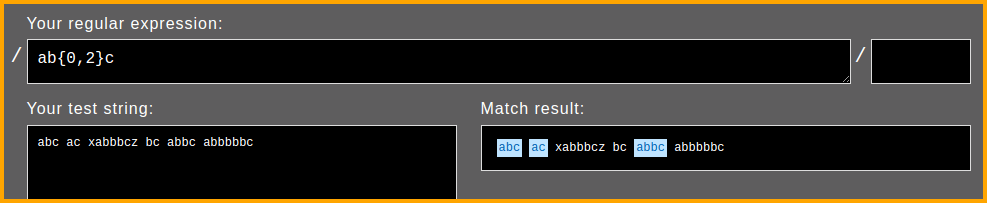

# Preface

Scripting and automation tasks often need to extract particular portions of text from input data or modify them from one format to another. This book will help you learn Regular Expressions, a mini-programming language for all sorts of text processing needs.

The book heavily leans on examples to present features of regular expressions one by one. It is recommended that you manually type each example and experiment with them. Understanding both the nature of sample input string and the output produced is essential. As an analogy, consider learning to drive a bike or a car — no matter how much you read about them or listen to explanations, you need to practice a lot and infer your own conclusions. Should you feel that copy-paste is ideal for you, [code snippets are available chapter wise on GitHub](https://github.com/learnbyexample/Ruby_Regexp/tree/master/code_snippets).

## Prerequisites

You should have prior experience working with Ruby, should know concepts like blocks, string formats, string methods, Enumerable, etc.

If you have prior experience with a programming language, but new to Ruby, check out my GitHub repository on [Ruby Scripting](https://github.com/learnbyexample/Ruby_Scripting) before starting this book. That repository also includes a chapter on Regular Expressions which has been edited and expanded to create this book.

## Conventions

* The examples presented here have been tested with **Ruby version 3.0.0** and includes features not available in earlier versions.
* Code snippets shown are copy pasted from `irb --simple-prompt` shell and modified for presentation purposes. Some commands are preceded by comments to provide context and explanations. Blank lines have been added to improve readability. `nil` return value is not shown for `puts` statements. Error messages are shortened. And so on.
* Unless otherwise noted, all examples and explanations are meant for **ASCII** characters.
* External links are provided for further reading throughout the book. Not necessary to immediately visit them. They have been chosen with care and would help, especially during re-reads.
* The [Ruby_Regexp repo](https://github.com/learnbyexample/Ruby_Regexp) has all the code snippets and files used in examples and exercises and other details related to the book. If you are not familiar with `git` command, click the **Code** button on the webpage to get the files.

## Acknowledgements

* [ruby-lang documentation](https://www.ruby-lang.org/en/documentation/) — manuals and tutorials
* [/r/ruby/](https://www.reddit.com/r/ruby/) and [/r/regex/](https://www.reddit.com/r/regex/) — helpful forum for beginners and experienced programmers alike
* [stackoverflow](https://stackoverflow.com/) — for getting answers to pertinent questions on Ruby and regular expressions
* [tex.stackexchange](https://tex.stackexchange.com/) — for help on [pandoc](https://github.com/jgm/pandoc/) and `tex` related questions
* Cover image:
    * [draw.io](https://about.draw.io/)
    * [tree icon](https://www.iconfinder.com/icons/3199231/ellipse_green_nature_tree_icon) by [Gopi Doraisamy](https://www.iconfinder.com/gopidoraisamy) under [Creative Commons Attribution 3.0 Unported](https://creativecommons.org/licenses/by/3.0/)
    * [wand icon](https://www.iconfinder.com/icons/1679640/design_magic_magician_tool_wand_icon) by [roundicons.com](https://www.iconfinder.com/roundicons)
* [pngquant](https://pngquant.org/) and [svgcleaner](https://github.com/RazrFalcon/svgcleaner) for optimizing images
* [Warning](https://commons.wikimedia.org/wiki/File:Warning_icon.svg) and [Info](https://commons.wikimedia.org/wiki/File:Info_icon_002.svg) icons by [Amada44](https://commons.wikimedia.org/wiki/User:Amada44) under public domain
* [softwareengineering.stackexchange](https://softwareengineering.stackexchange.com/questions/39/whats-your-favourite-quote-about-programming) and [skolakoda](https://skolakoda.org/programming-quotes) for programming quotes
* [gmovchan](https://github.com/gmovchan) for spotting a typo

Special thanks to Allen Downey, an attempt at translating his book [Think Python](https://greenteapress.com/wp/think-python-2e/) to [Think Ruby](https://github.com/learnbyexample/ThinkRubyBuild) gave me the confidence to publish my own book.

## Feedback and Errata

I would highly appreciate if you'd let me know how you felt about this book, it would help to improve this book as well as my future attempts. Also, please do let me know if you spot any error or typo.

Issue Manager: [https://github.com/learnbyexample/Ruby_Regexp/issues](https://github.com/learnbyexample/Ruby_Regexp/issues)

E-mail: learnbyexample.net@gmail.com

Twitter: https://twitter.com/learn_byexample

## Author info

Sundeep Agarwal is a freelance trainer, author and mentor. His previous experience includes working as a Design Engineer at Analog Devices for more than 5 years. You can find his other works, primarily focused on Linux command line, text processing, scripting languages and curated lists, at [https://github.com/learnbyexample](https://github.com/learnbyexample). He has also been a technical reviewer for [Command Line Fundamentals](https://www.packtpub.com/application-development/command-line-fundamentals) book and video course published by Packt.

**List of books:** https://learnbyexample.github.io/books/

## License

This work is licensed under a [Creative Commons Attribution-NonCommercial-ShareAlike 4.0 International License](https://creativecommons.org/licenses/by-nc-sa/4.0/)

Code snippets are available under [MIT License](https://github.com/learnbyexample/Ruby_Regexp/blob/master/LICENSE)

Resources mentioned in Acknowledgements section above are available under original licenses.

## Book version

2.6

See [Version_changes.md](https://github.com/learnbyexample/Ruby_Regexp/blob/master/Version_changes.md) to track changes across book versions.

# Why is it needed?

Regular Expressions is a versatile tool for text processing. You'll find them included as part of standard library of most programming languages that are used for scripting purposes. If not, you can usually find a third-party library. Syntax and features of regular expressions vary from language to language. Ruby's offering is based upon the [Onigmo regular expressions library](https://github.com/k-takata/Onigmo/blob/master/doc/RE).

The `String` class comes loaded with variety of methods to deal with text. So, what's so special about regular expressions and why would you need it? For learning and understanding purposes, one can view regular expressions as a mini programming language in itself, specialized for text processing. Parts of a regular expression can be saved for future use, analogous to variables and functions. There are ways to perform AND, OR, NOT conditionals. Operations similar to range and string repetition operators and so on.

Here's some common use cases:

* Sanitizing a string to ensure that it satisfies a known set of rules. For example, to check if a given string matches password rules.
* Filtering or extracting portions on an abstract level like alphabets, numbers, punctuation and so on.
* Qualified string replacement. For example, at the start or the end of a string, only whole words, based on surrounding text, etc.

You are likely to be familiar with graphical search and replace tool, like the screenshot shown below from LibreOffice Writer. **Match case**, **Whole words only**, **Replace** and **Replace All** are some of the basic features supported by regular expressions.


Another real world use case is password validation. The screenshot below is from GitHub sign up page. Performing multiple checks like **string length** and the **type of characters allowed** is another core feature of regular expressions.


Here's some articles on regular expressions to know about its history and the type of problems it is suited for.

* [The true power of regular expressions](https://nikic.github.io/2012/06/15/The-true-power-of-regular-expressions.html) — it also includes a nice explanation of what *regular* means in this context
* [softwareengineering: Is it a must for every programmer to learn regular expressions?](https://softwareengineering.stackexchange.com/questions/133968/is-it-a-must-for-every-programmer-to-learn-regular-expressions)
* [softwareengineering: When you should NOT use Regular Expressions?](https://softwareengineering.stackexchange.com/questions/113237/when-you-should-not-use-regular-expressions)
* [codinghorror: Now You Have Two Problems](https://blog.codinghorror.com/regular-expressions-now-you-have-two-problems/)
* [wikipedia: Regular expression](https://en.wikipedia.org/wiki/Regular_expression) — this article includes discussion on regular expressions as a formal language as well as details on various implementations

## How this book is organized

The book introduces concepts one by one and exercises at the end of chapters will require only the features introduced until that chapter. Each concept is accompanied by multiple examples to cover various angles of usage and corner cases. As mentioned before, follow along the illustrations by typing out the code snippets manually. It is important to understand both the nature of the sample input string as well as the actual programming command used. There are two interlude chapters that give an overview of useful external resources and some more resources are collated in the final chapter.

* [Regexp introduction](#regexp-introduction)
* [Anchors](#anchors)
* [Alternation and Grouping](#alternation-and-grouping)
* [Escaping metacharacters](#escaping-metacharacters)
* [Dot metacharacter and Quantifiers](#dot-metacharacter-and-quantifiers)
* [Interlude: Tools for debugging and visualization](#interlude-tools-for-debugging-and-visualization)
* [Working with matched portions](#working-with-matched-portions)
* [Character class](#character-class)
* [Groupings and backreferences](#groupings-and-backreferences)
* [Interlude: Common tasks](#interlude-common-tasks)
* [Lookarounds](#lookarounds)
* [Modifiers](#modifiers)
* [Unicode](#unicode)
* [Further Reading](#further-reading)

By the end of the book, you should be comfortable with both writing and reading regular expressions, how to debug them and know when to *avoid* them.

# Regexp introduction

In this chapter, you'll get to know how to declare and use regexps. For some examples, the equivalent normal string method is shown for comparison. Regular expression features will be covered next chapter onwards. The main focus will be to get you comfortable with syntax and text processing examples. Three methods will be introduced in this chapter. The `match?` method to search if the input contains a string and the `sub` and `gsub` methods to substitute a portion of the input with something else.

> This book will use the terms **regular expressions** and **regexp** interchangeably.

## Regexp documentation

It is always a good idea to know where to find the documentation. Visit [ruby-doc: Regexp](https://ruby-doc.org/core-3.0.0/Regexp.html) for information on `Regexp` class, available methods, syntax, features, examples and more. Here's a quote:

>Regular expressions (*regexps*) are patterns which describe the contents of a string. They're used for testing whether a string contains a given pattern, or extracting the portions that match. They are created with the `/pat/` and `%r{pat}` literals or the `Regexp.new` constructor.

## match? method

First up, a simple example to test whether a string is part of another string or not. Normally, you'd use the `include?` method and pass a string as argument. For regular expressions, use the `match?` method and enclose the search string within `//` delimiters (regexp literal).

```ruby
>> sentence = 'This is a sample string'

# check if 'sentence' contains the given string argument
>> sentence.include?('is')
=> true
>> sentence.include?('z')
=> false

# check if 'sentence' matches the pattern as described by the regexp argument
>> sentence.match?(/is/)
=> true
>> sentence.match?(/z/)
=> false
```

The `match?` method accepts an optional second argument which specifies the index to start searching from.

```ruby
>> sentence = 'This is a sample string'

>> sentence.match?(/is/, 2)
=> true
>> sentence.match?(/is/, 6)
=> false
```

Some of the regular expressions functionality is enabled by passing modifiers, represented by an alphabet character. If you have used command line, modifiers are similar to command options, for example `grep -i` will perform case insensitive matching. It will be discussed in detail in [Modifiers](#modifiers) chapter. Here's an example for `i` modifier. 

```ruby
>> sentence = 'This is a sample string'

>> sentence.match?(/this/)
=> false
# 'i' is a modifier to enable case insensitive matching
>> sentence.match?(/this/i)
=> true
```

## Regexp literal reuse and interpolation

The regexp literal can be saved in a variable. This helps to improve code clarity, pass around as method argument, enable reuse, etc.

```ruby
>> pet = /dog/i
>> pet
=> /dog/i

>> 'They bought a Dog'.match?(pet)
=> true
>> 'A cat crossed their path'.match?(pet)
=> false
```

Similar to double quoted string literals, you can use interpolation and escape sequences in a regexp literal. See [ruby-doc: Strings](https://ruby-doc.org/core-3.0.0/doc/syntax/literals_rdoc.html#label-Strings) for syntax details on string escape sequences. Regexp literals have their own special escapes, which will be discussed in [Escape sequences](#escape-sequences) section.

```ruby
>> "cat\tdog".match?(/\t/)
=> true
>> "cat\tdog".match?(/\a/)
=> false

>> greeting = 'hi'
>> /#{greeting} there/
=> /hi there/
>> /#{greeting.upcase} there/
=> /HI there/
>> /#{2**4} apples/
=> /16 apples/
```

## sub and gsub methods

For search and replace, use `sub` or `gsub` methods. The `sub` method will replace only the first occurrence of the match, whereas `gsub` will replace all the occurrences. The regexp pattern to match against the input string has to be passed as the first argument. The second argument specifies the string which will replace the portions matched by the pattern. 

```ruby
>> greeting = 'Have a nice weekend'

# replace first occurrence of 'e' with 'E'
>> greeting.sub(/e/, 'E')
=> "HavE a nice weekend"
# replace all occurrences of 'e' with 'E'
>> greeting.gsub(/e/, 'E')
=> "HavE a nicE wEEkEnd"
```

Use `sub!` and `gsub!` methods for in-place substitution.

```ruby
>> word = 'cater'

# this will return a string object, won't modify 'word' variable
>> word.sub(/cat/, 'wag')
=> "wager"
>> word
=> "cater"

# this will modify 'word' variable itself
>> word.sub!(/cat/, 'wag')
=> "wager"
>> word
=> "wager"
```

## Regexp operators

Ruby also provides operators for regexp matching.

* `=~` match operator returns index of the first match and `nil` if match is not found
* `!~` match operator returns `true` if string *doesn't* contain the given regexp and `false` otherwise
* `===` match operator returns `true` or `false` similar to the `match?` method

```ruby
>> sentence = 'This is a sample string'

# can also use: /is/ =~ sentence
>> sentence =~ /is/
=> 2
>> sentence =~ /z/
=> nil

# can also use: /z/ !~ sentence
>> sentence !~ /z/
=> true
>> sentence !~ /is/
=> false
```

Just like `match?` method, both `=~` and `!~` can be used in a conditional statement.

```ruby
>> sentence = 'This is a sample string'

>> puts 'hi' if sentence =~ /is/
hi

>> puts 'oh' if sentence !~ /z/
oh
```

The `===` operator comes in handy with Enumerable methods like `grep`, `grep_v`, `all?`, `any?`, etc.

```ruby
>> sentence = 'This is a sample string'

# regexp literal has to be on LHS and input string on RHS
>> /is/ === sentence
=> true
>> /z/ === sentence
=> false

>> words = %w[cat attempt tattle]
>> words.grep(/tt/)
=> ["attempt", "tattle"]
>> words.all?(/at/)
=> true
>> words.none?(/temp/)
=> false
```

> A key difference from `match?` method is that these operators will also set regexp related [global variables](#regexp-global-variables).

## Cheatsheet and Summary

| Note    | Description |
| ------- | ----------- |
| [ruby-doc: Regexp](https://ruby-doc.org/core-3.0.0/Regexp.html) | Ruby Regexp documentation |
| [Onigmo doc](https://github.com/k-takata/Onigmo/blob/master/doc/RE) | Onigmo library documentation |
| `/pat/` or `%r{pat}` | regexp literal |
|  | interpolation and escape sequences can also be used |
| `var = /pat/` | save regexp literal in a variable |
| `/pat1#{expr}pat2/` | use result of an expression to build regexp |
| `s.match?(/pat/)` | check if string `s` matches the pattern `/pat/` |
| | returns `true` or `false` |
| `s.match?(/pat/, 3)` | optional 2nd argument changes starting index of search |
| `/pat/i` | modifier `i` matches alphabets case insensitively |
| `s.sub(/pat/, 'replace')` | search and replace first matching occurrence |
| | use `gsub` to replace all occurrences |
| | use `sub!` and `gsub!` for in-place substitution |
| `s =~ /pat/` or `/pat/ =~ s` | returns index of first match or `nil` |
| `s !~ /pat/` or `/pat/ !~ s` | returns `true` if no match or `false` |
| `/pat/ === s` | returns `true` or `false` similar to `match?` |
| | these operators will also set [regexp global variables](#regexp-global-variables) |

This chapter introduced the `Regexp` class and methods `match?`, `sub` and `gsub` were discussed. You also learnt how to save and reuse regexp literals, how to specify modifiers and how to use regexp operators.

You might wonder why there are so many ways to test matching condition with regexps. The most common approach is to use `match?` method in a conditional statement. If you need position of match, use `=~` operator or `index` method. The `===` operator is usually relevant in Enumerable methods. Usage of global variables will be covered in later chapters. The `=~` and `!~` operators are also prevalent in command line usage (see my [Ruby one liners](https://github.com/learnbyexample/Command-line-text-processing/blob/master/ruby_one_liners.md) tutorial for examples).

The next section has exercises to test your understanding of the concepts introduced in this chapter. Please do solve them before moving on to the next chapter.

## Exercises

> Refer to [exercises folder](https://github.com/learnbyexample/Ruby_Regexp/tree/master/exercises) for input files required to solve the exercises.

> All the exercises are also collated together in one place at [Exercises.md](https://github.com/learnbyexample/Ruby_Regexp/blob/master/exercises/Exercises.md). For solutions, see [Exercise_solutions.md](https://github.com/learnbyexample/Ruby_Regexp/blob/master/exercises/Exercise_solutions.md).

**a)** Check whether the given strings contain `0xB0`. Display a boolean result as shown below.

```ruby
>> line1 = 'start address: 0xA0, func1 address: 0xC0'
>> line2 = 'end address: 0xFF, func2 address: 0xB0'

>> line1.match?()       ##### add your solution here
=> false
>> line2.match?()       ##### add your solution here
=> true
```

**b)** For the given input file, print all lines containing the string `two`.

```ruby
# note that expected output shown here is wrapped to fit pdf width
>> filename = 'programming_quotes.txt'

>> word =       ##### add your solution here

>> puts File.foreach(filename).grep(word)
"Some people, when confronted with a problem, think - I know, I'll use regular
expressions. Now they have two problems" by Jamie Zawinski
"So much complexity in software comes from trying to make one thing do two
things" by Ryan Singer
```

**c)** Replace all occurrences of `5` with `five` for the given string.

```ruby
>> ip = 'They ate 5 apples and 5 oranges'

>> ip.gsub(//, 'five')      ##### add your solution here
=> "They ate five apples and five oranges"
```

**d)** Replace first occurrence of `5` with `five` for the given string.

```ruby
>> ip = 'They ate 5 apples and 5 oranges'

>> ip.sub(//, 'five')       ##### add your solution here
=> "They ate five apples and 5 oranges"
```

**e)** For the given array, filter all elements that do *not* contain `e`.

```ruby
>> items = %w[goal new user sit eat dinner]

>> items.grep_v(//)     ##### add your solution here
=> ["goal", "sit"]
```

**f)** Replace all occurrences of `note` irrespective of case with `X`.

```ruby
>> ip = 'This note should not be NoTeD'

>> ip.gsub(//, 'X')     ##### add your solution here
=> "This X should not be XD"
```

**g)** For the given input string, print all lines NOT containing the string `2`

```ruby
'> purchases = %q{items qty
'> apple 24
'> mango 50
'> guava 42
'> onion 31
>> water 10}

>> num = //     ##### add your solution here

>> puts purchases.each_line.grep_v(num)
items qty
mango 50
onion 31
water 10
```

**h)** For the given array, filter all elements that contains either `a` or `w`.

```ruby
>> items = %w[goal new user sit eat dinner]

>> items.filter { }     ##### add your solution here
=> ["goal", "new", "eat"]
```

**i)** For the given array, filter all elements that contains both `e` and `n`.

```ruby
>> items = %w[goal new user sit eat dinner]

>> items.filter { }     ##### add your solution here
=> ["new", "dinner"]
```

**j)** For the given string, replace `0xA0` with `0x7F` and `0xC0` with `0x1F`.

```ruby
>> ip = 'start address: 0xA0, func1 address: 0xC0'

##### add your solution here
=> "start address: 0x7F, func1 address: 0x1F"
```

**k)** Find the starting index of the first occurrence of `is` for the given input string.

```ruby
>> ip = 'match this after the history lesson'

##### add your solution here
=> 8
```

# Anchors

Now that you're familiar with regexp syntax and some of the methods, the next step is to know about the special features of regular expressions. In this chapter, you'll be learning about qualifying a pattern. Instead of matching anywhere in the given input string, restrictions can be specified. For now, you'll see the ones that are already part of regular expression features. In later chapters, you'll learn how to define your own rules for restriction.

These restrictions are made possible by assigning special meaning to certain characters and escape sequences. The characters with special meaning are known as **metacharacters** in regexp parlance. In case you need to match those characters literally, you need to escape them with a `\` character (discussed in [Escaping metacharacters](#escaping-with-) section).

## String anchors

This restriction is about qualifying a regexp to match only at start or end of an input string. These provide functionality similar to the string methods `start_with?` and `end_with?`. There are three different escape sequences related to string level regexp anchors. First up is `\A` which restricts the matching to the start of string.

```ruby
# \A is placed as a prefix to the search term
>> 'cater'.match?(/\Acat/)
=> true
>> 'concatenation'.match?(/\Acat/)
=> false

>> "hi hello\ntop spot".match?(/\Ahi/)
=> true
>> "hi hello\ntop spot".match?(/\Atop/)
=> false
```

To restrict the match to the end of string, `\z` is used.

```ruby
# \z is placed as a suffix to the search term
>> 'spare'.match?(/are\z/)
=> true
>> 'nearest'.match?(/are\z/)
=> false

>> words = %w[surrender unicorn newer door empty eel pest]
>> words.grep(/er\z/)
=> ["surrender", "newer"]
>> words.grep(/t\z/)
=> ["pest"]
```

There is another end of string anchor `\Z`. It is similar to `\z` but if newline is the last character, then `\Z` allows matching just before the newline character.

```ruby
# same result for both \z and \Z
# as there is no newline character at the end of string
>> 'dare'.sub(/are\z/, 'X')
=> "dX"
>> 'dare'.sub(/are\Z/, 'X')
=> "dX"

# different results as there is a newline character at the end of string
>> "dare\n".sub(/are\z/, 'X')
=> "dare\n"
>> "dare\n".sub(/are\Z/, 'X')
=> "dX\n"
```

Combining both the start and end string anchors, you can restrict the matching to the whole string. Similar to comparing strings using the `==` operator.

```ruby
>> 'cat'.match?(/\Acat\z/)
=> true
>> 'cater'.match?(/\Acat\z/)
=> false
>> 'concatenation'.match?(/\Acat\z/)
=> false
```

The anchors can be used by themselves as a pattern. Helps to insert text at the start or end of string, emulating string concatenation operations. These might not feel like useful capability, but combined with other regexp features they become quite a handy tool.

```ruby
>> 'live'.sub(/\A/, 're')
=> "relive"
>> 'send'.sub(/\A/, 're')
=> "resend"

>> 'cat'.sub(/\z/, 'er')
=> "cater"
>> 'hack'.sub(/\z/, 'er')
=> "hacker"
```

## Line anchors

A string input may contain single or multiple lines. The newline character `\n` is used as the line separator. There are two line anchors, `^` metacharacter for matching the start of line and `$` for matching the end of line. If there are no newline characters in the input string, these will behave same as the `\A` and `\z` anchors respectively.

```ruby
>> pets = 'cat and dog'

>> pets.match?(/^cat/)
=> true
>> pets.match?(/^dog/)
=> false

>> pets.match?(/dog$/)
=> true

>> pets.match?(/^dog$/)
=> false
```

Here's some multiline examples to distinguish line anchors from string anchors.

```ruby
# check if any line in the string starts with 'top'
>> "hi hello\ntop spot".match?(/^top/)
=> true

# check if any line in the string ends with 'er'
>> "spare\npar\ndare".match?(/er$/)
=> false

# filter all lines ending with 'are'
>> "spare\npar\ndare".each_line.grep(/are$/)
=> ["spare\n", "dare"]

# check if any complete line in the string is 'par'
>> "spare\npar\ndare".match?(/^par$/)
=> true
```

Just like string anchors, you can use the line anchors by themselves as a pattern. `gsub` and `puts` will be used here to better illustrate the transformation. The `gsub` method returns an Enumerator if you don't specify a replacement string nor pass a block. That paves way to use all those wonderful Enumerator and Enumerable methods.

```ruby
>> str = "catapults\nconcatenate\ncat"

>> puts str.gsub(/^/, '1: ')
1: catapults
1: concatenate
1: cat
>> puts str.gsub(/^/).with_index(1) { |m, i| "#{i}: " }
1: catapults
2: concatenate
3: cat

>> puts str.gsub(/$/, '.')
catapults.
concatenate.
cat.
```

If there is a newline character at the end of string, there is an additional end of line match but no additional start of line match.

```ruby
>> puts "1\n2\n".gsub(/^/, 'foo ')
foo 1
foo 2
>> puts "1\n\n".gsub(/^/, 'foo ')
foo 1
foo 

# note the number of lines in output
>> puts "1\n2\n".gsub(/$/, ' baz')
1 baz
2 baz
 baz
>> puts "1\n\n".gsub(/$/, ' baz')
1 baz
 baz
 baz
```

> If you are dealing with Windows OS based text files, you'll have to convert `\r\n` line endings to `\n` first. Which is easily handled by many of the Ruby methods. For example, you can specify which line ending to use for `File.open` method, the `split` string method handles all whitespaces by default and so on. Or, you can handle `\r` as optional character with quantifiers (see [Greedy quantifiers](#greedy-quantifiers) section).

## Word anchors

The third type of restriction is word anchors. Alphabets (irrespective of case), digits and the underscore character qualify as word characters. You might wonder why there are digits and underscores as well, why not only alphabets? This comes from variable and function naming conventions — typically alphabets, digits and underscores are allowed. So, the definition is more oriented to programming languages than natural ones.

The escape sequence `\b` denotes a word boundary. This works for both the start of word and end of word anchoring. Start of word means either the character prior to the word is a non-word character or there is no character (start of string). Similarly, end of word means the character after the word is a non-word character or no character (end of string). This implies that you cannot have word boundary `\b` without a word character.

```ruby
>> words = 'par spar apparent spare part'

# replace 'par' irrespective of where it occurs
>> words.gsub(/par/, 'X')
=> "X sX apXent sXe Xt"
# replace 'par' only at the start of word
>> words.gsub(/\bpar/, 'X')
=> "X spar apparent spare Xt"
# replace 'par' only at the end of word
>> words.gsub(/par\b/, 'X')
=> "X sX apparent spare part"
# replace 'par' only if it is not part of another word
>> words.gsub(/\bpar\b/, 'X')
=> "X spar apparent spare part"
```

You can get lot more creative with using word boundary as a pattern by itself:

```ruby
# space separated words to double quoted csv
# note the use of 'tr' string method
>> puts words.gsub(/\b/, '"').tr(' ', ',')
"par","spar","apparent","spare","part"

>> '-----hello-----'.gsub(/\b/, ' ')
=> "----- hello -----"

# make a programming statement more readable
# shown for illustration purpose only, won't work for all cases
>> 'foo_baz=num1+35*42/num2'.gsub(/\b/, ' ')
=> " foo_baz = num1 + 35 * 42 / num2 "
# excess space at start/end of string can be stripped off
# later you'll learn how to add a qualifier so that strip is not needed
>> 'foo_baz=num1+35*42/num2'.gsub(/\b/, ' ').strip
=> "foo_baz = num1 + 35 * 42 / num2"
```

The word boundary has an opposite anchor too. `\B` matches wherever `\b` doesn't match. This duality will be seen with some other escape sequences too. Negative logic is handy in many text processing situations. But use it with care, you might end up matching things you didn't intend!

```ruby
>> words = 'par spar apparent spare part'

# replace 'par' if it is not start of word
>> words.gsub(/\Bpar/, 'X')
=> "par sX apXent sXe part"
# replace 'par' at the end of word but not whole word 'par'
>> words.gsub(/\Bpar\b/, 'X')
=> "par sX apparent spare part"
# replace 'par' if it is not end of word
>> words.gsub(/par\B/, 'X')
=> "par spar apXent sXe Xt"
# replace 'par' if it is surrounded by word characters
>> words.gsub(/\Bpar\B/, 'X')
=> "par spar apXent sXe part"
```

Here's some standalone pattern usage to compare and contrast the two word anchors.

```ruby
>> 'copper'.gsub(/\b/, ':')
=> ":copper:"
>> 'copper'.gsub(/\B/, ':')
=> "c:o:p:p:e:r"

>> '-----hello-----'.gsub(/\b/, ' ')
=> "----- hello -----"
>> '-----hello-----'.gsub(/\B/, ' ')
=> " - - - - -h e l l o- - - - - "
```

## Cheatsheet and Summary

| Note    | Description |
| ------- | ----------- |
| `\A` | restricts the match to the start of string |
| `\z` | restricts the match to the end of string |
| `\Z` | restricts the match to end or just before newline at the end of string |
| `\n` | line separator, dos-style files need special attention |
| metacharacter | characters with special meaning in regexp |
| `^` | restricts the match to the start of line |
| `$` | restricts the match to the end of line |
| `\b` | restricts the match to the start/end of words |
|  | word characters: alphabets, digits, underscore |
| `\B` | matches wherever `\b` doesn't match |

In this chapter, you've begun to see building blocks of regular expressions and how they can be used in interesting ways. At the same time, regular expression is but another tool for text processing. Often, you'd get simpler solution by combining regular expressions with other string and Enumerable methods. Practice, experience and imagination would help you construct creative solutions. In coming chapters, you'll see more applications of anchors as well as [`\G` anchor](#g-anchor) which is best understood in combination with other regexp features.

## Exercises

**a)** Check if the given strings start with `be`.

```ruby
>> line1 = 'be nice'
>> line2 = '"best!"'
>> line3 = 'better?'
>> line4 = 'oh no\nbear spotted'

>> pat =        ##### add your solution here

>> pat.match?(line1)
=> true
>> pat.match?(line2)
=> false
>> pat.match?(line3)
=> true
>> pat.match?(line4)
=> false
```

**b)** For the given input string, change only whole word `red` to `brown`

```ruby
>> words = 'bred red spread credible'

>> words.gsub()     ##### add your solution here
=> "bred brown spread credible"
```

**c)** For the given input array, filter all elements containing `42` surrounded by word characters.

```ruby
>> items = ['hi42bye', 'nice1423', 'bad42', 'cool_42a', 'fake4b']

>> items.grep()     ##### add your solution here
=> ["hi42bye", "nice1423", "cool_42a"]
```

**d)** For the given input array, filter all elements that start with `den` or end with `ly`

```ruby
>> items = ['lovely', "1\ndentist", '2 lonely', 'eden', "fly\n", 'dent']

>> items.filter { }     ##### add your solution here
=> ["lovely", "2 lonely", "dent"]
```

**e)** For the given input string, change whole word `mall` to `1234` only if it is at start of line.

```ruby
'> para = %q{ball fall wall tall
'> mall call ball pall
'> wall mall ball fall
>> mallet wallet malls}

>> puts para.gsub()     ##### add your solution here
ball fall wall tall
1234 call ball pall
wall mall ball fall
mallet wallet malls
```

**f)** For the given array, filter all elements having a line starting with `den` or ending with `ly`.

```ruby
>> items = ['lovely', "1\ndentist", '2 lonely', 'eden', "fly\nfar", 'dent']

>> items.filter { }     ##### add your solution here
=> ["lovely", "1\ndentist", "2 lonely", "fly\nfar", "dent"]
```

**g)** For the given input array, filter all whole elements `12\nthree` irrespective of case.

```ruby
>> items = ["12\nthree\n", "12\nThree", "12\nthree\n4", "12\nthree"]

>> items.grep()     ##### add your solution here
=> ["12\nThree", "12\nthree"]
```

**h)** For the given input array, replace `hand` with `X` for all words that start with `hand` followed by at least one word character.

```ruby
>> items = %w[handed hand handy unhanded handle hand-2]

>> items.map { }        ##### add your solution here
=> ["Xed", "hand", "Xy", "unhanded", "Xle", "hand-2"]
```

**i)** For the given input array, filter all elements starting with `h`. Additionally, replace `e` with `X` for these filtered elements.

```ruby
>> items = %w[handed hand handy unhanded handle hand-2]

>> items.filter_map { }     ##### add your solution here
=> ["handXd", "hand", "handy", "handlX", "hand-2"]
```

# Alternation and Grouping

Many a times, you want to check if the input string matches multiple patterns. For example, whether an object's color is *green* or *blue* or *red*. In programming terms, you need to perform OR conditional. This chapter will show how to use alternation for such cases. These patterns can have some common elements between them, in which case grouping helps to form terser expressions. This chapter will also discuss the precedence rules used to determine which alternation wins.

## OR conditional

A conditional expression combined with logical OR evaluates to `true` if any of the condition is satisfied. Similarly, in regular expressions, you can use `|` metacharacter to combine multiple patterns to indicate logical OR. The matching will succeed if any of the alternate pattern is found in the input string. These alternatives have the full power of a regular expression, for example they can have their own independent anchors. Here's some examples.

```ruby
# match either 'cat' or 'dog'
>> 'I like cats'.match?(/cat|dog/)
=> true
>> 'I like dogs'.match?(/cat|dog/)
=> true
>> 'I like parrots'.match?(/cat|dog/)
=> false

# replace either 'cat' at start of string or 'cat' at end of word
>> 'catapults concatenate cat scat'.gsub(/\Acat|cat\b/, 'X')
=> "Xapults concatenate X sX"

# replace either 'cat' or 'dog' or 'fox' with 'mammal'
>> 'cat dog bee parrot fox'.gsub(/cat|dog|fox/, 'mammal')
=> "mammal mammal bee parrot mammal"
```

## Regexp.union method

You might infer from above examples that there can be cases where lots of alternation is required. The `Regexp.union` method can be used to build the alternation list automatically. It accepts an array as argument or a list of comma separated arguments.

```ruby
>> Regexp.union('car', 'jeep')
=> /car|jeep/

>> words = %w[cat dog fox]
>> pat = Regexp.union(words)
>> pat
=> /cat|dog|fox/
>> 'cat dog bee parrot fox'.gsub(pat, 'mammal')
=> "mammal mammal bee parrot mammal"
```

> In the above examples, the elements do not contain any special regular expression characters. Strings having metacharacters will be discussed in [Regexp.escape method](#regexpescape-method) section.

## Grouping

Often, there are some common things among the regexp alternatives. It could be common characters or regexp qualifiers like the anchors. In such cases, you can group them using a pair of parentheses metacharacters. Similar to `a(b+c)d = abd+acd` in maths, you get `a(b|c)d = abd|acd` in regular expressions.

```ruby
# without grouping
>> 'red reform read arrest'.gsub(/reform|rest/, 'X')
=> "red X read arX"
# with grouping
>> 'red reform read arrest'.gsub(/re(form|st)/, 'X')
=> "red X read arX"

# without grouping
>> 'par spare part party'.gsub(/\bpar\b|\bpart\b/, 'X')
=> "X spare X party"
# taking out common anchors
>> 'par spare part party'.gsub(/\b(par|part)\b/, 'X')
=> "X spare X party"
# taking out common characters as well
# you'll later learn a better technique instead of using empty alternate
>> 'par spare part party'.gsub(/\bpar(|t)\b/, 'X')
=> "X spare X party"
```

> There's plenty more features to grouping than just forming terser regexp. It will be discussed as they become relevant in coming chapters.

## Regexp.source method

The `Regexp.source` method helps to interpolate a regexp literal inside another regexp. For example, adding anchors to alternation list created using the `Regexp.union` method.

```ruby
>> words = %w[cat par]
>> alt = Regexp.union(words)
>> alt
=> /cat|par/
>> alt_w = /\b(#{alt.source})\b/
>> alt_w
=> /\b(cat|par)\b/

>> 'cater cat concatenate par spare'.gsub(alt, 'X')
=> "Xer X conXenate X sXe"
>> 'cater cat concatenate par spare'.gsub(alt_w, 'X')
=> "cater X concatenate X spare"
```

> The above example will work without `Regexp.source` method too, but you'll see that `/\b(#{alt})\b/` gives `/\b((?-mix:cat|par))\b/` instead of `/\b(cat|par)\b/`. Their meaning will be explained in [Modifiers](#modifiers) chapter.

## Precedence rules

There's some tricky situations when using alternation. If it is used for testing a match to get `true/false` against a string input, there is no ambiguity. However, for other things like string replacement, it depends on a few factors. Say, you want to replace either `are` or `spared` — which one should get precedence? The bigger word `spared` or the substring `are` inside it or based on something else?

In Ruby, the regexp alternative which matches earliest in the input string gets precedence. Regexp operator `=~` helps to illustrate this concept.

```ruby
>> words = 'lion elephant are rope not'

>> words =~ /on/
=> 2
>> words =~ /ant/
=> 10

# starting index of 'on' < index of 'ant' for given string input
# so 'on' will be replaced irrespective of order of regexp
>> words.sub(/on|ant/, 'X')
=> "liX elephant are rope not"
>> words.sub(/ant|on/, 'X')
=> "liX elephant are rope not"
```

So, what happens if two or more alternatives match on same index? The precedence is then left to right in the order of declaration.

```ruby
>> mood = 'best years'

>> mood =~ /year/
=> 5
>> mood =~ /years/
=> 5

# starting index for 'year' and 'years' will always be same
# so, which one gets replaced depends on the order of alternation
>> mood.sub(/year|years/, 'X')
=> "best Xs"
>> mood.sub(/years|year/, 'X')
=> "best X"
```

Another example with `gsub` to drive home the issue.

```ruby
>> words = 'ear xerox at mare part learn eye'

# this is going to be same as: gsub(/ar/, 'X')
>> words.gsub(/ar|are|art/, 'X')
=> "eX xerox at mXe pXt leXn eye"

# this is going to be same as: gsub(/are|ar/, 'X')
>> words.gsub(/are|ar|art/, 'X')
=> "eX xerox at mX pXt leXn eye"

# phew, finally this one works as needed
>> words.gsub(/are|art|ar/, 'X')
=> "eX xerox at mX pX leXn eye"
```

If you do not want substrings to sabotage your replacements, a robust workaround is to sort the alternations based on length, longest first.

```ruby
>> words = %w[hand handy handful]

>> alt = Regexp.union(words.sort_by { |w| -w.length })
>> alt
=> /handful|handy|hand/

>> 'hands handful handed handy'.gsub(alt, 'X')
=> "Xs X Xed X"

# without sorting, order will come into play
>> 'hands handful handed handy'.gsub(Regexp.union(words), 'X')
=> "Xs Xful Xed Xy"
```

## Cheatsheet and Summary

| Note    | Description |
| ------- | ----------- |
| `\|` | multiple regexp combined as conditional OR |
|   | each alternative can have independent anchors  |
| `Regexp.union(array)` | programmatically combine multiple strings/regexps  |
| `()` | group pattern(s) |
| `a(b\|c)d` | same as `abd\|acd` |
| `/#{pat.source}/` | interpolate a regexp literal inside another regexp |
| Alternation precedence | pattern which matches earliest in the input gets precedence |
|   | tie-breaker is left to right if patterns have same starting location |
|   | robust solution: sort the alternations based on length, longest first |
|   | for ex: `Regexp.union(words.sort_by { \|w\| -w.length })` |

So, this chapter was about specifying one or more alternate matches within the same regexp using `|` metacharacter. Which can further be simplified using `()` grouping if there are common aspects among the alternations. Among the alternations, earliest matching pattern gets precedence. Left to right ordering is used as a tie-breaker if multiple alternations match starting from the same location. You also learnt couple of `Regexp` methods that help to programmatically construct a regexp literal.

## Exercises

**a)** For the given input array, filter all elements that start with `den` or end with `ly`

```ruby
>> items = ['lovely', "1\ndentist", '2 lonely', 'eden', "fly\n", 'dent']

>> items.grep()     ##### add your solution here
=> ["lovely", "2 lonely", "dent"]
```

**b)** For the given array, filter all elements having a line starting with `den` or ending with `ly`

```ruby
>> items = ['lovely', "1\ndentist", '2 lonely', 'eden', "fly\nfar", 'dent']

>> items.grep()     ##### add your solution here
=> ["lovely", "1\ndentist", "2 lonely", "fly\nfar", "dent"]
```

**c)** For the given input strings, replace all occurrences of `removed` or `reed` or `received` or `refused` with `X`.

```ruby
>> s1 = 'creed refuse removed read'
>> s2 = 'refused reed redo received'

>> pat =        ##### add your solution here

>> s1.gsub(pat, 'X')
=> "cX refuse X read"
>> s2.gsub(pat, 'X')
=> "X X redo X"
```

**d)** For the given input strings, replace all matches from the array `words` with `A`.

```ruby
>> s1 = 'plate full of slate'
>> s2 = "slated for later, don't be late"
>> words = %w[late later slated]

>> pat =        ##### add your solution here

>> s1.gsub(pat, 'A')
=> "pA full of sA"
>> s2.gsub(pat, 'A')
=> "A for A, don't be A"
```

**e)** Filter all whole elements from the input array `items` that exactly matches any of the elements present in the array `words`.

```ruby
>> items = ['slate', 'later', 'plate', 'late', 'slates', 'slated ']
>> words = %w[late later slated]

>> pat =        ##### add your solution here

>> items.grep(pat)
=> ["later", "late"]
```

# Escaping metacharacters

This chapter will show how to match metacharacters literally, for manually as well as programmatically constructed patterns. You'll also learn about escape sequences supported by regexp and how they differ from strings.

## Escaping with \

You have seen a few metacharacters and escape sequences that help to compose a regexp literal. To match the metacharacters literally, i.e. to remove their special meaning, prefix those characters with a `\` character. To indicate a literal `\` character, use `\\`.

To spice up the examples a bit, block form has been used below to modify the matched portion of string with an expression. In later chapters, you'll see more ways to work directly with matched portions.

```ruby
# even though ^ is not being used as anchor, it won't be matched literally
>> 'a^2 + b^2 - C*3'.match?(/b^2/)
=> false
# escaping will work
>> 'a^2 + b^2 - C*3'.gsub(/(a|b)\^2/) { |m| m.upcase }
=> "A^2 + B^2 - C*3"

# match ( or ) literally
>> '(a*b) + c'.gsub(/\(|\)/, '')
=> "a*b + c"

>> '\learn\by\example'.gsub(/\\/, '/')
=> "/learn/by/example"
```

As emphasized earlier, regular expression is just another tool to process text. Some examples and exercises presented in this book can be solved using normal string methods as well. For real world use cases, ask yourself first if regexp is needed at all?

```ruby
>> eqn = 'f*(a^b) - 3*(a^b)'

# straightforward search and replace, no need regexp shenanigans
>> eqn.gsub('(a^b)', 'c')
=> "f*c - 3*c"
```

## Regexp.escape method

How to escape all the metacharacters when a regexp is constructed dynamically? Relax, `Regexp.escape` method has got you covered. No need to manually take care of all the metacharacters or worry about changes in future versions.

```ruby
>> eqn = 'f*(a^b) - 3*(a^b)'
>> expr = '(a^b)'

>> puts Regexp.escape(expr)
\(a\^b\)

# replace only at the end of string
>> eqn.sub(/#{Regexp.escape(expr)}\z/, 'c')
=> "f*(a^b) - 3*c"
```

The `Regexp.union` method automatically applies escaping for string arguments.

```ruby
# array of strings, assume alternation precedence sorting isn't needed
>> terms = %w[a_42 (a^b) 2|3]

>> pat = Regexp.union(terms)
>> pat
=> /a_42|\(a\^b\)|2\|3/

>> 'ba_423 (a^b)c 2|3 a^b'.gsub(pat, 'X')
=> "bX3 Xc X a^b"
```

`Regexp.union` will also take care of mixing string and regexp patterns correctly. `(?-mix:` seen in the output below will be explained in the [Modifiers](#modifiers) chapter.

```ruby
>> Regexp.union(/^cat|dog$/, 'a^b')
=> /(?-mix:^cat|dog$)|a\^b/
```

## Escaping delimiter

Another character to keep track for escaping is the delimiter used to define the regexp literal. Or, you can use a different delimiter than `/` to define a regexp literal using `%r` to avoid escaping. Also, you need not worry about unescaped delimiter inside `#{}` interpolation.

```ruby
>> path = '/abc/123/foo/baz/ip.txt'

# \/ is also known as 'leaning toothpick syndrome'
>> path.sub(/\A\/abc\/123\//, '~/')
=> "~/foo/baz/ip.txt"

# a different delimiter improves readability and reduces typos
>> path.sub(%r#\A/abc/123/#, '~/')
=> "~/foo/baz/ip.txt"
```

## Escape sequences

In regexp literals, characters like tab and newline can be expressed using escape sequences as `\t` and `\n` respectively. These are similar to how they are treated in normal string literals (see [ruby-doc: Strings](https://ruby-doc.org/core-3.0.0/doc/syntax/literals_rdoc.html#label-Strings) for details). However, escapes like `\b` (word boundary) and `\s` (see [Escape sequence character sets](#escape-sequence-character-sets) section) are different for regexps. And octal escapes `\nnn` have to be three digits to avoid conflict with [Backreferences](#backreferences).

```ruby
>> "a\tb\tc".gsub(/\t/, ':')
=> "a:b:c"

>> "1\n2\n3".gsub(/\n/, ' ')
=> "1 2 3"
```

If an escape sequence is not defined, it'll match the character that is escaped. For example, `\%` will match `%` and not `\` followed by `%`.

```ruby
>> 'h%x'.match?(/h\%x/)
=> true
>> 'h\%x'.match?(/h\%x/)
=> false

>> 'hello'.match?(/\l/)
=> true
```

If you represent a metacharacter using escapes, it will be treated literally instead of its metacharacter feature.

```ruby
# \x20 is hexadecimal for space character
>> 'h e l l o'.gsub(/\x20/, '')
=> "hello"
# \053 is octal for + character
>> 'a+b'.match?(/a\053b/)
=> true

# \x7c is '|' character
>> '12|30'.gsub(/2\x7c3/, '5')
=> "150"
>> '12|30'.gsub(/2|3/, '5')
=> "15|50"
```

> See [ASCII code table](https://ascii.cl/) for a handy cheatsheet with all the ASCII characters and their hexadecimal representation.

[Codepoints and Unicode escapes](#codepoints-and-unicode-escapes) section will discuss escapes for unicode characters.

## Cheatsheet and Summary

| Note    | Description |
| ------- | ----------- |
| `\` | prefix metacharacters with `\` to match them literally |
| `\\` | to match `\` literally |
| `Regexp.escape(s)` | automatically escape all metacharacters for string `s` |
| | `Regexp.union` also automatically escapes string arguments |
| `%r` | helps to avoid/reduce escaping delimiter character |
| `\t` | escape sequences like those supported in string literals |
| | but escapes like `\b` and `\s` have different meaning in regexps |
| `\%` | undefined escapes will match the character it escapes |
| `\x7c` | will match `\|` literally |
| | instead of acting as alternation metacharacter |

## Exercises

**a)** Transform given input strings to expected output using same logic on both strings.

```ruby
>> str1 = '(9-2)*5+qty/3'
>> str2 = '(qty+4)/2-(9-2)*5+pq/4'

>> str1.gsub()      ##### add your solution here
=> "35+qty/3"
>> str2.gsub()      ##### add your solution here
=> "(qty+4)/2-35+pq/4"
```

**b)** Replace `(4)\|` with `2` only at the start or end of given input strings.

```ruby
>> s1 = '2.3/(4)\|6 foo 5.3-(4)\|'
>> s2 = '(4)\|42 - (4)\|3'
>> s3 = "two - (4)\\|\n"

>> pat =        ##### add your solution here

>> s1.gsub(pat, '2')
=> "2.3/(4)\\|6 foo 5.3-2"
>> s2.gsub(pat, '2')
=> "242 - (4)\\|3"
>> s3.gsub(pat, '2')
=> "two - (4)\\|\n"
```

**c)** Replace any matching item from given array with `X` for given input strings. Match the elements from `items` literally. Assume no two elements of `items` will result in any matching conflict.

```ruby
>> items = ['a.b', '3+n', 'x\y\z', 'qty||price', '{n}']

>> pat =        ##### add your solution here

>> '0a.bcd'.gsub(pat, 'X')
=> "0Xcd"
>> 'E{n}AMPLE'.gsub(pat, 'X')
=> "EXAMPLE"
>> '43+n2 ax\y\ze'.gsub(pat, 'X')
=> "4X2 aXe"
```

**d)** Replace backspace character `\b` with a single space character for the given input string.

```ruby
>> ip = "123\b456"
>> puts ip
12456

>> ip.gsub()        ##### add your solution here
=> "123 456"
```

**e)** Replace all occurrences of `\o` with `o`.

```ruby
>> ip = 'there are c\omm\on aspects am\ong the alternati\ons'

>> ip.gsub()        ##### add your solution here
=> "there are common aspects among the alternations"
```

**f)** Replace any matching item from the array `eqns` with `X` for given the string `ip`. Match the items from `eqns` literally.

```ruby
>> ip = '3-(a^b)+2*(a^b)-(a/b)+3'
>> eqns = %w[(a^b) (a/b) (a^b)+2]

>> pat =        ##### add your solution here

>> ip.gsub(pat, 'X')
=> "3-X*X-X+3"
```

# Dot metacharacter and Quantifiers

This chapter introduces dot metacharacter and quantifiers. As the name implies, quantifiers allows you to specify how many times a character or grouping should be matched. With `*` string operator, you can do something like `'no' * 5` to get `"nonononono"`. This saves you manual repetition as well as gives the ability to programmatically repeat a string object as many times as you need. Quantifiers support this simple repetition as well as ways to specify a range of repetition. This range has the flexibility of being bounded or unbounded with respect to start and end values. Combined with dot metacharacter (and alternation if needed), quantifiers allow you to construct conditional AND logic between patterns.

## Dot metacharacter

The dot metacharacter matches any character except the newline character.

```ruby
# matches character 'c', any character and then character 't'
>> 'tac tin c.t abc;tuv acute'.gsub(/c.t/, 'X')
=> "taXin X abXuv aXe"

# matches character 'r', any two characters and then character 'd'
>> 'breadth markedly reported overrides'.gsub(/r..d/) { |s| s.upcase }
=> "bREADth maRKEDly repoRTED oveRRIDes"

# matches character '2', any character and then character '3'
>> "42\t33".sub(/2.3/, '8')
=> "483"
```

See [m modifier](#m-modifier) section to know how `.` can match newline as well. Chapter [Character class](#character-class) will discuss how to define your own custom placeholder for limited set of characters.

## split method

This chapter will additionally use `split` method to illustrate examples. The `split` method separates the string based on given regexp (or string) and returns an array of strings.

```ruby
# same as: 'apple-85-mango-70'.split('-')
>> 'apple-85-mango-70'.split(/-/)
=> ["apple", "85", "mango", "70"]

>> 'bus:3:car:5:van'.split(/:.:/)
=> ["bus", "car", "van"]

# optional limit can be specified as second argument
# when limit is positive, you get maximum of limit-1 splits
>> 'apple-85-mango-70'.split(/-/, 2)
=> ["apple", "85-mango-70"]
```

See [split with capture groups](#split-with-capture-groups) section for details of how capture groups affect the output of `split` method.

## Greedy quantifiers

Quantifiers have functionality like the string repetition operator and range method. They can be applied to both characters and groupings (and more, as you'll see in later chapters). Apart from ability to specify exact quantity and bounded range, these can also match unbounded varying quantities. If the input string can satisfy a pattern with varying quantities in multiple ways, you can choose among three types of quantifiers to narrow down possibilities. In this section, **greedy** type of quantifiers is covered.

First up, the `?` metacharacter which quantifies a character or group to match `0` or `1` times. In other words, you make that character or group as something to be optionally matched. This leads to a terser regexp compared to alternation and grouping.

```ruby
# same as: /ear|ar/
>> 'far feat flare fear'.gsub(/e?ar/, 'X')
=> "fX feat flXe fX"

# same as: /\bpar(t|)\b/
>> 'par spare part party'.gsub(/\bpart?\b/, 'X')
=> "X spare X party"

# same as: /\b(re.d|red)\b/
>> words = %w[red read ready re;d road redo reed rod]
>> words.grep(/\bre.?d\b/)
=> ["red", "read", "re;d", "reed"]

# same as: /part|parrot/
>> 'par part parrot parent'.gsub(/par(ro)?t/, 'X')
=> "par X X parent"
# same as: /part|parrot|parent/
>> 'par part parrot parent'.gsub(/par(en|ro)?t/, 'X')
=> "par X X X"
```

The `*` metacharacter quantifies a character or group to match `0` or more times. There is no upper bound, more details will be discussed later in this chapter.

```ruby
# match 't' followed by zero or more of 'a' followed by 'r'
>> 'tr tear tare steer sitaara'.gsub(/ta*r/, 'X')
=> "X tear Xe steer siXa"

# match 't' followed by zero or more of 'e' or 'a' followed by 'r'
>> 'tr tear tare steer sitaara'.gsub(/t(e|a)*r/, 'X')
=> "X X Xe sX siXa"

# match zero or more of '1' followed by '2'
>> '3111111111125111142'.gsub(/1*2/, 'X')
=> "3X511114X"
```

Here's some examples with `split` and related methods. `partition` splits the input string on the first match and the text matched by the regexp is also present in the output. `rpartition` is like `partition` but splits on the last match.

```ruby
# note how '25' and '42' gets split, there is '1' zero times in between them
>> '3111111111125111142'.split(/1*/)
=> ["3", "2", "5", "4", "2"]
# there is '1' zero times at end of string as well, note the use of -1 for limit
>> '3111111111125111142'.split(/1*/, -1)
=> ["3", "2", "5", "4", "2", ""]

>> '3111111111125111142'.partition(/1*2/)
=> ["3", "11111111112", "5111142"]

# last element is empty because there is nothing after 2 at the end of string
>> '3111111111125111142'.rpartition(/1*2/)
=> ["311111111112511114", "2", ""]
```

The `+` metacharacter quantifies a character or group to match `1` or more times. Similar to `*` quantifier, there is no upper bound. More importantly, this doesn't have surprises like matching empty string in between patterns or at the end of string.

```ruby
>> 'tr tear tare steer sitaara'.gsub(/ta+r/, 'X')
=> "tr tear Xe steer siXa"
>> 'tr tear tare steer sitaara'.gsub(/t(e|a)+r/, 'X')
=> "tr X Xe sX siXa"

>> '3111111111125111142'.gsub(/1+2/, 'X')
=> "3X5111142"
>> '3111111111125111142'.split(/1+/)
=> ["3", "25", "42"]
```

You can specify a range of integer numbers, both bounded and unbounded, using `{}` metacharacters. There are four ways to use this quantifier as listed below:

| Pattern | Description |
| ------- | ----------- |
| `{m,n}` | match `m` to `n` times |
| `{m,}`  | match at least `m` times |
| `{,n}`  | match up to `n` times (including `0` times) |
| `{n}`   | match exactly `n` times |

```ruby
>> demo = %w[abc ac adc abbc xabbbcz bbb bc abbbbbc]

>> demo.grep(/ab{1,4}c/)
=> ["abc", "abbc", "xabbbcz"]
>> demo.grep(/ab{3,}c/)
=> ["xabbbcz", "abbbbbc"]
>> demo.grep(/ab{,2}c/)
=> ["abc", "ac", "abbc"]
>> demo.grep(/ab{3}c/)
=> ["xabbbcz"]
```

> The `{}` metacharacters have to be escaped to match them literally. However, unlike `()` metacharacters, these have lot more leeway. For example, escaping `{` alone is enough, or if it doesn't conform strictly to any of the four forms listed above, escaping is not needed at all. Also, if you are applying `{}` quantifier to `#` character, you need to escape the `#` to override interpolation.

## AND conditional

Next up, how to construct AND conditional using dot metacharacter and quantifiers.

```ruby
# match 'Error' followed by zero or more characters followed by 'valid'
>> 'Error: not a valid input'.match?(/Error.*valid/)
=> true

>> 'Error: key not found'.match?(/Error.*valid/)
=> false
```

To allow matching in any order, you'll have to bring in alternation as well. That is somewhat manageable for 2 or 3 patterns. See [AND conditional with lookarounds](#and-conditional-with-lookarounds) section for an easier approach.

```ruby
>> seq1, seq2 = ['cat and dog', 'dog and cat']
>> seq1.match?(/cat.*dog|dog.*cat/)
=> true
>> seq2.match?(/cat.*dog|dog.*cat/)
=> true

# if you just need true/false result, this would be a scalable approach
>> patterns = [/cat/, /dog/]
>> patterns.all? { |re| seq1.match?(re) }
=> true
>> patterns.all? { |re| seq2.match?(re) }
=> true
```

## What does greedy mean?

When you are using the `?` quantifier, how does Ruby decide to match `0` or `1` times, if both quantities can satisfy the regexp?  For example, consider this substitution expression `'foot'.sub(/f.?o/, 'X')` — should `foo` be replaced or `fo`? It will always replace `foo` because these are **greedy** quantifiers, meaning they try to match as much as possible.

```ruby
>> 'foot'.sub(/f.?o/, 'X')
=> "Xt"

# a more practical example
# prefix '<' with '\' if it is not already prefixed
# both '<' and '\<' will get replaced with '\<'
>> puts 'blah \< foo < bar \< blah < baz'.gsub(/\\?</, '\<')
blah \< foo \< bar \< blah \< baz

# say goodbye to /handful|handy|hand/ shenanigans
>> 'hand handy handful'.gsub(/hand(y|ful)?/, 'X')
=> "X X X"
```

But wait, then how did `/Error.*valid/` example work? Shouldn't `.*` consume all the characters after `Error`? Good question. The regular expression engine actually does consume all the characters. Then realizing that the regexp fails, it gives back one character from end of string and checks again if the overall regexp is satisfied. This process is repeated until a match is found or failure is confirmed. In regular expression parlance, this is called **backtracking**.

```ruby
>> sentence = 'that is quite a fabricated tale'

# /t.*a/ will always match from first 't' to last 'a'
# also, note that 'sub' is being used here, not 'gsub'
>> sentence.sub(/t.*a/, 'X')
=> "Xle"
>> 'star'.sub(/t.*a/, 'X')
=> "sXr"

# matching first 't' to last 'a' for t.*a won't work for these cases
# the regexp engine backtracks until .*q matches and so on
>> sentence.sub(/t.*a.*q.*f/, 'X')
=> "Xabricated tale"
>> sentence.sub(/t.*a.*u/, 'X')
=> "Xite a fabricated tale"
```

> Backtracking can be quite time consuming for certain corner cases (see [ruby-doc: Regexp Performance](https://ruby-doc.org/core-3.0.0/Regexp.html#class-Regexp-label-Performance)). Or even catastrophic (see [cloudflare: Details of the Cloudflare outage on July 2, 2019](https://blog.cloudflare.com/details-of-the-cloudflare-outage-on-july-2-2019/)).

## Non-greedy quantifiers

As the name implies, these quantifiers will try to match as minimally as possible. Also known as **lazy** or **reluctant** quantifiers. Appending a `?` to greedy quantifiers makes them non-greedy.

```ruby
>> 'foot'.sub(/f.??o/, 'X')
=> "Xot"
>> 'frost'.sub(/f.??o/, 'X')
=> "Xst"

>> '123456789'.sub(/.{2,5}?/, 'X')
=> "X3456789"

>> 'green:3.14:teal::brown:oh!:blue'.split(/:.*?:/)
=> ["green", "teal", "brown", "blue"]
```

Like greedy quantifiers, lazy quantifiers will try to satisfy the overall regexp.

```ruby
>> sentence = 'that is quite a fabricated tale'

# /t.*?a/ will always match from first 't' to first 'a'
>> sentence.sub(/t.*?a/, 'X')
=> "Xt is quite a fabricated tale"

# matching first 't' to first 'a' for t.*?a won't work for this case
# so, regexp engine will move forward until .*?f matches and so on
>> sentence.sub(/t.*?a.*?f/, 'X')
=> "Xabricated tale"
# this matches last 'e' after 'q' to satisfy the anchor requirement
>> sentence.sub(/q.*?e$/, 'X')
=> "that is X"
```

## Possessive quantifiers

Appending a `+` to greedy quantifiers makes them possessive quantifiers. These are like greedy quantifiers, but without the backtracking. So, something like `/Error.*+valid/` will never match because `.*+` will consume all the remaining characters. If both the greedy and possessive quantifier versions are functionally equivalent, then possessive is preferred because it will fail faster for non-matching cases.

```ruby
# functionally equivalent greedy and possessive versions
>> %w[abc ac adc abbc xabbbcz bbb bc abbbbbc].grep(/ab*c/)
=> ["abc", "ac", "abbc", "xabbbcz", "abbbbbc"]
>> %w[abc ac adc abbc xabbbcz bbb bc abbbbbc].grep(/ab*+c/)
=> ["abc", "ac", "abbc", "xabbbcz", "abbbbbc"]

# different results
# numbers >= 100 if there are leading zeros
# \d will be discussed in a later chapter, it matches all digit characters
>> '0501 035 154 12 26 98234'.gsub(/\b0*\d{3,}\b/, 'X')
=> "X X X 12 26 X"
>> '0501 035 154 12 26 98234'.gsub(/\b0*+\d{3,}\b/, 'X')
=> "X 035 X 12 26 X"
```

The effect of possessive quantifier can also be expressed using **atomic grouping**. The syntax is `(?>pat)`, where `pat` is an abbreviation for a portion of regular expression pattern. In later chapters you'll see more such special groupings.

```ruby
# same as: /(b|o)++/
>> 'abbbc foooooot'.gsub(/(?>(b|o)+)/, 'X')
=> "aXc fXt"

# same as: /\b0*+\d{3,}\b/
>> '0501 035 154 12 26 98234'.gsub(/\b(?>0*)\d{3,}\b/, 'X')
=> "X 035 X 12 26 X"
```

## Cheatsheet and Summary

| Note    | Description |
| ------- | ----------- |
| `.` | match any character except the newline character |
| greedy | match as much as possible |
| `?` | greedy quantifier, match `0` or `1` times |
| `*` | greedy quantifier, match `0` or more times |
| `+` | greedy quantifier, match `1` or more times |
| `{m,n}` | greedy quantifier, match `m` to `n` times |
| `{m,}`  | greedy quantifier, match at least `m` times |
| `{,n}`  | greedy quantifier, match up to `n` times (including `0` times) |
| `{n}`   | greedy quantifier, match exactly `n` times |
| `pat1.*pat2` | any number of characters between `pat1` and `pat2` |
| `pat1.*pat2\|pat2.*pat1` | match both `pat1` and `pat2` in any order |
| non-greedy | append `?` to greedy quantifier |
| | match as minimally as possible |
| possessive | append `+` to greedy quantifier |
| | like greedy, but no backtracking |
| `(?>pat)` | atomic grouping, similar to possessive quantifier |
| `s.split(/pat/)` | split a string based on `pat` |
| | accepts an optional limit argument to control no. of splits |
| `s.partition(/pat/)` | returns array of 3 elements based on first match of `pat` |
| | portion before match, matched portion, portion after match |
| `s.rpartition(/pat/)` | returns array of 3 elements based on last match of `pat` |

This chapter introduced the concept of specifying a placeholder instead of fixed string. When combined with quantifiers, you've seen a glimpse of how a simple regexp can match wide range of text. In coming chapters, you'll learn how to create your own restricted set of placeholder characters.

## Exercises

> Since `.` metacharacter doesn't match newline character by default, assume that the input strings in the following exercises will not contain newline characters.

**a)** Replace `42//5` or `42/5` with `8` for the given input.

```ruby
>> ip = 'a+42//5-c pressure*3+42/5-14256'

>> ip.gsub()        ##### add your solution here
=> "a+8-c pressure*3+8-14256"
```

**b)** For the array `items`, filter all elements starting with `hand` and ending with at most one more character or `le`.

```ruby
>> items = %w[handed hand handled handy unhand hands handle]

>> items.grep()     ##### add your solution here
=> ["hand", "handy", "hands", "handle"]
```

**c)** Use `split` method to get the output as shown for the given input strings.

```ruby
>> eqn1 = 'a+42//5-c'
>> eqn2 = 'pressure*3+42/5-14256'
>> eqn3 = 'r*42-5/3+42///5-42/53+a'

>> pat =        ##### add your solution here

>> eqn1.split(pat)
=> ["a+", "-c"]
>> eqn2.split(pat)
=> ["pressure*3+", "-14256"]
>> eqn3.split(pat)
=> ["r*42-5/3+42///5-", "3+a"]
```

**d)** For the given input strings, remove everything from the first occurrence of `i` till end of the string.

```ruby
>> s1 = 'remove the special meaning of such constructs'
>> s2 = 'characters while constructing'

>> pat =        ##### add your solution here

>> s1.sub(pat, '')
=> "remove the spec"
>> s2.sub(pat, '')
=> "characters wh"
```

**e)** For the given strings, construct a regexp to get output as shown.

```ruby
>> str1 = 'a+b(addition)'
>> str2 = 'a/b(division) + c%d(#modulo)'
>> str3 = 'Hi there(greeting). Nice day(a(b)'

>> remove_parentheses =     ##### add your solution here

>> str1.gsub(remove_parentheses, '')
=> "a+b"
>> str2.gsub(remove_parentheses, '')
=> "a/b + c%d"
>> str3.gsub(remove_parentheses, '')
=> "Hi there. Nice day"
```

**f)** Correct the given regexp to get the expected output.

```ruby
>> words = 'plink incoming tint winter in caution sentient'

# wrong output
>> change = /int|in|ion|ing|inco|inter|ink/
>> words.gsub(change, 'X')
=> "plXk XcomXg tX wXer X cautX sentient"

# expected output
>> change =     ##### add your solution here
>> words.gsub(change, 'X')
=> "plX XmX tX wX X cautX sentient"
```

**g)** For the given greedy quantifiers, what would be the equivalent form using `{m,n}` representation?

* `?` is same as
* `*` is same as
* `+` is same as

**h)** `(a*|b*)` is same as `(a|b)*` — true or false?

**i)** For the given input strings, remove everything from the first occurrence of `test` (irrespective of case) till end of the string, provided `test` isn't at the end of the string.

```ruby
>> s1 = 'this is a Test'
>> s2 = 'always test your RE for corner cases'
>> s3 = 'a TEST of skill tests?'

>> pat =        ##### add your solution here

>> s1.sub(pat, '')
=> "this is a Test"
>> s2.sub(pat, '')
=> "always "
>> s3.sub(pat, '')
=> "a "
```

**j)** For the input array `words`, filter all elements starting with `s` and containing `e` and `t` in any order.

```ruby
>> words = %w[sequoia subtle exhibit asset sets tests site]

>> words.grep()     ##### add your solution here
=> ["subtle", "sets", "site"]
```

**k)** For the input array `words`, remove all elements having less than `6` characters.

```ruby
>> words = %w[sequoia subtle exhibit asset sets tests site]

>> words.grep()     ##### add your solution here
=> ["sequoia", "subtle", "exhibit"]
```

**l)** For the input array `words`, filter all elements starting with `s` or `t` and having a maximum of `6` characters.

```ruby
>> words = %w[sequoia subtle exhibit asset sets tests site]

>> words.grep()     ##### add your solution here
=> ["subtle", "sets", "tests", "site"]
```

**m)** Can you reason out why this code results in the output shown? The aim was to remove all `<characters>` patterns but not the `<>` ones. The expected result was `'a 1<> b 2<> c'`.

```ruby
>> ip = 'a<apple> 1<> b<bye> 2<> c<cat>'

>> ip.gsub(/<.+?>/, '')
=> "a 1 2"
```

**n)** Use `split` method to get the output as shown below for given input strings.

```ruby
>> s1 = 'go there  ::   this :: that'
>> s2 = 'a::b :: c::d e::f :: 4::5'
>> s3 = '42:: hi::bye::see :: carefully'

>> pat =        ##### add your solution here

>> s1.split(pat, 2)
=> ["go there", "this :: that"]
>> s2.split(pat, 2)
=> ["a::b", "c::d e::f :: 4::5"]
>> s3.split(pat, 2)
=> ["42:: hi::bye::see", "carefully"]
```

**o)** For the given input strings, match if the string starts with optional space characters followed by at least two `#` characters.

```ruby
>> s1 = '   ## header2'
>> s2 = '#### header4'
>> s3 = '# comment'
>> s4 = 'normal string'
>> s5 = 'nope ## not this'

>> pat =        ##### add your solution here

>> s1.match?(pat)
=> true
>> s2.match?(pat)
=> true
>> s3.match?(pat)
=> false
>> s4.match?(pat)
=> false
>> s5.match?(pat)
=> false
```

# Interlude: Tools for debugging and visualization

As your regexp gets complicated, it can get difficult to debug if you run into issues. Building your regexp step by step from scratch and testing against input strings will go a long way in correcting the problem. To aid in such a process, you could use [various online tools](https://news.ycombinator.com/item?id=20614847).

## rubular

[rubular](https://rubular.com/) is an online Ruby regular expression editor (based on Ruby 2.5.7) to visually test your regexp. You need to add your regexp, input string and optional modifiers. Matching portions will be highlighted.

The below image is a screenshot from this link — [rubular: `/ab{0,2}c/`](https://rubular.com/r/TkZiW5fx8WucUS)



> [regex101](https://regex101.com/) and [regexr](https://regexr.com/) are similar sites with more features, but they do not support Ruby flavor. They both have JavaScript flavor, which is the closest option to Ruby.

## debuggex

Another useful tool is [debuggex](https://www.debuggex.com/) which converts your regexp to a rail road diagram, thus providing a visual aid to understanding the pattern. This doesn't support Ruby, so select JavaScript flavor.

The below image is a screenshot from this link — [debuggex: `/\bpar(en|ro)?t\b/`](https://www.debuggex.com/r/YvhfAn46M4G3_C0i)


## regexcrossword

For practice, [regexcrossword](https://regexcrossword.com/) is often recommended. It only supports JavaScript, so some of the puzzles may not work the same with Ruby syntax. See [regexcrossword: howtoplay](https://regexcrossword.com/howtoplay) for help.

The below image is a screenshot from this link — [regexcrossword: tutorial puzzle 5](https://regexcrossword.com/challenges/tutorial/puzzles/5)


## Summary

This chapter briefly presented three tools that help you with understanding and interactively solving/debugging regular expressions. Syntax and features can vary, sometimes significantly, between various tools and programming languages. So, you will have to be careful if the tool doesn't support the flavor you are using.

# Working with matched portions

Having seen a few regexp features that can match varying text, you'll learn how to extract and work with those matching portions in this chapter. First, you'll learn about the `match` method and the resulting `MatchData` object. Then you'll learn about `scan` method and how capture groups affects `scan` and `split` methods. You'll also learn how to use global variables related to regexp.

## match method

First up, the `match` method which is similar to `match?` method. Both these methods accept a regexp and an optional index to indicate the starting location. Furthermore, these methods treat a string argument as if it was a regexp all along (which is not the case with other string methods like `sub`, `split`, etc). The `match` method returns a `MatchData` object from which various details can be extracted like the matched portion of string, location of matched portion, etc. `nil` is returned if there's no match for the given regexp.

```ruby
# only the first matching portion is considered
>> 'abc ac adc abbbc'.match(/ab*c/)
=> #<MatchData "abc">
# string argument is treated the same as a regexp
>> 'abc ac adc abbbc'.match('a.*d')
=> #<MatchData "abc ac ad">

# second argument specifies starting location to search for a match
>> 'abc ac adc abbbc'.match(/ab*c/, 7)
=> #<MatchData "abbbc">
```

The regexp grouping inside `()` is also known as a **capture group**. It has multiple uses, one of which is the ability to work with matched portions of those groups. When capture groups are used with `match` method, they can be retrieved using array index slicing on the `MatchData` object. The first element is always the entire matched portion and rest of the elements are for capture groups if they are present. The leftmost `(` will get group number `1`, second leftmost `(` will get group number `2` and so on.

```ruby
# retrieving entire matched portion using [0] as index
>> 'abc ac adc abbbc'.match(/a.*d/)[0]
=> "abc ac ad"

# capture group example
>> m = 'abc ac adc abbbc'.match(/a(.*)d(.*a)/)
# entire matching portion and capture group portions
>> m.to_a
=> ["abc ac adc a", "bc ac a", "c a"]
# only the capture group portions
>> m.captures
=> ["bc ac a", "c a"]
# getting a specific capture group portion
>> m[1]
=> "bc ac a"
```

The `offset` method gives the **starting** and **ending + 1** indexes of the matching portion. It accepts an argument to indicate entire matching portion or specific capture group. You can also use `begin` and `end` methods to get either of those locations.

```ruby
>> m = 'awesome'.match(/w(.*)me/)

>> m.offset(0)
=> [1, 7]
>> m.offset(1)
=> [2, 5]

>> m.begin(0)
=> 1
>> m.end(1)
=> 5
```

> There are many more methods available. See [ruby-doc: MatchData](https://ruby-doc.org/core-3.0.0/MatchData.html) for details.

```ruby
>> m = 'THIS is goodbye then'.match(/hi.*bye/i)

>> m.regexp
=> /hi.*bye/i

>> m.string
=> "THIS is goodbye then"
```

`named_captures` method will be covered in [Named capture groups](#named-capture-groups) section.

## match method with block

The `match` method also supports block form, which is executed only if the regexp matching succeeds.

```ruby
>> 'abc ac adc abbbc'.match(/a(.*)d(.*a)/) { |m| puts m[2], m[1] }
c a
bc ac a

>> 'abc ac adc abbbc'.match(/xyz/) { 2 * 3 }
=> nil
```

## Using regexp as a string index

If you are a fan of code golfing, you can use a regexp inside `[]` on a string object to replicate some features of the `match` and `sub!` methods.

```ruby
# same as: match(/c.*d/)[0]
>> 'abc ac adc abbbc'[/c.*d/]
=> "c ac ad"

# same as: match(/a(.*)d(.*a)/)[1]
>> 'abc ac adc abbbc'[/a(.*)d(.*a)/, 1]
=> "bc ac a"

# same as: match(/ab*c/, 7)[0]
>> 'abc ac adc abbbc'[7..][/ab*c/]
=> "abbbc"

>> word = 'elephant'
# same as: word.sub!(/e.*h/, 'w')
>> word[/e.*h/] = 'w'
=> "w"
>> word
=> "want"
```

## scan method

The `scan` method returns all the matched portions as an array. With `match` method you can get only the first matching portion.

```ruby
>> 'abc ac adc abbbc'.scan(/ab*c/)
=> ["abc", "ac", "abbbc"]

>> 'abc ac adc abbbc'.scan(/ab+c/)
=> ["abc", "abbbc"]

>> 'par spar apparent spare part'.scan(/\bs?pare?\b/)
=> ["par", "spar", "spare"]
```

It is a useful method for debugging purposes as well, for example to see what is going on under the hood before applying substitution methods.

```ruby
>> 'that is quite a fabricated tale'.scan(/t.*a/)
=> ["that is quite a fabricated ta"]

>> 'that is quite a fabricated tale'.scan(/t.*?a/)
=> ["tha", "t is quite a", "ted ta"]
```

If capture groups are used, each element of output will be an array of strings of all the capture groups. Text matched by regexp outside of capture groups won't be present in the output array. Also, you'll get an empty string if a particular capture group didn't match any character. See [Non-capturing groups](#non-capturing-groups) section if you need to use groupings without affecting `scan` output.


```ruby
# without capture groups
>> 'abc ac adc abbc xabbbcz bbb bc abbbbbc'.scan(/ab*c/)
=> ["abc", "ac", "abbc", "abbbc", "abbbbbc"]
# with single capture group
>> 'abc ac adc abbc xabbbcz bbb bc abbbbbc'.scan(/a(b*)c/)
=> [["b"], [""], ["bb"], ["bbb"], ["bbbbb"]]

# multiple capture groups
# note that last date didn't match because there's no comma at the end
# you'll later learn better ways to match such patterns
>> '2020/04/25,1986/Mar/02,77/12/31'.scan(%r{(.*?)/(.*?)/(.*?),})
=> [["2020", "04", "25"], ["1986", "Mar", "02"]]
```

Use block form to iterate over the matched portions.

```ruby
>> 'abc ac adc abbbc'.scan(/ab+c/) { |m| puts m.upcase }
ABC
ABBBC

>> 'xx:yyy x: x:yy :y'.scan(/(x*):(y*)/) { |a, b| puts a.size + b.size }
5
1
3
1
```

## split with capture groups

Capture groups affects `split` method as well. If the regexp used to split contains capture groups, the portions matched by those groups will also be a part of the output array.

```ruby
# without capture group
>> '31111111111251111426'.split(/1*4?2/)
=> ["3", "5", "6"]

# to include the matching portions of the regexp as well in the output
>> '31111111111251111426'.split(/(1*4?2)/)
=> ["3", "11111111112", "5", "111142", "6"]
```

If part of the regexp is outside a capture group, the text thus matched won't be in the output. If a capture group didn't participate, that element will be totally absent in the output.

```ruby
# here 4?2 is outside capture group, so that portion won't be in output
>> '31111111111251111426'.split(/(1*)4?2/)
=> ["3", "1111111111", "5", "1111", "6"]

# multiple capture groups example
# note that the portion matched by b+ isn't present in the output
>> '3.14aabccc42'.split(/(a+)b+(c+)/)
=> ["3.14", "aa", "ccc", "42"]
# here (4)? matches zero times on the first occasion, thus absent
>> '31111111111251111426'.split(/(1*)(4)?2/)
=> ["3", "1111111111", "5", "1111", "4", "6"]
```

Use of capture groups and optional limit as 2 gives behavior similar to `partition` method.

```ruby
# same as: partition(/a+b+c+/)
>> '3.14aabccc42abc88'.split(/(a+b+c+)/, 2)
=> ["3.14", "aabccc", "42abc88"]
```

## regexp global variables

An expression involving regexp also sets regexp related global variables, except for the `match?` method. Assume `m` is a `MatchData` object in the below description of four of the regexp related global variables.

* `$~` contains `MatchData` object, same as `m`
* `` $` `` string before the matched portion, same as `m.pre_match`
* `$&` matched portion, same as `m[0]`
* `$'` string after the matched portion, same as `m.post_match`

Here's an example:

```ruby
>> sentence = 'that is quite a fabricated tale'
>> sentence =~ /q.*b/
=> 8

>> $~
=> #<MatchData "quite a fab">
>> $~[0]
=> "quite a fab"
>> $`
=> "that is "
>> $&
=> "quite a fab"
>> $'
=> "ricated tale"
```

For methods that match multiple times, like `scan` and `gsub`, the global variables will be updated for each match. Referring to them in later instructions will give you information only for the final match.

```ruby
# same as: { |m| puts m.upcase }
>> 'abc ac adc abbbc'.scan(/ab+c/) { puts $&.upcase }
ABC
ABBBC

# using 'gsub' for illustration purpose, can also use 'scan'
>> 'abc ac adc abbbc'.gsub(/ab+c/) { puts $~.begin(0) }
0
11

# using global variables afterwards will give info only for the final match
>> $~
=> #<MatchData "abbbc">
>> $`
=> "abc ac adc "
```

> If you need to apply methods like `map` and use regexp global variables, use `gsub` instead of `scan`.

```ruby
>> sentence = 'that is quite a fabricated tale'

# you'll only get information for last match with 'scan'
>> sentence.scan(/t.*?a/).map { $~.begin(0) }
=> [23, 23, 23]
# 'gsub' will get you information for each match
>> sentence.gsub(/t.*?a/).map { $~.begin(0) }
=> [0, 3, 23]
```

In addition to using `$~`, you can also use `$N` where N is the capture group you want. `$1` will have string matched by the first group, `$2` will have string matched by the second group and so on. As a special case, `$+` will have string matched by the last group. Default value is `nil` if that particular capture group wasn't used in the regexp.

```ruby
>> sentence = 'that is quite a fabricated tale'

>> sentence =~ /a.*(q.*(f.*b).*c)(.*a)/
=> 2

>> $&
=> "at is quite a fabricated ta"
# same as $~[1]
>> $1
=> "quite a fabric"
>> $2
=> "fab"
>> $+
=> "ated ta"
>> $4
=> nil

# $~ is handy if array slicing, negative index, etc are needed
>> $~[-2]
=> "fab"
>> $~.values_at(1, 3)
=> ["quite a fabric", "ated ta"]
```

## Using hashes

With the help of block form and global variables, you can use a hash variable to determine the replacement string based on the matched text. If the requirement is as simple as passing entire matched portion to the hash variable, both `sub` and `gsub` methods accept a hash instead of string in replacement section.

```ruby
# one to one mappings
>> h = { '1' => 'one', '2' => 'two', '4' => 'four' }

# same as: '9234012'.gsub(/1|2|4/) { h[$&] }
>> '9234012'.gsub(/1|2|4/, h)
=> "9two3four0onetwo"

# if the matched text doesn't exist as a key, default value will be used
>> h.default = 'X'
>> '9234012'.gsub(/./, h)
=> "XtwoXfourXonetwo"
```

For swapping two or more strings without using intermediate result, using a hash object is recommended.

```ruby
>> swap = { 'cat' => 'tiger', 'tiger' => 'cat' }

>> 'cat tiger dog tiger cat'.gsub(/cat|tiger/, swap)
=> "tiger cat dog cat tiger"
```

For hashes that have many entries and likely to undergo changes during development, building alternation list manually is not a good choice. Also, recall that as per precedence rules, longest length string should come first.

```ruby
>> h = { 'hand' => 1, 'handy' => 2, 'handful' => 3, 'a^b' => 4 }

>> pat = Regexp.union(h.keys.sort_by { |w| -w.length })
>> pat
=> /handful|handy|hand|a\^b/

>> 'handful hand pin handy (a^b)'.gsub(pat, h)
=> "3 1 pin 2 (4)"
```

## Substitution in conditional expression

The `sub!` and `gsub!` methods return `nil` if substitution fails. That makes them usable as part of a conditional expression leading to creative and terser solutions.

```ruby
>> num = '4'
>> puts "#{num} apples" if num.sub!(/5/) { $&.to_i ** 2 }
=> nil
>> puts "#{num} apples" if num.sub!(/4/) { $&.to_i ** 2 }
16 apples

>> word, cnt = ['coffining', 0]
>> cnt += 1 while word.sub!(/fin/, '')
=> nil
>> [word, cnt]
=> ["cog", 2]
```

## Cheatsheet and Summary

| Note    | Description |
| ------- | ----------- |
| `s.match(/pat/)` | returns a `MatchData` object |
| | which has details like matched portions, location, etc |
| | `match` and `match?` methods treat string arg as regexp |
| `m[0]` | entire matched portion of `MatchData` object `m` |
| `m[1]` | matched portion of first capture group |
| `m[2]` | matched portion of second capture group and so on |
| `m.to_a` | array of entire matched portion and capture groups |
| `m.captures` | array of only the capture group portions |
| `m.offset(N)` | array of start and end+1 index of *N*th group |
| `m.begin(N)` | start index of *N*th group |
| `m.end(N)` | end+1 index of *N*th group |
| `s[/pat/]` | same as `s.match(/pat/)[0]` |
| `s[/pat/, N]` | same as `s.match(/pat/)[N]` |
| `s[/pat/] = 'replace'` | same as `s.sub!(/pat/, 'replace')` |
| `s.scan(/pat/)` | returns all the matches as an array |
| | if capture group(s) is used, only its matches are returned |
| | each element will be array of capture group(s) matches |
| | `match` and `scan` methods also support block form |
| `split` | capture groups affects `split` method too |
| | text matched by the groups will be part of the output |
| | portion matched by pattern outside group won't be in output |
| | group that didn't match will be absent from the output |
| `$~` | contains `MatchData` object |
| `` $` `` | string before the matched portion |
| `$&` | matched portion |
| `$'` | string after the matched portion |
| `$N` | matched portion of *N*th capture group |
| `$+` | matched portion of last group |
| `s.gsub(/pat/, h)` | replacement string based on the matched text as hash key |
| | applicable to `sub` method as well |
| inplace substitution | `sub!` and `gsub!` return `nil` if substitution fails |
|  | makes them usable as part of a conditional expression |
|  | ex: `cnt += 1 while word.sub!(/fin/, '')` |

This chapter introduced different ways to work with various matching portions of input string. The `match` method returns a `MatchData` object that helps you get the portion matched by the regexp, capture groups, location of the match, etc. To get all the matching portions as an array of strings instead of just the first match, you can use `scan` method. You also learnt how capture groups affect the output of `scan` and `split` methods. You'll see many more uses of groupings in coming chapters. All regexp usage also sets global variables (except the `match?` method) which provides information similar to `MatchData` object. You also learnt tricks like passing blocks to methods, using hash as a source of replacement string, regexp as string index, etc.

## Exercises

**a)** For the given strings, extract the matching portion from first `is` to last `t`.

```ruby
>> str1 = 'This the biggest fruit you have seen?'
>> str2 = 'Your mission is to read and practice consistently'

>> pat =        ##### add your solution here

##### add your solution here for str1
=> "is the biggest fruit"
##### add your solution here for str2
=> "ission is to read and practice consistent"
```

**b)** Find the starting index of first occurrence of `is` or `the` or `was` or `to` for the given input strings.

```ruby
>> s1 = 'match after the last newline character'
>> s2 = 'and then you want to test'
>> s3 = 'this is good bye then'
>> s4 = 'who was there to see?'

>> pat =        ##### add your solution here

##### add your solution here for s1
=> 12
##### add your solution here for s2
=> 4
##### add your solution here for s3
=> 2
##### add your solution here for s4
=> 4
```

**c)** Find the starting index of last occurrence of `is` or `the` or `was` or `to` for the given input strings.

```ruby
>> s1 = 'match after the last newline character'
>> s2 = 'and then you want to test'
>> s3 = 'this is good bye then'
>> s4 = 'who was there to see?'

>> pat =        ##### add your solution here

##### add your solution here for s1
=> 12
##### add your solution here for s2
=> 18
##### add your solution here for s3
=> 17
##### add your solution here for s4
=> 14
```

**d)** The given input string contains `:` exactly once. Extract all characters after the `:` as output.

```ruby
>> ip = 'fruits:apple, mango, guava, blueberry'

##### add your solution here
'apple, mango, guava, blueberry'
```

**e)** The given input strings contains some text followed by `-` followed by a number. Replace that number with its `log` value using `Math.log()`.

```ruby
>> s1 = 'first-3.14'
>> s2 = 'next-123'

>> pat =        ##### add your solution here

##### add your solution here for s1
=> "first-1.144222799920162"
##### add your solution here for s2
=> "next-4.812184355372417"
```

**f)** Replace all occurrences of `par` with `spar`, `spare` with `extra` and `park` with `garden` for the given input strings.

```ruby
>> str1 = 'apartment has a park'
>> str2 = 'do you have a spare cable'
>> str3 = 'write a parser'

##### add your solution here for str1
=> "aspartment has a garden"
##### add your solution here for str2
=> "do you have a extra cable"
##### add your solution here for str3
=> "write a sparser"
```

**g)** Extract all words between `(` and `)` from the given input string as an array. Assume that the input will not contain any broken parentheses.

```ruby
>> ip = 'another (way) to reuse (portion) matched (by) capture groups'

# as nested array output
##### add your solution here
=> [["way"], ["portion"], ["by"]]

# as array of strings output
##### add your solution here
=> ["way", "portion", "by"]
```

**h)** Extract all occurrences of `<` up to next occurrence of `>`, provided there is at least one character in between `<` and `>`.

```ruby
>> ip = 'a<apple> 1<> b<bye> 2<> c<cat>'

##### add your solution here
=> ["<apple>", "<> b<bye>", "<> c<cat>"]
```

**i)** Use `scan` to get the output as shown below for the given input strings. Note the characters used in the input strings carefully.

```ruby
>> row1 = '-2,5 4,+3 +42,-53 4356246,-357532354 '
>> row2 = '1.32,-3.14 634,5.63 63.3e3,9907809345343.235 '

>> pat =        ##### add your solution here

>> row1.scan(pat)
=> [["-2", "5"], ["4", "+3"], ["+42", "-53"], ["4356246", "-357532354"]]
>> row2.scan(pat)
=> [["1.32", "-3.14"], ["634", "5.63"], ["63.3e3", "9907809345343.235"]]
```

**j)** This is an extension to the previous question.

* For `row1`, find the sum of integers of each array element. For example, sum of `-2` and `5` is `3`.
* For `row2`, find the sum of floating-point numbers of each array element. For example, sum of `1.32` and `-3.14` is `-1.82`.

```ruby
>> row1 = '-2,5 4,+3 +42,-53 4356246,-357532354 '
>> row2 = '1.32,-3.14 634,5.63 63.3e3,9907809345343.235 '

# should be same as previous question
>> pat =        ##### add your solution here

##### add your solution here for row1
=> [3, 7, -11, -353176108]

##### add your solution here for row2
=> [-1.82, 639.63, 9907809408643.234]
```

**k)** Use `split` method to get the output as shown below.

```ruby
>> ip = '42:no-output;1000:car-truck;SQEX49801'

>> ip.split()       ##### add your solution here
=> ["42", "output", "1000", "truck", "SQEX49801"]
```

**l)** Convert the comma separated strings to corresponding `hash` objects as shown below. Note that the input strings have an extra `,` at the end.

```ruby
>> row1 = 'name:rohan,maths:75,phy:89,'
>> row2 = 'name:rose,maths:88,phy:92,'

>> pat =        ##### add your solution here

##### add your solution here for row1
=> {"name"=>"rohan", "maths"=>"75", "phy"=>"89"}
##### add your solution here for row2
=> {"name"=>"rose", "maths"=>"88", "phy"=>"92"}
```

# Character class

This chapter will discuss how to create your own custom placeholders to match limited set of characters and various metacharacters applicable inside character classes. You'll also learn various predefined character sets.

## Custom character sets

Characters enclosed inside `[]` metacharacters is a character class (or set). It will result in matching any one of those characters once. It is similar to using single character alternations inside a grouping, but without the drawbacks of a capture group. In addition, character classes have their own versions of metacharacters and provide special predefined sets for common use cases. Quantifiers are applicable to character classes as well.

```ruby
# same as: /cot|cut/ or /c(o|u)t/
>> %w[cute cat cot coat cost scuttle].grep(/c[ou]t/)
=> ["cute", "cot", "scuttle"]

# same as: /(a|e|o)+t/
>> 'meeting cute boat site foot'.gsub(/[aeo]+t/, 'X')
=> "mXing cute bX site fX"
```

## Range of characters

Character classes have their own metacharacters to help define the sets succinctly. Metacharacters outside of character classes like `^`, `$`, `()` etc either don't have special meaning or have completely different one inside the character classes. First up, the `-` metacharacter that helps to define a range of characters instead of having to specify them all individually.

```ruby
# all digits, same as: scan(/[0123456789]+/)
>> 'Sample123string42with777numbers'.scan(/[0-9]+/)
=> ["123", "42", "777"]

# whole words made up of lowercase alphabets only
>> 'coat Bin food tar12 best'.scan(/\b[a-z]+\b/)
=> ["coat", "food", "best"]

# whole words made up of lowercase alphabets and digits only
>> 'coat Bin food tar12 best'.scan(/\b[a-z0-9]+\b/)
=> ["coat", "food", "tar12", "best"]

# whole words made up of lowercase alphabets, but starting with 'p' to 'z'
>> 'coat tin food put stoop best'.scan(/\b[p-z][a-z]*\b/)
=> ["tin", "put", "stoop"]

# whole words made up of only 'a' to 'f' and 'p' to 't' lowercase alphabets
>> 'coat tin food put stoop best'.scan(/\b[a-fp-t]+\b/)
=> ["best"]
```

## Negating character sets

Next metacharacter is `^` which has to specified as the first character of the character class. It negates the set of characters, so all characters other than those specified will be matched. As highlighted earlier, handle negative logic with care, you might end up matching more than you wanted. Also, these examples below are all excellent places to use possessive quantifier as there is no backtracking involved.

```ruby
# all non-digits
>> 'Sample123string42with777numbers'.scan(/[^0-9]+/)
=> ["Sample", "string", "with", "numbers"]

# remove first two columns where : is delimiter
>> 'foo:123:bar:baz'.sub(/\A([^:]+:){2}/, '')
=> "bar:baz"

# deleting characters at end of string based on a delimiter
>> 'foo=42; baz=123'.sub(/=[^=]+\z/, '')
=> "foo=42; baz"

>> dates = '2020/04/25,1986/Mar/02,77/12/31'
# Note that the third character set negates comma as well
# and comma is matched optionally outside the capture groups
>> dates.scan(%r{([^/]+)/([^/]+)/([^/,]+),?})
=> [["2020", "04", "25"], ["1986", "Mar", "02"], ["77", "12", "31"]]
```

Sometimes, it is easier to use positive character class and invert the boolean result instead of negating the character class.

```ruby
>> words = %w[tryst fun glyph pity why]

# words not containing vowel characters
>> words.grep(/\A[^aeiou]+\z/)
=> ["tryst", "glyph", "why"]

# easier to write and maintain
# but this'll match empty strings too unlike the previous solution
>> words.grep_v(/[aeiou]/)
=> ["tryst", "glyph", "why"]
```

## Set intersection

Using `&&` between two sets of characters will result in matching only the intersection of those two sets. To aid in such definitions, you can use `[]` in nested fashion.

```ruby
# [^aeiou] will match any non-vowel character
# which means space is also a valid character to be matched
>> 'tryst glyph pity why'.scan(/\b[^aeiou]+\b/)
=> ["tryst glyph ", " why"]

# [a-z&&[^aeiou]] will be intersection of a-z and non-vowel characters
# this results in positive definition of characters to match
>> 'tryst glyph pity why'.scan(/\b[a-z&&[^aeiou]]+\b/)
=> ["tryst", "glyph", "why"]
```

## Matching metacharacters literally

Similar to other metacharacters, prefix `\` to character class metacharacters to match them literally. Some of them can be achieved by different placement as well.

`-` should be first or last character or escaped using `\`.

```ruby
>> 'ab-cd gh-c 12-423'.scan(/\b[a-z-]{2,}\b/)
=> ["ab-cd", "gh-c"]
>> 'ab-cd gh-c 12-423'.scan(/\b[a-z\-0-9]{2,}\b/)
=> ["ab-cd", "gh-c", "12-423"]
```

`^` should be other than first character or escaped using `\`.

```ruby
>> 'f*(a^b) - 3*(a+b)'.scan(/a[+^]b/)
=> ["a^b", "a+b"]
>> 'f*(a^b) - 3*(a+b)'.scan(/a[\^+]b/)
=> ["a^b", "a+b"]
```

`[`, `]` and `\` should be escaped using `\`.

```ruby
>> 'words[5] = tea'[/[a-z\[\]0-9]+/]
=> "words[5]"

>> puts '5ba\babc2'[/[a\\b]+/]
ba\bab
```

## Escape sequence character sets

Commonly used character sets have predefined escape sequences:

* `\w` is equivalent to `[A-Za-z0-9_]` for matching word characters (recall the definition for word boundaries)
* `\d` is equivalent to `[0-9]` for matching digit characters
* `\s` is equivalent to `[ \t\r\n\f\v]` for matching whitespace characters
* `\h` is equivalent to `[0-9a-fA-F]` for matching hexadecimal characters

These escape sequences can be used as a standalone pattern or inside a character class.

```ruby
>> '128A foo1 fe32 34 bar'.scan(/\b\h+\b/)
=> ["128A", "fe32", "34"]
>> '128A foo1 fe32 34 bar'.scan(/\b\h+\b/).map(&:hex)
=> [4746, 65074, 52]

>> 'Sample123string42with777numbers'.split(/\d+/)
=> ["Sample", "string", "with", "numbers"]
>> 'foo=5, bar=3; x=83, y=120'.scan(/\d+/).map(&:to_i)
=> [5, 3, 83, 120]

>> 'sea eat car rat eel tea'.scan(/\b\w/).join
=> "secret"

>> 'tea sea-pit sit-lean bean'.scan(/[\w\s]+/)
=> ["tea sea", "pit sit", "lean bean"]
```

And negative logic strikes again. Use `\W`, `\D`, `\S` and `\H` respectively for their negated sets.

```ruby
>> 'Sample123string42with777numbers'.gsub(/\D+/, '-')
=> "-123-42-777-"

>> 'foo=5, bar=3; x=83, y=120'.gsub(/\W+/, '')
=> "foo5bar3x83y120"

>> "   1..3  \v\f  foo_baz 42\tzzz   \r\n1-2-3  ".scan(/\S+/)
=> ["1..3", "foo_baz", "42", "zzz", "1-2-3"]
```

`\R` matches line break characters `\n`, `\v`, `\f`, `\r`, `\u0085` (next line), `\u2028` (line separator), `\u2029` (paragraph separator) or `\r\n`. Unlike other escapes, `\R` cannot be used inside a character class.

```ruby
>> "food\r\ngood"[/d\Rg/]
=> "d\r\ng"
```

## Named character sets

Ruby also provides named character sets, which are Unicode aware unlike escape sequence sets which are limited only to ASCII characters. A named character set is defined by a name enclosed between `[:` and `:]` and has to be used within a character class `[]`, along with any other characters as needed. Using `[:^` instead of `[:` will negate the named set.

Four of the escape sequences presented above have named set equivalents. See [ruby-doc: Character Classes](https://ruby-doc.org/core-3.0.0/Regexp.html#class-Regexp-label-Character+Classes) for full list and details.

```ruby
# similar to: /\d+/ or /[0-9]+/
>> 'Sample123string42with777numbers'.split(/[[:digit:]]+/)
=> ["Sample", "string", "with", "numbers"]

# similar to: /\S+/
>> "   1..3  \v\f  foo_baz 42\tzzz   \r\n1-2-3  ".scan(/[[:^space:]]+/)
=> ["1..3", "foo_baz", "42", "zzz", "1-2-3"]

# similar to: /[\w\s]+/
>> 'tea sea-pit sit-lean bean'.scan(/[[:word:][:space:]]+/)
=> ["tea sea", "pit sit", "lean bean"]
```

Here's some named character sets which do not have escape sequence versions:

```ruby
# similar to: /[a-zA-Z]+/
>> 'Sample123string42with777numbers'.scan(/[[:alpha:]]+/)
=> ["Sample", "string", "with", "numbers"]

# remove all punctuation characters
>> ip = '"Hi", there! How *are* you? All fine here.'
>> ip.gsub(/[[:punct:]]+/, '')
=> "Hi there How are you All fine here"
# remove all punctuation characters except . ! and ?
>> ip.gsub(/[[^.!?]&&[:punct:]]+/, '')
=> "Hi there! How are you? All fine here."
```

## Numeric ranges

Character classes can also be used to construct numeric ranges.

```ruby
# numbers between 10 to 29
>> '23 154 12 26 98234'.scan(/\b[12]\d\b/)
=> ["23", "12", "26"]

# numbers >= 100
>> '23 154 12 26 98234'.scan(/\b\d{3,}\b/)
=> ["154", "98234"]

# numbers >= 100 if there are leading zeros
>> '0501 035 154 12 26 98234'.scan(/\b0*+\d{3,}\b/)
=> ["0501", "154", "98234"]
```

However, it is easy to miss corner cases and some ranges are complicated to design. In such cases, it is better to convert the matched portion to appropriate numeric format first.

```ruby
# numbers < 350
>> '45 349 651 593 4 204'.scan(/\d++/).filter { |n| n.to_i < 350 }
=> ["45", "349", "4", "204"]

# numbers between 200 and 650
>> '45 349 651 593 4 204'.gsub(/\d++/) { (200..650) === $&.to_i ? 0 : 1 }
=> "1 0 1 0 1 0"
```

## Cheatsheet and Summary

| Note    | Description |
| ------- | ----------- |
| `[ae;o]` | match any of these characters once |
| | quantifiers are applicable to character classes too |
| `[3-7]` | range of characters from `3` to `7` |
| `[^=b2]` | match other than `=` or `b` or `2` |
| `[a-z&&[^aeiou]]` | intersection of `a-z` and `[^aeiou]` |
| `[a-z-]` | `-` should be first/last or escaped using `\` to match literally |
| `[+^]` | `^` shouldn't be first character or escaped using `\` |
| `[a-z\[\]\\]` | `[`, `]` and `\` should be escaped using `\` |
| `\w` | similar to `[A-Za-z0-9_]` for matching word characters |
| `\d` | similar to `[0-9]` for matching digit characters |
| `\s` | similar to `[ \t\n\r\f\v]` for matching whitespace characters |
| `\h` | similar to `[0-9a-fA-F]` for matching hexadecimal characters |
| | `\W`, `\D`, `\S` and `\H` for their opposites respectively |
| | these escapes can be used inside character class as well |
| `[[:alpha:]]` | named character set to match alphabets |
| `[[:^punct:]]` | named character set to match other than punctuation |
|  | see [ruby-doc: Character Classes](https://ruby-doc.org/core-3.0.0/Regexp.html#class-Regexp-label-Character+Classes) for full list |
| `\R` | matches line breaks `\n`, `\v`, `\f`, `\r`, `\u0085` (next line)
| | `\u2028` (line separator), `\u2029` (paragraph separator) or `\r\n` |
| | `\R` has no special meaning inside a character class |

This chapter focused on how to create custom placeholders for limited set of characters. Grouping and character classes can be considered as two levels of abstractions. On the one hand, you can have character sets inside `[]` and on the other, you can have multiple alternations grouped inside `()` including character classes. As anchoring and quantifiers can be applied to both these abstractions, you can begin to see how regular expressions is considered a mini-programming language. In coming chapters, you'll even see how to negate groupings similar to negated character class in certain scenarios.

## Exercises

**a)** For the array `items`, filter all elements starting with `hand` and ending with `s` or `y` or `le`.

```ruby
>> items = %w[-handy hand handy unhand hands handle]

##### add your solution here
=> ["handy", "hands", "handle"]
```

**b)** Replace all whole words `reed` or `read` or `red` with `X`.

```ruby
>> ip = 'redo red credible :read: rod reed'

##### add your solution here
=> "redo X credible :X: rod X"
```

**c)** For the array `words`, filter all elements containing `e` or `i` followed by `l` or `n`. Note that the order mentioned should be followed.

```ruby
>> words = %w[surrender unicorn newer door empty eel pest]

##### add your solution here
=> ["surrender", "unicorn", "eel"]
```

**d)** For the array `words`, filter all elements containing `e` or `i` and `l` or `n` in any order.

```ruby
>> words = %w[surrender unicorn newer door empty eel pest]

##### add your solution here
=> ["surrender", "unicorn", "newer", "eel"]
```

**e)** Convert the comma separated strings to corresponding `hash` objects as shown below.

```ruby
>> row1 = 'name:rohan,maths:75,phy:89'
>> row2 = 'name:rose,maths:88,phy:92'

>> pat =        ##### add your solution here

##### add your solution here for row1
=> {"name"=>"rohan", "maths"=>"75", "phy"=>"89"}
##### add your solution here for row2
=> {"name"=>"rose", "maths"=>"88", "phy"=>"92"}
```

**f)** Delete from `(` to the next occurrence of `)` unless they contain parentheses characters in between.

```ruby
>> str1 = 'def factorial()'
>> str2 = 'a/b(division) + c%d(#modulo) - (e+(j/k-3)*4)'
>> str3 = 'Hi there(greeting). Nice day(a(b)'

>> remove_parentheses =     ##### add your solution here

>> str1.gsub(remove_parentheses, '')
=> "def factorial"
>> str2.gsub(remove_parentheses, '')
=> "a/b + c%d - (e+*4)"
>> str3.gsub(remove_parentheses, '')
=> "Hi there. Nice day(a"
```

**g)** For the array `words`, filter all elements not starting with `e` or `p` or `u`.

```ruby
>> words = %w[surrender unicorn newer door empty eel pest]

##### add your solution here
=> ["surrender", "newer", "door"]
```

**h)** For the array `words`, filter all elements not containing `u` or `w` or `ee` or `-`.

```ruby
>> words = %w[p-t you tea heel owe new reed ear]

##### add your solution here
=> ["tea", "ear"]
```

**i)** The given input strings contain fields separated by `,` and fields can be empty too. Replace last three fields with `WHTSZ323`.

```ruby
>> row1 = '(2),kite,12,,D,C,,'
>> row2 = 'hi,bye,sun,moon'

>> pat =        ##### add your solution here

##### add your solution here for row1
=> "(2),kite,12,,D,WHTSZ323"
##### add your solution here for row2
=> "hi,WHTSZ323"
```

**j)** Split the given strings based on consecutive sequence of digit or whitespace characters.

```ruby
>> str1 = "lion \t Ink32onion Nice"
>> str2 = "**1\f2\n3star\t7 77\r**"

>> pat =        ##### add your solution here

>> str1.split(pat)
=> ["lion", "Ink", "onion", "Nice"]
>> str2.split(pat)
=> ["**", "star", "**"]
```

**k)** Delete all occurrences of the sequence `<characters>` where `characters` is one or more non `>` characters and cannot be empty.

```ruby
>> ip = 'a<apple> 1<> b<bye> 2<> c<cat>'

##### add your solution here
=> "a 1<> b 2<> c"
```

**l)** `\b[a-z](on|no)[a-z]\b` is same as `\b[a-z][on]{2}[a-z]\b`. True or False? Sample input lines shown below might help to understand the differences, if any.

```ruby
>> puts "known\nmood\nknow\npony\ninns"
known
mood
know
pony
inns
```

**m)** For the given array, filter all elements containing any number sequence greater than `624`.

```ruby
>> items = ['h0000432ab', 'car00625', '42_624 0512', '96 foo1234baz 3.14 2']

##### add your solution here
=> ["car00625", "96 foo1234baz 3.14 2"]
```

**n)** Count the maximum depth of nested braces for the given strings. Unbalanced or wrongly ordered braces should return `-1`. Note that this will require a mix of regular expressions and Ruby code.

```ruby
?> def max_nested_braces(ip)
##### add your solution here
>> end

>> max_nested_braces('a*b')
=> 0
>> max_nested_braces('}a+b{')
=> -1
>> max_nested_braces('a*b+{}')
=> 1
>> max_nested_braces('{{a+2}*{b+c}+e}')
=> 2
>> max_nested_braces('{{a+2}*{b+{c*d}}+e}')
=> 3
>> max_nested_braces("{{a+2}*{\n{b+{c*d}}+e*d}}")
=> 4
>> max_nested_braces('a*{b+c*{e*3.14}}}')
=> -1
```

**o)** By default, `split` method will split on whitespace and remove empty strings from the result. Which regexp based method would you use to replicate this functionality?

```ruby
>> ip = " \t\r  so  pole\t\t\t\n\nlit in to \r\n\v\f  "

>> ip.split
=> ["so", "pole", "lit", "in", "to"]

##### add your solution here
=> ["so", "pole", "lit", "in", "to"]
```

**p)** Convert the given input string to two different arrays as shown below. You can optimize the regexp based on characters present in the input string.

```ruby
>> ip = "price_42 roast^\t\n^-ice==cat\neast"

##### add your solution here
=> ["price_42", "roast", "ice", "cat", "east"]

##### add your solution here
=> ["price_42", " ", "roast", "^\t\n^-", "ice", "==", "cat", "\n", "east"]
```

**q)** Filter all elements whose first non-whitespace character is not a `#` character. Any element made up of only whitespace characters should be ignored as well.

```ruby
>> items = ['    #comment', "\t\napple #42", '#oops', 'sure', 'no#1', "\t\r\f"]

##### add your solution here
=> ["\t\napple #42", "sure", "no#1"]
```

**r)** Extract all whole words for the given input strings. However, based on user input `ignore`, do not match words if they contain any character present in the `ignore` variable. Assume that `ignore` variable will not contain any regexp metacharacter.

```ruby
>> s1 = 'match after the last newline character'
>> s2 = 'and then you want to test'

>> ignore = 'aty'
>> pat =        ##### add your solution here
>> s1.scan(pat)
=> ["newline"]
>> s2.scan(pat)
=> []

>> ignore = 'esw'
>> pat =        ##### add your solution here
>> s1.scan(pat)
=> ["match"]
>> s2.scan(pat)
=> ["and", "you", "to"]
```

# Groupings and backreferences

This chapter will show how to reuse portion matched by capture groups via backreferences within regexp definition and replacement section. You'll also learn some of the special grouping syntax for cases where plain capture groups isn't enough.

## Backreferences

Backreferences are like variables in a programming language. You have already seen how to use `MatchData` object and regexp global variables to refer to the text matched by capture groups. Backreferences provide the same functionality, with the advantage that these can be directly used in regexp definition as well as replacement section. Another advantage is that you can apply quantifiers to backreferences.

The syntax for **replacement section** is `\N` where `N` is the capture group you want.

* use `\1`, `\2` up to `\9` to refer to the corresponding capture group
    * use block form with global variables if you need more than `9` backreferences in replacement section
* use `\0` or `\&` to get entire the matched portion (same as `$&`)
    * similarly, `` \` `` and `\'` are equivalents for `` $` `` and `$'` respectively

```ruby
# remove square brackets that surround digit characters
>> '[52] apples [and] [31] mangoes'.gsub(/\[(\d+)\]/, '\1')
=> "52 apples [and] 31 mangoes"

# replace __ with _ and delete _ if it is alone
>> '_foo_ __123__ _baz_'.gsub(/(_)?_/, '\1')
=> "foo _123_ baz"

# add something around the matched strings
>> '52 apples and 31 mangoes'.gsub(/\d+/, '(\0)')
=> "(52) apples and (31) mangoes"
>> 'Hello world'.sub(/.*/, 'Hi. \0. Have a nice day')
=> "Hi. Hello world. Have a nice day"

# duplicate first field and add it as last field
>> 'fork,42,nice,3.14'.sub(/,.+/, '\0,\`')
=> "fork,42,nice,3.14,fork"

# swap words that are separated by a comma
>> 'good,bad 42,24'.gsub(/(\w+),(\w+)/, '\2,\1')
=> "bad,good 24,42"
```

> If double quotes is used in replacement section, you'll have to use `\\1`, `\\2`, `\\3` and so on.

In **regexp definition**, the syntax is `\N` or `\k<N>` to refer to the *N*th capture group. Unlike replacement section, there is no upper limit of `9`. Here's some examples for using backreferences within regexp definition.

```ruby
# elements that have at least one consecutive repeated character
>> %w[effort flee facade oddball rat tool].grep(/(\w)\1/)
=> ["effort", "flee", "oddball", "tool"]

# remove any number of consecutive duplicate words separated by space
# note the use of quantifier on backreferences
# use \W+ instead of space to cover cases like 'a;a<-;a'
>> 'aa a a a 42 f_1 f_1 f_13.14'.gsub(/\b(\w+)( \1)+\b/, '\1')
=> "aa a 42 f_1 f_13.14"
```

Use `\k<N>` or escape sequences to avoid ambiguity between normal digit characters and backreferences.

```ruby
# \12 is treated as 12th backreference even though there's only one capture group
>> 'two one 5 one2 three'.match?(/([a-z]+).*\12/)
=> false
# there's no ambiguity here as \k<1> can only mean 1st backreference
>> 'two one 5 one2 three'.match?(/([a-z]+).*\k<1>2/)
=> true

>> s = 'abcdefghijklmna1d'
# there are 12 capture groups here
# requirement is \1 as backreference and 1 as normal digit
# using escapes is another way to avoid ambiguity
>> s.sub(/(.)(.)(.)(.)(.)(.)(.)(.)(.)(.)(.)(.).*\1\x31/, 'X')
=> "Xd"
```

> See [Negative backreferences](#negative-backreferences) section for another use of `\k<N>` backreference syntax.

## Non-capturing groups

Grouping has many uses like applying quantifier on a regexp portion, creating terse regexp by factoring common portions and so on. It also affects the output of `scan` and `split` methods as seen in [Working with matched portions](#working-with-matched-portions) chapter.

When backreferencing is not required, you can use a non-capturing group to avoid behavior change of `scan` and `split` methods. It also helps to avoid keeping a track of capture group numbers when that particular group is not needed for backreferencing. The syntax is `(?:pat)` to define a non-capturing group. Recall that `(?>pat)` is used to define atomic groups. More such special groups starting with `(?` syntax will be discussed later on.

```ruby
# normal capture group will hinder ability to get whole match
# non-capturing group to the rescue
>> 'cost akin more east run against'.scan(/\b\w*(?:st|in)\b/)
=> ["cost", "akin", "east", "against"]

# capturing wasn't needed here, only common grouping and quantifier
>> '123hand42handy777handful500'.split(/hand(?:y|ful)?/)
=> ["123", "42", "777", "500"]

# with normal grouping, need to keep track of all the groups
>> '1,2,3,4,5,6,7'.sub(/\A(([^,]+,){3})([^,]+)/, '\1(\3)')
=> "1,2,3,(4),5,6,7"
# using non-capturing groups, only relevant groups have to be tracked
>> '1,2,3,4,5,6,7'.sub(/\A((?:[^,]+,){3})([^,]+)/, '\1(\2)')
=> "1,2,3,(4),5,6,7"
```

Referring to text matched by a capture group with a quantifier will give only the last match, not entire match. Use a capture group around the grouping and quantifier together to get the entire matching portion. In such cases, the inner grouping is an ideal candidate to use non-capturing group.

```ruby
>> s = 'hi 123123123 bye 456123456'
>> s.scan(/(123)+/)
=> [["123"], ["123"]]
>> s.scan(/(?:123)+/)
=> ["123123123", "123"]
# note that this issue doesn't affect substitutions
>> s.gsub(/(123)+/, 'X')
=> "hi X bye 456X456"

>> row = 'one,2,3.14,42,five'
# surround only fourth column with double quotes
# note the loss of columns in the first case
>> puts row.sub(/\A([^,]+,){3}([^,]+)/, '\1"\2"')
3.14,"42",five
>> puts row.sub(/\A((?:[^,]+,){3})([^,]+)/, '\1"\2"')
one,2,3.14,"42",five
```

However, there are situations where capture groups cannot be avoided. In such cases, `gsub` can be used instead of `scan`. Recall that `gsub` can return an Enumerator which can be hacked to simulate `scan` like behavior.

```ruby
# same as: scan(/\b\w*(?:st|in)\b/) but using capture group for gsub
>> 'cost akin more east run against'.gsub(/\b\w*(st|in)\b/).to_a
=> ["cost", "akin", "east", "against"]
# same as: scan(/\b\w*(?:st|in)\b/).map(&:upcase)
>> 'cost akin more east run against'.gsub(/\b\w*(st|in)\b/).map(&:upcase)
=> ["COST", "AKIN", "EAST", "AGAINST"]

# now for an example that is not possible with scan
# get whole words containing at least one consecutive repeated character
>> 'effort flee facade oddball rat tool'.gsub(/\b\w*(\w)\1\w*\b/).to_a
=> ["effort", "flee", "oddball", "tool"]
```

## Subexpression calls

It may be obvious, but it should be noted that backreference will provide the string that was matched, not the regexp that was inside the capture group. For example, if `(\d[a-f])` matches `3b`, then backreferencing will only give `3b` and not any other valid match of regexp like `8f`, `0a` etc. This is akin to how variables behave in programming, only the result of expression stays after variable assignment, not the expression itself.

To refer to the regexp itself, use `\g<0>`, `\g<1>`, `\g<2>` etc. This is applicable only in regexp definition, not in replacement sections. This behavior, which is similar to function call, is known as **subexpression call** in regular expression parlance. Recursion will be discussed in the next section.

```ruby
>> row = 'today,2008-03-24,food,2012-08-12,nice,5632'

# same as: /\d{4}-\d{2}-\d{2}.*\d{4}-\d{2}-\d{2}/
>> row[/(\d{4}-\d{2}-\d{2}).*\g<1>/]
=> "2008-03-24,food,2012-08-12"
```

`\g` affects what text is represented by the original capture group in context of `scan` and `split` methods and normal backreference. You will get only the latest matched text.

```ruby
>> d = '2008-03-24,2012-08-12 2017-06-27,2018-03-25 1999-12-23,2001-05-08'

# output has the value matched by \g<1> and not the original capture group
>> d.scan(/(\d{4}-\d{2}-\d{2}),\g<1>/)
=> [["2012-08-12"], ["2018-03-25"], ["2001-05-08"]]

# this will retain the second date of each pair
>> d.gsub(/(\d{4}-\d{2}-\d{2}),\g<1>/, '\1')
=> "2012-08-12 2018-03-25 2001-05-08"
# to retain the first date of each pair, use another capture group
# and adjust the backreference numbers
>> d.gsub(/((\d{4}-\d{2}-\d{2})),\g<2>/, '\1')
=> "2008-03-24 2017-06-27 1999-12-23"
```

> See also [stackoverflow: How to prevent `\g` subexpression from overwriting the grouped content](https://stackoverflow.com/q/64726107/4082052). The trick is to switch the subexpression call and the capture group.

## Recursive matching

The `\g<N>` subexpression call supports recursion as well. Useful to match nested patterns, which is usually not recommended to be done with regular expressions. Indeed, use a proper parser library if you are looking to parse file formats like html, xml, json, csv, etc. But for some cases, a parser might not be available and using regexp might be simpler than writing a parser from scratch.

First up, matching a set of parentheses that is not nested (termed as **level-one** regexp for reference).

```ruby
# note the use of possessive quantifier
>> eqn0 = 'a + (b * c) - (d / e)'
>> eqn0.scan(/\([^()]++\)/)
=> ["(b * c)", "(d / e)"]

>> eqn1 = '((f+x)^y-42)*((3-g)^z+2)'
>> eqn1.scan(/\([^()]++\)/)
=> ["(f+x)", "(3-g)"]
```

Next, matching a set of parentheses which may optionally contain any number of non-nested sets of parentheses (termed as **level-two** regexp for reference). See [debuggex](https://www.debuggex.com/r/47pQc0dSqXtWVlJ9) for a railroad diagram, which visually shows the recursive nature of this regexp.

```ruby
>> eqn1 = '((f+x)^y-42)*((3-g)^z+2)'
# note the use of non-capturing group
>> eqn1.scan(/\((?:[^()]++|\([^()]++\))++\)/)
=> ["((f+x)^y-42)", "((3-g)^z+2)"]

>> eqn2 = 'a + (b) + ((c)) + (((d)))'
>> eqn2.scan(/\((?:[^()]++|\([^()]++\))++\)/)
=> ["(b)", "((c))", "((d))"]
```

That looks very cryptic. You can use [x modifier](#x-modifier) for clarity as well as to make it easy to compare against the recursive version. Breaking down the regexp, you can see `(` and `)` have to be matched literally. Inside that, valid string is made up of either non-parentheses characters or a non-nested parentheses sequence (**level-one** regexp).

```ruby
>> lvl2 = /\(               #literal (
             (?:            #start of non-capturing group
               [^()]++      #non-parentheses characters
               |            #OR
               \([^()]++\)  #level-one regexp
             )++            #end of non-capturing group, 1 or more times
           \)               #literal )
          /x

>> eqn1.scan(lvl2)
=> ["((f+x)^y-42)", "((3-g)^z+2)"]

>> eqn2.scan(lvl2)
=> ["(b)", "((c))", "((d))"]
```

To recursively match any number of nested sets of parentheses, use a capture group and call it within the capture group itself. Since entire regexp needs to be called here, you can use the default zeroth capture group (this also helps to avoid having to use `gsub+to_a` trick). Comparing with **level-two** regexp, the only change is that `\g<0>` is used instead of the **level-one** regexp in the second alternation.

```ruby
>> lvln = /\(               #literal (
             (?:            #start of non-capturing group
               [^()]++      #non-parentheses characters
               |            #OR
               \g<0>        #recursive call
             )++            #end of non-capturing group, 1 or more times
           \)               #literal )
          /x

>> eqn0.scan(lvln)
=> ["(b * c)", "(d / e)"]

>> eqn1.scan(lvln)
=> ["((f+x)^y-42)", "((3-g)^z+2)"]

>> eqn2.scan(lvln)
=> ["(b)", "((c))", "(((d)))"]

>> eqn3 = '(3+a) * ((r-2)*(t+2)/6) + 42 * (a(b(c(d(e)))))'
>> eqn3.scan(lvln)
=> ["(3+a)", "((r-2)*(t+2)/6)", "(a(b(c(d(e)))))"]
```

## Named capture groups

Regexp can get cryptic and difficult to maintain, even for seasoned programmers. There are a few constructs to help add clarity. One such is naming the capture groups and using that name for backreferencing instead of plain numbers. The syntax is `(?<name>pat)` or `(?'name'pat)` for naming the capture groups and `\k<name>` for backreferencing. Any other normal capture group will be treated as if it was a non-capturing group.

```ruby
# giving names to first and second captured words
>> 'good,bad 42,24'.gsub(/(?<fw>\w+),(?<sw>\w+)/, '\k<sw>,\k<fw>')
=> "bad,good 24,42"

# alternate syntax
>> 'good,bad 42,24'.gsub(/(?'fw'\w+),(?'sw'\w+)/, '\k<sw>,\k<fw>')
=> "bad,good 24,42"
```

Named capture group can be used for subexpression call using `\g<name>` syntax.

```ruby
>> row = 'today,2008-03-24,food,2012-08-12,nice,5632'

>> row[/(?<date>\d{4}-\d{2}-\d{2}).*\g<date>/]
=> "2008-03-24,food,2012-08-12"
```

If you recall, both `/pat/ =~ string` and `string =~ /pat/` forms can be used. One advantage of first syntax is that named capture groups will also create variables with those names and can be used instead of relying on global variables.

```ruby
>> details = '2018-10-25,car'

>> /(?<date>[^,]+),(?<product>[^,]+)/ =~ details
=> 0

# same as: $1
>> date
=> "2018-10-25"
# same as: $2
>> product
=> "car"
```

You can use `named_captures` method on the `MatchData` object to extract the portions matched by named capture groups as a `hash` object. The capture group name will be the **key** and the portion matched by the group will be the **value**.

```ruby
# single match
>> details = '2018-10-25,car,2346'
>> details.match(/(?<date>[^,]+),(?<product>[^,]+)/).named_captures
=> {"date"=>"2018-10-25", "product"=>"car"}

# normal groups won't be part of the output
>> details.match(/(?<date>[^,]+),([^,]+)/).named_captures
=> {"date"=>"2018-10-25"}

# multiple matches
>> s = 'good,bad 42,24'
>> s.gsub(/(?<fw>\w+),(?<sw>\w+)/).map { $~.named_captures }
=> [{"fw"=>"good", "sw"=>"bad"}, {"fw"=>"42", "sw"=>"24"}]
```

## Negative backreferences

Another approach when there are multiple capture groups is to use **negative backreference**. The negative numbering starts with `-1` to refer to capture group closest to the backreference that was defined before the use of negative backreference. In other words, the highest numbered capture group prior to the negative backreference will be `-1`, the second highest will be `-2` and so on. The `\k<N>` syntax with negative `N` becomes a negative backreference. This can only be used in regexp definition section as `\k` in replacement section is reserved for named references.

```ruby
# check if third and fourth columns have same data
# same as: match?(/\A([^,]+,){2}([^,]+),\2,/)
>> '1,2,3,3,5'.match?(/\A([^,]+,){2}([^,]+),\k<-1>,/)
=> true
```

## Conditional groups

This special grouping allows you to add a condition that depends on whether a capture group succeeded in matching. You can also add an optional else condition. The syntax as per [Onigmo doc](https://github.com/k-takata/Onigmo/blob/master/doc/RE) is shown below.

>`(?(cond)yes-subexp|no-subexp)`

Here `cond` is `N` for normal backreference and `<name>` or `'name'` for named backreference. **no-subexp** is optional. Here's an example with **yes-subexp** alone being used. The task is to match elements containing word characters only or if it additionally starts with a `<` character, it must end with a `>` character.

```ruby
>> words = %w[<hi> bye bad> <good> 42 <3]
>> words.grep(/\A(<)?\w+(?(1)>)\z/)
=> ["<hi>", "bye", "<good>", "42"]

# for this simple case, you can also expand it manually
# but for complex patterns, it is better to use conditional groups
# as it will avoid repeating the complex pattern
>> words.grep(/\A(?:<\w+>|\w+)\z/)
=> ["<hi>", "bye", "<good>", "42"]

# cannot simply use ? quantifier as they are independent, not constrained
>> words.grep(/\A(?:<?\w+>?)\z/)
=> ["<hi>", "bye", "bad>", "<good>", "42", "<3"]
```

Here's an example with **no-subexp** as well.

```ruby
# filter elements containing word characters surrounded by ()
# or, containing word characters separated by a hyphen
>> words = ['(hi)', 'good-bye', 'bad', '(42)', '-oh', 'i-j', '(-)']

# same as: /\A(?:\(\w+\)|\w+-\w+)\z/ or /\A(?:\((\w+)\)|\g<1>-\g<1>)\z/
>> words.grep(/\A(?:(\()?\w+(?(1)\)|-\w+))\z/)
=> ["(hi)", "good-bye", "(42)", "i-j"]
```

Conditional groups have a very specific use case, and it is generally helpful for those cases. The main advantage is that it prevents pattern duplication, although that can also be achieved using [Subexpression calls](#subexpression-calls). Another advantage is that if the common pattern uses capture groups, then backreference numbers will not require adjustment unlike the duplication alternation method.

## Cheatsheet and Summary

| Note    | Description |
| ------- | ----------- |
| `\N` | backreference, gives matched portion of Nth capture group |
|  | applies to both search and replacement sections |
|  | possible values: `\1`, `\2` up to `\9` in replacement section |
| | not limited to `9` in regexp definition |
|  | `\0` or `\&` in replacement section gives entire matched portion |
|  | `` \` `` and `\'` are equivalents for `` $` `` and `$'` respectively |
| `\k<N>` | N can be both positive/negative (applicable in regexp definition) |
| | negative is relative, `-1` indicates closest group to the left of reference |
| `\g<N>` | subexpression call for Nth capture group |
|  | applicable only in regexp definition, recursion also possible |
|  | ex: `/\((?:[^()]++\|\g<0>)++\)/` matches nested parentheses |
| `(?:pat)` | non-capturing group |
|  | useful wherever grouping is required, but not backreference |
| `(?<name>pat)` | named capture group |
| `(?'name'pat)` | another way to define named capture group |
| | use `\k<name>` for backreferencing |
| | use `\g<name>` for subexpression call |
| `/pat/ =~ s` | named capture groups here will create variables with those names |
| `named_captures` | method applied on a `MatchData` object |
|  | gives named capture group portions as a `hash` object |
| `(?(cond)yes\|no)` | conditional group |
|  | match `yes-subexp` if backreferenced group succeeded |
|  | else, match `no-subexp` which is optional |

This chapter showed how to use backreferences and subexpression calls to refer to portions matched by capture groups in regexp definition and replacement section. When capture groups results in unwanted behavior change (ex: `scan` and `split`), you can use non-capturing groups instead. Named capture groups add clarity to patterns and you can use `named_captures` method on a `MatchData` object to get a `hash` of matched portions. Conditional groups allows you to take an action based on another capture group succeeding or failing to match. There are more special groups to be discussed in coming chapters.

## Exercises

**a)** Replace the space character that occurs after a word ending with `a` or `r` with a newline character.

```ruby
>> ip = 'area not a _a2_ roar took 22'

>> puts ip.gsub()       ##### add your solution here
area
not a
_a2_ roar
took 22
```

**b)** Add `[]` around words starting with `s` and containing `e` and `t` in any order.

```ruby
>> ip = 'sequoia subtle exhibit asset sets tests site'

##### add your solution here
=> "sequoia [subtle] exhibit asset [sets] tests [site]"
```

**c)** Replace all whole words with `X` that start and end with the same word character. Single character word should get replaced with `X` too, as it satisfies the stated condition.

```ruby
>> ip = 'oreo not a _a2_ roar took 22'

##### add your solution here
=> "X not X X X took X"
```

**d)** Convert the given **markdown** headers to corresponding **anchor** tag. Consider the input to start with one or more `#` characters followed by space and word characters. The `name` attribute is constructed by converting the header to lowercase and replacing spaces with hyphens. Can you do it without using a capture group?

```ruby
>> header1 = '# Regular Expressions'
>> header2 = '## Named capture groups'

>> anchor =     ##### add your solution here

##### add your solution here for header1
=> "# <a name='regular-expressions'></a>Regular Expressions"
##### add your solution here for header2
=> "## <a name='named-capture-groups'></a>Named capture groups"
```

**e)** Convert the given **markdown** anchors to corresponding **hyperlinks**.

```ruby
>> anchor1 = "# <a name='regular-expressions'></a>Regular Expressions"
>> anchor2 = "## <a name='subexpression-calls'></a>Subexpression calls"

>> hyperlink =      ##### add your solution here

##### add your solution here for anchor1
=> "[Regular Expressions](#regular-expressions)"
##### add your solution here for anchor2
=> "[Subexpression calls](#subexpression-calls)"
```

**f)** Count the number of whole words that have at least two occurrences of consecutive repeated alphabets. For example, words like `stillness` and `Committee` should be counted but not words like `root` or `readable` or `rotational`.

```ruby
'> ip = %q{oppressed abandon accommodation bloodless
'> carelessness committed apparition innkeeper
'> occasionally afforded embarrassment foolishness
'> depended successfully succeeded
>> possession cleanliness suppress}

##### add your solution here
=> 13
```

**g)** For the given input string, replace all occurrences of digit sequences with only the unique non-repeating sequence. For example, `232323` should be changed to `23` and `897897` should be changed to `897`. If there no repeats (for example `1234`) or if the repeats end prematurely (for example `12121`), it should not be changed.

```ruby
>> ip = '1234 2323 453545354535 9339 11 60260260'

##### add your solution here
=> "1234 23 4535 9339 1 60260260"
```

**h)** Replace sequences made up of words separated by `:` or `.` by the first word of the sequence. Such sequences will end when `:` or `.` is not followed by a word character.

```ruby
>> ip = 'wow:Good:2_two:five: hi-2 bye kite.777.water.'

##### add your solution here
=> "wow hi-2 bye kite"
```

**i)** Replace sequences made up of words separated by `:` or `.` by the last word of the sequence. Such sequences will end when `:` or `.` is not followed by a word character.

```ruby
>> ip = 'wow:Good:2_two:five: hi-2 bye kite.777.water.'

##### add your solution here
=> "five hi-2 bye water"
```

**j)** Split the given input string on one or more repeated sequence of `cat`.

```ruby
>> ip = 'firecatlioncatcatcatbearcatcatparrot'

##### add your solution here
=> ["fire", "lion", "bear", "parrot"]
```

**k)** For the given input string, find all occurrences of digit sequences with at least one repeating sequence. For example, `232323` and `897897`. If the repeats end prematurely, for example `12121`, it should not be matched.

```ruby
>> ip = '1234 2323 453545354535 9339 11 60260260'

>> pat =        ##### add your solution here

# entire sequences in the output
##### add your solution here
=> ["2323", "453545354535", "11"]

# only the unique sequence in the output
##### add your solution here
=> ["23", "4535", "1"]
```

**l)** Convert the comma separated strings to corresponding `hash` objects as shown below. The keys are `name`, `maths` and `phy` for the three fields in the input strings.

```ruby
>> row1 = 'rohan,75,89'
>> row2 = 'rose,88,92'

>> pat =        ##### add your solution here

##### add your solution here for row1
=> {"name"=>"rohan", "maths"=>"75", "phy"=>"89"}
##### add your solution here for row2
=> {"name"=>"rose", "maths"=>"88", "phy"=>"92"}
```

**m)** Surround all whole words with `()`. Additionally, if the whole word is `imp` or `ant`, delete them. Can you do it with single substitution?

```ruby
>> ip = 'tiger imp goat eagle ant important'

##### add your solution here
=> "(tiger) () (goat) (eagle) () (important)"
```

**n)** Filter all elements that contains a sequence of lowercase alphabets followed by `-` followed by digits. They can be optionally surrounded by `{{` and `}}`. Any partial match shouldn't be part of the output.

```ruby
>> ip = %w[{{apple-150}} {{mango2-100}} {{cherry-200 grape-87 {{go-to}}]

##### add your solution here
=> ["{{apple-150}}", "grape-87"]
```

**o)** Extract all hex character sequences, with `0x` optional prefix. Match the characters case insensitively, and the sequences shouldn't be surrounded by other word characters.

```ruby
>> str1 = '128A foo 0xfe32 34 0xbar'
>> str2 = '0XDEADBEEF place 0x0ff1ce bad'

>> hex_seq =        ##### add your solution here

>> str1.scan(hex_seq)
=> ["128A", "0xfe32", "34"]
>> str2.scan(hex_seq)
=> ["0XDEADBEEF", "0x0ff1ce", "bad"]
```

**p)** Replace sequences made up of words separated by `:` or `.` by the first/last word of the sequence and the separator. Such sequences will end when `:` or `.` is not followed by a word character.

```ruby
>> ip = 'wow:Good:2_two:five: hi-2 bye kite.777.water.'

# first word of the sequence
##### add your solution here
=> "wow: hi-2 bye kite."

# last word of the sequence
##### add your solution here
=> "five: hi-2 bye water."
```

**q)** For the given input strings, extract `if` followed by any number of nested parentheses. Assume that there will be only one such pattern per input string.

```ruby
>> ip1 = 'for (((i*3)+2)/6) if(3-(k*3+4)/12-(r+2/3)) while()'
>> ip2 = 'if+while if(a(b)c(d(e(f)1)2)3) for(i=1)'

>> pat =        ##### add your solution here

>> ip1[pat]
=> "if(3-(k*3+4)/12-(r+2/3))"
>> ip2[pat]
=> "if(a(b)c(d(e(f)1)2)3)"
```

# Interlude: Common tasks

Tasks like matching phone numbers, ip addresses, dates, etc are so common that you can often find them collected as a library. This chapter shows some examples for [CommonRegexRuby](https://github.com/talyssonoc/CommonRegexRuby). See also [Awesome Regex: Collections](https://github.com/aloisdg/awesome-regex#collections).

## CommonRegexRuby

You can either install `commonregex` gem or go through [commonregex.rb](https://github.com/talyssonoc/CommonRegexRuby/blob/master/lib/commonregex.rb) and choose the regular expression you need. See also [CommonRegexRuby: README](https://github.com/talyssonoc/CommonRegexRuby/blob/master/README.md) for details and examples of available patterns.

```ruby
>> require 'commonregex'
=> true

>> data = 'hello 255.21.255.22 okay 23/04/96'

# match all available patterns
>> parsed = CommonRegex.new(data)
>> parsed.get_ipv4
=> ["255.21.255.22"]
>> parsed.get_dates
=> ["23/04/96"]

# or, use specific method directly on CommonRegex
>> CommonRegex.get_ipv4(data)
=> ["255.21.255.22"]
>> CommonRegex.get_dates(data)
=> ["23/04/96"]
```

Make sure to test these patterns for your use case. For example, the below data has a valid IPv4 address followed by another number separated by a dot character. If such cases should be ignored, then you'll have to create your own version of the pattern or change the input accordingly.

```ruby
>> new_data = '23.14.2.4.2 255.21.255.22 567.12.2.1'

# 23.14.2.4 gets matched from 23.14.2.4.2
>> CommonRegex.get_ipv4(new_data)
=> ["23.14.2.4", "255.21.255.22"]
```

## Summary

Some patterns are quite complex and not easy to build and validate from scratch. Libraries like **CommonRegexRuby** are helpful to reduce your time and effort needed for commonly known tasks. However, you do need to **test** the solution for *your* use case. See also [stackoverflow: validating email addresses](https://stackoverflow.com/q/201323/4082052).

# Lookarounds

You've already seen how to create custom character classes and various avatars of special groupings. In this chapter you'll learn more groupings, known as lookarounds, that help to create custom anchors and add conditions within regexp definition. These assertions are also known as **zero-width patterns** because they add restrictions similar to anchors and are not part of the matched portions. Also, you will learn how to negate a grouping similar to negated character sets and what's special about the `\G` anchor.

## Conditional expressions

Before you get used to lookarounds too much, it is good to remember that Ruby is a programming language. You have control structures and you can combine multiple conditions using logical operators, methods like `all?`, `any?`, etc. Also, do not forget that regular expressions is only one of the tools available for string processing.

```ruby
>> items = ['1,2,3,4', 'a,b,c,d', '#foo 123']

# filter elements containing digit and '#' characters
>> items.filter { |s| s.match?(/\d/) && s.include?('#') }
=> ["#foo 123"]

# modify elements only if it doesn't start with '#'
>> items.filter_map { |s| s.sub(/,.+,/, ' ') if s[0] != '#' }
=> ["1 4", "a d"]
```

## Negative lookarounds

Lookaround assertions can be added in two ways — **lookbehind** and **lookahead**. Each of these can be a **positive** or a **negative** assertion. Syntax wise, lookbehind has an extra `<` compared to the lookahead version. Negative lookarounds can be identified by the use of `!` whereas `=` is used for positive lookarounds. This section is about negative lookarounds, whose complete syntax is shown below.

* `(?!pat)` for negative lookahead assertion
* `(?<!pat)` for negative lookbehind assertion

As mentioned earlier, lookarounds are not part of matched portions and do not capture the matched text.

```ruby
# change 'foo' only if it is not followed by a digit character
# note that end of string satisfies the given assertion
# 'foofoo' has two matches as the assertion doesn't consume characters
>> 'hey food! foo42 foot5 foofoo'.gsub(/foo(?!\d)/, 'baz')
=> "hey bazd! foo42 bazt5 bazbaz"

# change 'foo' only if it is not preceded by _
# note how 'foo' at start of string is matched as well
>> 'foo _foo 42foofoo'.gsub(/(?<!_)foo/, 'baz')
=> "baz _foo 42bazbaz"

# overlap example
# the final _ was replaced as well as played a part in the assertion
>> 'food _fool 42foo_foot'.gsub(/(?<!_)foo./, 'baz')
=> "baz _fool 42bazfoot"
```

Lookarounds can be mixed with already existing anchors and other features to define truly powerful restrictions.

```ruby
# change whole word only if it is not preceded by : or --
>> ':cart apple --rest ;tea'.gsub(/(?<!:|--)\b\w+/, 'X')
=> ":cart X --rest ;X"

# extract whole words not surrounded by punctuation marks
>> 'tie. ink east;'.scan(/(?<![[:punct:]])\b\w+\b(?![[:punct:]])/)
=> ["ink"]

# add space to word boundaries, but not at start or end of string
# similar to: gsub(/\b/, ' ').strip
>> 'foo_baz=num1+35*42/num2'.gsub(/(?<!\A)\b(?!\z)/, ' ')
=> "foo_baz = num1 + 35 * 42 / num2"
```

In all the examples so far, lookahead grouping was placed as a suffix and lookbehind as a prefix. This is how they are used most of the time, but not the only way to use them. Lookarounds can be placed anywhere and multiple lookarounds can be combined in any order. They do not consume characters nor do they play a role in matched portions. They just let you know whether the condition you want to test is satisfied from the current location in the input string.

```ruby
# these two are equivalent
# replace a character as long as it is not preceded by 'p' or 'r'
>> 'spare'.gsub(/(?<![pr])./, '*')
=> "**a*e"
>> 'spare'.gsub(/.(?<![pr].)/, '*')
=> "**a*e"

# replace 'par' as long as 's' is not present later in the input
# this assumes that the lookaround doesn't conflict with search pattern
# i.e. 's' will not conflict 'par' but would affect if it was 'r' and 'par'
>> 'par spare part party'.gsub(/par(?!.*s)/, 'X')
=> "par sXe Xt Xty"
>> 'par spare part party'.gsub(/(?!.*s)par/, 'X')
=> "par sXe Xt Xty"

# since the three assertions used here are all zero-width,
# all of the 6 possible combinations will be equivalent
>> 'foo_baz=num1+35*42/num2'.gsub(/(?!\z)\b(?<!\A)/, ' ')
=> "foo_baz = num1 + 35 * 42 / num2"
```

## Positive lookarounds

Unlike negative lookarounds, absence of something will not satisfy positive lookarounds. Instead, for the condition to satisfy, the pattern has to match actual characters and/or zero-width assertions. Positive lookaround can be identified by use of `=` in the grouping. The complete syntax looks like:

* `(?=pat)` for positive lookahead assertion
* `(?<=pat)` for positive lookbehind assertion

```ruby
# extract digits only if it is followed by ,
# note that end of string doesn't qualify as this is positive assertion
>> '42 foo-5, baz3; x83, y-20; f12'.scan(/\d+(?=,)/)
=> ["5", "83"]

# extract digits only if it is preceded by - and followed by ; or :
>> '42 foo-5, baz3; x83, y-20; f12'.scan(/(?<=-)\d+(?=[;:])/)
=> ["20"]

# replace 'par' as long as 'part' occurs as a whole word later in the line
>> 'par spare part party'.gsub(/par(?=.*\bpart\b)/, 'X')
=> "X sXe part party"
```

Lookarounds can be quite handy in field based processing.

```ruby
# except first and last fields
>> '1,two,3,four,5'.scan(/(?<=,)[^,]+(?=,)/)
=> ["two", "3", "four"]

# replace empty fields with nil
# note that in this case, order of lookbehind and lookahead doesn't matter
# can also use: gsub(/(?<![^,])(?![^,])/, 'nil')
>> ',1,,,two,3,,'.gsub(/(?<=\A|,)(?=,|\z)/, 'nil')
=> "nil,1,nil,nil,two,3,nil,nil"

# surround all fields (which can be empty too) with {}
# there is an extra empty string match at end of non-empty columns
>> ',cat,tiger'.gsub(/[^,]*/, '{\0}')
=> "{},{cat}{},{tiger}{}"
# lookarounds to the rescue
>> ',cat,tiger'.gsub(/(?<=\A|,)[^,]*/, '{\0}')
=> "{},{cat},{tiger}"
```

## Capture groups inside positive lookarounds

Even though lookarounds are not part of matched portions, capture groups can be used inside positive lookarounds. Can you reason out why it won't work for negative lookarounds?

```ruby
# note also the use of double quoted string in replacement section
>> puts 'a b c d e'.gsub(/(\S+\s+)(?=(\S+)\s)/, "\\1\\2\n")
a b
b c
c d
d e

# and of course, use non-capturing group where needed
>> 'pore42 car3 pare7 care5'.scan(/(?<=(po|ca)re)\d+/)
=> [["po"], ["ca"]]
>> 'pore42 car3 pare7 care5'.scan(/(?<=(?:po|ca)re)\d+/)
=> ["42", "5"]
```

## AND conditional with lookarounds

As promised earlier, here's how lookarounds make it simpler to construct AND conditionals.

```ruby
>> words = %w[sequoia subtle questionable exhibit equation]

# words containing 'b' and 'e' and 't' in any order
# same as: /b.*e.*t|b.*t.*e|e.*b.*t|e.*t.*b|t.*b.*e|t.*e.*b/
>> words.grep(/(?=.*b)(?=.*e).*t/)
=> ["subtle", "questionable", "exhibit"]

# words containing all vowels in any order
>> words.grep(/(?=.*a)(?=.*e)(?=.*i)(?=.*o).*u/)
=> ["sequoia", "questionable", "equation"]

# words containing 'a' and 'q' but not 'n' at the end of the element
>> words.grep(/(?=.*a)(?=.*q)(?!.*n\z)/)
=> ["sequoia", "questionable"]
```

## Emulating positive lookbehind with \K

Some of the variable length positive lookbehind cases can be simulated by using `\K` as a suffix to the regexp that is needed as lookbehind assertion. `\K` isn't a zero-width assertion as characters matched are consumed.

```ruby
# similar to: /(?<=\b\w)\w*\W*/
# text matched before \K won't be part of the matching portion
>> 'sea eat car rat eel tea'.gsub(/\b\w\K\w*\W*/, '')
=> "secret"

# replace only 3rd occurrence of 'cat'
>> 'cat scatter cater scat'.sub(/(cat.*?){2}\Kcat/, 'X')
=> "cat scatter Xer scat"
```

Here's another example that won't work if greedy quantifier is used instead of possessive quantifier.

```ruby
>> row = '421,foo,2425,42,5,foo,6,6,42'

# similar to: row.split(',').uniq.join(',')
# possessive quantifier used to ensure partial column is not captured
# if a column has same text as another column, the latter column is deleted
>> nil while row.gsub!(/(?<=\A|,)([^,]++).*\K,\1(?=,|\z)/, '')
=> nil
>> row
=> "421,foo,2425,42,5,6"
```

> Don't use `\K` with `gsub` or `scan` if the string to match after `\K` can be empty. This is how the regexp engine has been implemented, other libraries like PCRE don't have this limitation. See [stackoverflow: \K in ruby](https://stackoverflow.com/q/48375925/4082052) for some more details on this topic.

```ruby
# [^,]*+ can match empty field, so use lookaround instead of \K
>> ',cat,tiger'.gsub(/(?<=\A|,)[^,]*+/, '{\0}')
=> "{},{cat},{tiger}"
>> ',cat,tiger'.gsub(/(?:\A|,)\K[^,]*+/, '{\0}')
=> "{},cat,{tiger}"

# another example with nothing to be matched after \K
>> 'abcd 123456'.gsub(/(?<=\w)/, ':')
=> "a:b:c:d: 1:2:3:4:5:6:"
>> 'abcd 123456'.gsub(/\w/, '\0:')
=> "a:b:c:d: 1:2:3:4:5:6:"
>> 'abcd 123456'.gsub(/\w\K/, ':')
=> "a:bc:d 1:23:45:6"
```

## Variable length lookbehind

The pattern used for lookbehind assertion (either positive or negative) cannot *imply* matching variable length of text. Using fixed length quantifier or alternations of different lengths (but each alternation being fixed length) is allowed. For some reason, alternations of different lengths inside a group is not allowed. Here's some examples to clarify these points:

```ruby
>> s = 'pore42 tar3 dare7 care5'

# allowed
>> s.scan(/(?<=(?:po|da)re)\d+/)
=> ["42", "7"]
>> s.scan(/(?<=\b[a-z]{4})\d+/)
=> ["42", "7", "5"]
>> s.scan(/(?<!tar|dare)\d+/)
=> ["42", "5"]

# not allowed
>> s.scan(/(?<=(?:o|ca)re)\d+/)
SyntaxError ((irb):4: invalid pattern in look-behind
>> s.scan(/(?<=\b[a-z]+)\d+/)
SyntaxError ((irb):5: invalid pattern in look-behind
```

There are various workarounds possible depending upon the use case. Some of the positive lookbehind cases can be solved using `\K` as seen in previous section, but `\K` isn't a zero-width assertion. For some cases, you can skip lookbehind entirely and workaround with normal groupings. This works even when you don't know the length of patterns.

```ruby
>> s = 'pore42 tar3 dare7 care5'

# examples where lookbehind won't give error
# same as: s.scan(/(?<=tar|dare)\d+/)
>> s.gsub(/(?:tar|dare)(\d+)/).map { $1 }
=> ["3", "7"]
# delete digits only if they are preceded by 'tar' or 'dare'
# same as: s.gsub(/(?<=tar|dare)\d+/, '')
>> s.gsub(/(tar|dare)\d+/, '\1')
=> "pore42 tar dare care5"

# examples where lookbehind will give error
# workaround for /(?<=\b[pd][a-z]*)\d+/
# get digits only if they are preceded by a word starting with 'p' or 'd'
>> s.gsub(/\b[pd][a-z]*(\d+)/).map { $1 }
=> ["42", "7"]
# delete digits only if they are preceded by a word starting with 'p' or 'd'
>> s.gsub(/(\b[pd][a-z]*)\d+/, '\1')
=> "pore tar3 dare care5"
```

However, if you don't know the lengths for negative lookbehind, you cannot use the above workarounds. The next section will show how to negate a grouping, and that helps for some of the variable negative lookbehind cases.

## Negated groups and absence operator

Variable length negative lookbehind can be simulated using negative lookahead (which doesn't have restriction on variable length) inside a grouping and applying quantifier to match characters one by one. This also showcases how grouping can be negated in certain cases. Note that this will only work if you have well defined conditions before the negated group.

```ruby
# match 'dog' only if it is not preceded by 'cat'
# note the use of \A anchor to force matching all characters up to 'dog'
# cannot use /(?<!cat.*)dog/ as variable length lookbehind is not allowed
>> 'fox,cat,dog,parrot'.match?(/\A((?!cat).)*dog/)
=> false
# match 'dog' only if it is not preceded by 'parrot'
>> 'fox,cat,dog,parrot'.match?(/\A((?!parrot).)*dog/)
=> true

# easier to understand by checking matched portion
>> 'fox,cat,dog,parrot'[/\A((?!cat).)*/]
=> "fox,"
>> 'fox,cat,dog,parrot'[/\A((?!parrot).)*/]
=> "fox,cat,dog,"
>> 'fox,cat,dog,parrot'[/\A(?:(?!(.)\1).)*/]
=> "fox,cat,dog,pa"
```

There's an alternate syntax that can be used for cases where the grouping to be negated is bound on both sides by another regexp, anchor, etc. It is known as **absence operator** and the syntax is `(?~pat)`.

```ruby
# match if 'do' is not there between 'at' and 'par'
# note that quantifier is not used, absence operator takes care of it
# same as: /at((?!do).)*par/
>> 'fox,cat,dog,parrot'.match?(/at(?~do)par/)
=> false

# match if 'go' is not there between 'at' and 'par'
>> 'fox,cat,dog,parrot'.match?(/at(?~go)par/)
=> true
>> 'fox,cat,dog,parrot'[/at(?~go)par/]
=> "at,dog,par"
```

## \G anchor

The `\G` anchor restricts matching from start of string like the `\A` anchor. In addition, after a match is done, ending of that match is considered as the new anchor location. This process is repeated again and continues until the given regexp fails to match (assuming multiple matches with methods like `scan` and `gsub`).

```ruby
# all non-whitespace characters from start of string
>> '123-87-593 42 foo'.scan(/\G\S/)
=> ["1", "2", "3", "-", "8", "7", "-", "5", "9", "3"]
>> '123-87-593 42 foo'.gsub(/\G\S/, '*')
=> "********** 42 foo"

# all digits and optional hyphen combo from start of string
>> '123-87-593 42 foo'.scan(/\G\d+-?/)
=> ["123-", "87-", "593"]
>> '123-87-593 42 foo'.gsub(/\G(\d+)(-?)/, '(\1)\2')
=> "(123)-(87)-(593) 42 foo"

# all word characters from start of string
# only if it is followed by word character
>> 'cat12 bat pin'.gsub(/\G\w(?=\w)/, '\0:')
=> "c:a:t:1:2 bat pin"

# all lowercase alphabets or space from start of string
>> 'par tar-den hen-food mood'.gsub(/\G[a-z ]/, '(\0)')
=> "(p)(a)(r)( )(t)(a)(r)-den hen-food mood"
```

## Cheatsheet and Summary

| Note    | Description |
| ------- | ----------- |
| lookarounds | custom assertions, zero-width like anchors |
| `(?!pat)` | negative lookahead assertion |
| `(?<!pat)` | negative lookbehind assertion |
| `(?=pat)` | positive lookahead assertion |
| `(?<=pat)` | positive lookbehind assertion |
| `(?!pat1)(?=pat2)` | multiple assertions can be specified next to each other in any order |
|  | as they mark a matching location without consuming characters |
| `pat\K` | `pat` won't be part of matching portion |
| | helpful to emulate some variable length positive lookbehind cases |
| `((?!pat).)*` | Negate a grouping, similar to negated character class |
| | helpful to emulate some variable length negative lookbehind cases |
| `(?~pat)` | absence operator |
|  | similar to `((?!pat).)*` if bounded on both sides |
| `\G` | restricts matching from start of string like `\A` |
|  | continues matching from end of match as new anchor until it fails |
|  | ex: `'12-34 42'.scan(/\G\d+-?/)` gives `["12-", "34"]` |

In this chapter, you learnt how to use lookarounds to create custom restrictions and also how to use negated grouping. You also learnt about the `\G` anchor. With this, most of the powerful features of regexp have been covered. The special groupings seem never ending though, there's some more of them in coming chapters!!

## Exercises

> Please use lookarounds for solving the following exercises even if you can do it without lookarounds. Unless you cannot use lookarounds for cases like variable length lookbehinds.

**a)** Replace all whole words with `X` unless it is preceded by `(` character.

```ruby
>> ip = '(apple) guava berry) apple (mango) (grape'

##### add your solution here
=> "(apple) X X) X (mango) (grape"
```

**b)** Replace all whole words with `X` unless it is followed by `)` character.

```ruby
>> ip = '(apple) guava berry) apple (mango) (grape'

##### add your solution here
=> "(apple) X berry) X (mango) (X"
```

**c)** Replace all whole words with `X` unless it is preceded by `(` or followed by `)` characters.

```ruby
>> ip = '(apple) guava berry) apple (mango) (grape'

##### add your solution here
=> "(apple) X berry) X (mango) (grape"
```

**d)** Extract all whole words that do not end with `e` or `n`.

```ruby
>> ip = 'at row on urn e note dust n'

##### add your solution here
=> ["at", "row", "dust"]
```

**e)** Extract all whole words that do not start with `a` or `d` or `n`.

```ruby
>> ip = 'at row on urn e note dust n'

##### add your solution here
=> ["row", "on", "urn", "e"]
```

**f)** Extract all whole words only if they are followed by `:` or `,` or `-`.

```ruby
>> ip = 'poke,on=-=so:ink.to/is(vast)ever-sit'

##### add your solution here
=> ["poke", "so", "ever"]
```

**g)** Extract all whole words only if they are preceded by `=` or `/` or `-`.

```ruby
>> ip = 'poke,on=-=so:ink.to/is(vast)ever-sit'

##### add your solution here
=> ["so", "is", "sit"]
```

**h)** Extract all whole words only if they are preceded by `=` or `:` and followed by `:` or `.`.

```ruby
>> ip = 'poke,on=-=so:ink.to/is(vast)ever-sit'

##### add your solution here
=> ["so", "ink"]
```

**i)** Extract all whole words only if they are preceded by `=` or `:` or `.` or `(` or `-` and not followed by `.` or `/`.

```ruby
>> ip = 'poke,on=-=so:ink.to/is(vast)ever-sit'

##### add your solution here
=> ["so", "vast", "sit"]
```

**j)** Remove leading and trailing whitespaces from all the individual fields where `,` is the field separator.

```ruby
>> csv1 = " comma  ,separated ,values \t\r "
>> csv2 = 'good bad,nice  ice  , 42 , ,   stall   small'

>> remove_whitespace =      ##### add your solution here

>> csv1.gsub(remove_whitespace, '')
=> "comma,separated,values"
>> csv2.gsub(remove_whitespace, '')
=> "good bad,nice  ice,42,,stall   small"
```

**k)** Filter all elements that satisfy all of these rules:

* should have at least two alphabets
* should have at least 3 digits
* should have at least one special character among `%` or `*` or `#` or `$`
* should not end with a whitespace character

```ruby
>> pwds = ['hunter2', 'F2H3u%9', "*X3Yz3.14\t", 'r2_d2_42', 'A $B C1234']

>> rule_chk =       ##### add your solution here

>> pwds.grep(rule_chk)
=> ["F2H3u%9", "A $B C1234"]
```

**l)** For the given string, surround all whole words with `{}` except for whole words `par` and `cat` and `apple`.

```ruby
>> ip = 'part; cat {super} rest_42 par scatter apple spar'

##### add your solution here
=> "{part}; cat {{super}} {rest_42} par {scatter} apple {spar}"
```

**m)** Extract integer portion of floating-point numbers for the given string. A number ending with `.` and no further digits should not be considered.

```ruby
>> ip = '12 ab32.4 go 5 2. 46.42 5'

##### add your solution here
=> ["32", "46"]
```

**n)** For the given input strings, extract all overlapping two character sequences.

```ruby
>> s1 = 'apple'
>> s2 = '1.2-3:4'

>> pat =        ##### add your solution here

##### add your solution here for s1
=> ["ap", "pp", "pl", "le"]
##### add your solution here for s2
=> ["1.", ".2", "2-", "-3", "3:", ":4"]
```

**o)** The given input strings contain fields separated by `:` character. Delete `:` and the last field if there is a digit character anywhere before the last field.

```ruby
>> s1 = '42:cat'
>> s2 = 'twelve:a2b'
>> s3 = 'we:be:he:0:a:b:bother'

>> pat =        ##### add your solution here

##### add your solution here for s1
=> "42"
##### add your solution here for s2
=> "twelve:a2b"
##### add your solution here for s3
=> "we:be:he:0:a:b"
```

**p)** Extract all whole words unless they are preceded by `:` or `<=>` or `----` or `#`.

```ruby
>> ip = '::very--at<=>row|in.a_b#b2c=>lion----east'

##### add your solution here
=> ["at", "in", "a_b", "lion"]
```

**q)** Match strings if it contains `qty` followed by `price` but not if there is **whitespace** or the string `error` between them.

```ruby
>> str1 = '23,qty,price,42'
>> str2 = 'qty price,oh'
>> str3 = '3.14,qty,6,errors,9,price,3'
>> str4 = "42\nqty-6,apple-56,price-234,error"
>> str5 = '4,price,3.14,qty,4'

>> neg =        ##### add your solution here

>> str1.match?(neg)
=> true
>> str2.match?(neg)
=> false
>> str3.match?(neg)
=> false
>> str4.match?(neg)
=> true
>> str5.match?(neg)
=> false
```

**r)** Can you reason out why the output shown is different for these two regular expressions?

```ruby
>> ip = 'I have 12, he has 2!'

>> ip.gsub(/\b..\b/, '{\0}')
=> "{I }have {12}{, }{he} has{ 2}!"

>> ip.gsub(/(?<!\w)..(?!\w)/, '{\0}')
=> "I have {12}, {he} has {2!}"
```

**s)** The given input string has fields separated by `:` character. Delete all fields, including the separator, unless the field contains a digit character. Stop deleting once a field with digit character is found.

```ruby
>> row1 = 'vast:a2b2:ride:in:awe:b2b:3list:end'
>> row2 = 'um:no:low:3e:s4w:seer'
>> row3 = 'thr33:f0ur'

>> pat =        ##### add your solution here

>> row1.gsub(pat, '')
=> "a2b2:ride:in:awe:b2b:3list:end"
>> row2.gsub(pat, '')
=> "3e:s4w:seer"
>> row3.gsub(pat, '')
=> "thr33:f0ur"
```

# Modifiers

Just like options change the default behavior of commands used from a terminal, modifiers are used to change aspects of regexp. They can be applied to entire regexp or to a particular portion of regexp, and both forms can be mixed up as well. The cryptic output of `Regexp.union` when one of the arguments is a regexp will be explained as well in this chapter. In regular expression parlance, modifiers are also known as **flags**.

Modifiers already seen will again be discussed in this chapter for sake of completeness. You'll also see how to combine multiple modifiers.

## i modifier

First up, the `i` modifier which will ignore case while matching alphabets.

```ruby
>> 'Cat' =~ /cat/
=> nil
>> 'Cat' =~ /cat/i
=> 0

>> 'Cat scat CATER cAts'.scan(/cat/i)
=> ["Cat", "cat", "CAT", "cAt"]

# same as: /[a-zA-Z]+/
# can also use: /[A-Z]+/i
>> 'Sample123string42with777numbers'.scan(/[a-z]+/i)
=> ["Sample", "string", "with", "numbers"]
```

## m modifier

Use `m` modifier to allow `.` metacharacter to match newline character as well.

```ruby
# by default, the . metacharacter doesn't match newline
>> "Hi there\nHave a Nice Day".sub(/the.*ice/, 'X')
=> "Hi there\nHave a Nice Day"

# m modifier will allow newline character to be matched as well
>> "Hi there\nHave a Nice Day".sub(/the.*ice/m, 'X')
=> "Hi X Day"

# multiple modifiers can be specified next to each other
>> "Hi there\nHave a Nice Day".sub(/the.*day/im, 'Bye')
=> "Hi Bye"
```

## o modifier

The `o` modifier restricts the `#{}` interpolations inside a regexp definition to be performed only once, even if it is inside a loop. As an alternate, you could simply assign a variable with the regexp definition and use that within the loop without needing the `o` modifier.

```ruby
>> words = %w[car bike bus auto train plane]

# as 'o' modifier is used, expression inside #{} will be evaluated only once
# and not calculated again and again every iteration
>> n = 2
?> for w in words
?>     puts w if w.match?(/\A\w{#{2**n}}\z/o)
>> end
bike
auto

# here, expression result is not constant, so don't use 'o' modifier
# with 'o' modifier, there'll be no match because #{n} will be '1' always
>> n = 1
?> for w in words
?>     puts w if w.match?(/\A\w{#{n}}\z/)
?>     n += 1
>> end
bus
auto
train
```

## x modifier

The `x` modifier is another provision like the named capture groups to help add clarity to regexp definitions. This modifier allows to use literal whitespaces for aligning purposes and add comments after the `#` character to break down complex regexp into multiple lines with comments.

```ruby
# same as: pat = /\A((?:[^,]+,){3})([^,]+)/
>> pat = /\A(                 # group-1, captures first 3 columns
              (?:[^,]+,){3}   # non-capturing group to get the 3 columns
            )
            ([^,]+)           # group-2, captures 4th column
         /x

>> '1,2,3,4,5,6,7'.sub(pat, '\1(\2)')
=> "1,2,3,(4),5,6,7"
```

As whitespace and `#` characters get special meaning when using the `x` modifier, they have to be escaped or represented by backslash escape sequences to match them literally. See [ruby-doc: Free-Spacing Mode and Comments](https://ruby-doc.org/core-3.0.0/Regexp.html#class-Regexp-label-Free-Spacing+Mode+and+Comments) for more details.

```ruby
>> 'cat and dog'.match?(/t a/x)
=> false
>> 'cat and dog'.match?(/t\ a/x)
=> true
>> 'cat and dog'.match?(/t\x20a/x)
=> true

>> 'foo a#b 123'[/a#b/x]
=> "a"
>> 'foo a#b 123'[/a\#b/x]
=> "a#b"
```

## Inline comments

Comments can also be added using `(?#comment)` grouping independent of `x` modifier.

```ruby
>> pat = /\A((?:[^,]+,){3})(?#3-cols)([^,]+)(?#4th-col)/

>> '1,2,3,4,5,6,7'.sub(pat, '\1(\2)')
=> "1,2,3,(4),5,6,7"
```

## Inline modifiers

To apply modifiers to specific portions of regexp, specify them inside a special grouping syntax. This will override the modifiers applied to entire regexp definitions, if any. The syntax variations are:

* `(?modifiers:pat)` will apply modifiers only for this regexp portion
* `(?-modifiers:pat)` will negate modifiers only for this regexp portion
* `(?modifiers-modifiers:pat)` will apply and negate particular modifiers only for this regexp portion
* `(?modifiers)` when `:pat` is not used within the grouping, modifiers (including negation) will be applied from this point onwards

In these ways, modifiers can be specified precisely only where it is needed. And as can be observed from below examples, these do not act like a capture group.

```ruby
# case-insensitive only for 'cat' portion
>> 'Cat scatter CATER cAts'.scan(/(?i:cat)[a-z]*\b/)
=> ["Cat", "catter", "cAts"]
# same thing by overriding overall modifier
>> 'Cat scatter CATER cAts'.scan(/cat(?-i)[a-z]*\b/i)
=> ["Cat", "catter", "cAts"]

# case-sensitive only for 'Cat'
>> 'Cat SCatTeR CATER cAts'.scan(/(?-i:Cat)[a-z]*\b/i)
=> ["Cat", "CatTeR"]
# same thing without overall modifier
>> 'Cat SCatTeR CATER cAts'.scan(/Cat(?i)[a-z]*\b/)
=> ["Cat", "CatTeR"]
```

So, now you should be able to decode the output of `Regexp.union` when one of the arguments is regexp.

```ruby
>> Regexp.union(/^cat/i, '123')
=> /(?i-mx:^cat)|123/

>> Regexp.union(/cat/, 'a^b', /the.*ice/im)
=> /(?-mix:cat)|a\^b|(?mi-x:the.*ice)/
```

## Cheatsheet and Summary

| Note    | Description |
| ------- | ----------- |
| `i` | modifier to ignore case while matching alphabets |
| `m` | allow `.` metacharacter to match newline character too |
| `o` | interpolate `#{}` inside a regexp only once |
| `x` | allows to use literal whitespaces for aligning purposes |
|  | and to add comments after the `#` character |
|  | escape spaces and `#` if needed as part of actual regexp |
| `(?#comment)` | another way to add comments, not a modifier |
| `(?modifiers:pat)` | apply modifiers only for this `pat` |
| `(?-modifiers:pat)` | negate modifiers only for this `pat` |
| `(?modifiers-modifiers:pat)` | apply and negate modifiers only for this `pat` |
| `(?modifiers)` | modifiers will be applied from this point onwards |

This chapter showed some of the modifiers that can be used to change default behavior of regexp. And more special groupings were covered.

## Exercises

**a)** Remove from first occurrence of `hat` to last occurrence of `it` for the given input strings. Match these markers case insensitively.

```ruby
>> s1 = "But Cool THAT\nsee What okay\nwow quite"
>> s2 = 'it this hat is sliced HIT.'

>> pat =        ##### add your solution here

>> s1.sub(pat, '')
=> "But Cool Te"
>> s2.sub(pat, '')
=> "it this ."
```

**b)** Delete from the string `start` if it is at the beginning of a line up to the next occurrence of the string `end` at the end of a line. Match these keywords irrespective of case.

```ruby
'> para = %q{good start
'> start working on that
'> project you always wanted
'> to, do not let it end
'> hi there
'> start and end the end
'> 42
'> Start and try to
'> finish the End
>> bye}

>> pat =        ##### add your solution here

>> puts para.gsub(pat, '')
good start

hi there

42

bye
```

**c)** For the given **markdown** file, replace all occurrences of the string `ruby` (irrespective of case) with the string `Ruby`. However, any match within code blocks that start with whole line ` ```ruby ` and end with whole line ` ``` ` shouldn't be replaced. Consider the input file to be small enough to fit memory requirements.

Refer to [exercises folder](https://github.com/learnbyexample/Ruby_Regexp/tree/master/exercises) for input files required to solve the exercises.

```ruby
>> ip_str = File.open('sample.md').read
>> pat =        ##### add your solution here

>> File.open('sample_mod.md', 'w') do |f|
?>   ip_str.split(pat).each_with_index do |s, i|
?>     f.write(i.odd? ? s : s.gsub(/ruby/i) { $&.capitalize })
>>   end
>> end

>> File.open('sample_mod.md').read == File.open('expected.md').read
=> true
```

**d)** Write a string method that changes given input to alternate case (starting with lowercase first).

```ruby
?> def aLtErNaTe_CaSe(ip_str)
##### add your solution here
>> end

>> aLtErNaTe_CaSe('HI THERE!')
=> "hI tHeRe!"
>> aLtErNaTe_CaSe('good morning')
=> "gOoD mOrNiNg"
>> aLtErNaTe_CaSe('Sample123string42with777numbers')
=> "sAmPlE123sTrInG42wItH777nUmBeRs"
```

**e)** For the given input strings, match all of these three patterns:

* `This` case sensitively
* `nice` and `cool` case insensitively

```ruby
>> s1 = 'This is nice and Cool'
>> s2 = 'Nice and cool this is'
>> s3 = 'What is so nice and cool about This?'

>> pat =        ##### add your solution here

>> s1.match?(pat)
=> true
>> s2.match?(pat)
=> false
>> s3.match?(pat)
=> true
```

**f)** For the given input strings, match if the string begins with `Th` and also contains a line that starts with `There`.

```ruby
>> s1 = "There there\nHave a cookie"
>> s2 = "This is a mess\nYeah?\nThereeeee"
>> s3 = "Oh\nThere goes the fun"

>> pat =        ##### add your solution here

>> s1.match?(pat)
=> true
>> s2.match?(pat)
=> true
>> s3.match?(pat)
=> false
```

# Unicode

So far in the book, all examples were meant for strings made up of *ASCII* characters only. However, Regexp class uses source encoding by default. And the default string encoding is `UTF-8`. See [ruby-doc: Encoding](https://ruby-doc.org/core-3.0.0/Encoding.html) for details on working with different string encoding.

## Encoding modifiers

Modifiers can be used to override the encoding to be used. For example, the `n` modifier will use *ASCII-8BIT* instead of source encoding.

```ruby
# example with ASCII characters only
>> 'foo - baz'.gsub(/\w+/n, '(\0)')
=> "(foo) - (baz)"

# example with non-ASCII characters as well
>> 'fox:αλεπού'.scan(/\w+/n)
(irb):2: warning: historical binary regexp match /.../n against UTF-8 string
=> ["fox"]
```

Character set escapes like `\w` match only ASCII characters whereas named character sets are Unicode aware. You can also use `(?u)` inline modifier to allow character set escapes to match Unicode characters.

```ruby
>> 'fox:αλεπού'.scan(/\w+/)
=> ["fox"]

>> 'fox:αλεπού'.scan(/[[:word:]]+/)
=> ["fox", "αλεπού"]

>> 'fox:αλεπού'.scan(/(?u)\w+/)
=> ["fox", "αλεπού"]
```

> See [ruby-doc: Regexp Encoding](https://ruby-doc.org/core-3.0.0/Regexp.html#class-Regexp-label-Encoding) for other such modifiers and details.

## Unicode character sets

Similar to named character classes and escape sequences, the `\p{}` construct offers various predefined sets that will work for Unicode strings. See [ruby-doc: Character Properties](https://ruby-doc.org/core-3.0.0/Regexp.html#class-Regexp-label-Character+Properties) for full list and details.

```ruby
# extract all consecutive letters
>> 'fox:αλεπού,eagle:αετός'.scan(/\p{L}+/)
=> ["fox", "αλεπού", "eagle", "αετός"]
# extract all consecutive Greek letters
>> 'fox:αλεπού,eagle:αετός'.scan(/\p{Greek}+/)
=> ["αλεπού", "αετός"]

# extract all words
>> 'φοο12,βτ_4,foo'.scan(/\p{Word}+/)
=> ["φοο12", "βτ_4", "foo"]

# delete all characters other than letters
# \p{^L} can also be used instead of \P{L}
>> 'φοο12,βτ_4,foo'.gsub(/\P{L}+/, '')
=> "φοοβτfoo"
```

## Codepoints and Unicode escapes

For generic Unicode character ranges, specify codepoints using `\u{}` construct. The below snippet also shows how to get codepoints (numerical value of a character) in Ruby.

```ruby
# to get codepoints from string
>> 'fox:αλεπού'.codepoints.map { |i| '%x' % i }
=> ["66", "6f", "78", "3a", "3b1", "3bb", "3b5", "3c0", "3bf", "3cd"]
# one or more codepoints can be specified inside \u{}
>> puts "\u{66 6f 78 3a 3b1 3bb 3b5 3c0 3bf 3cd}"
fox:αλεπού

# character range example using \u{}
# all english lowercase letters
>> 'fox:αλεπού,eagle:αετός'.scan(/[\u{61}-\u{7a}]+/)
=> ["fox", "eagle"]
```

> See also: [codepoints](https://codepoints.net/), a site dedicated for Unicode characters.

## \X vs dot metacharacter

Some characters have more than one codepoint. These are handled in Unicode with **grapheme clusters**. The dot metacharacter will only match one codepoint at a time. You can use `\X` to match any character, even if it has multiple codepoints.

```ruby
>> 'g̈'.codepoints.map { |i| '%x' % i }
=> ["67", "308"]
>> puts "\u{67 308}"
g̈

>> 'cag̈ed'.sub(/a.e/, 'o')
=> "cag̈ed"
>> 'cag̈ed'.sub(/a..e/, 'o')
=> "cod"

>> 'cag̈ed'.sub(/a\Xe/, 'o')
=> "cod"
```

Another difference is that `\X` will match newline characters by default.

```ruby
>> "he\nat".sub(/e.a/, 'ea')
=> "he\nat"
>> "he\nat".sub(/e.a/m, 'ea')
=> "heat"

>> "he\nat".sub(/e\Xa/, 'ea')
=> "heat"
```

## Cheatsheet and Summary

| Note    | Description |
| ------- | ----------- |
| [ruby-doc: Encoding](https://ruby-doc.org/core-3.0.0/Encoding.html) | details on working with different string encoding |
| `n` | modifier to use *ASCII-8BIT* instead of source encoding |
| `(?u)` | inline modifier to allow escapes like `\w` to match unicode |
| `\p{}` | Unicode character sets |
| | see [ruby-doc: Character Properties](https://ruby-doc.org/core-3.0.0/Regexp.html#class-Regexp-label-Character+Properties) for full list and details |
| `s.codepoints` | get codepoints of characters of string `s` |
| `\u{}` | specify characters using codepoints |
| `.` | matches only single codepoint at a time |
| `\X` | matches any character even if it has multiple codepoints |
| | `\X` will also match newline characters by default |
| | whereas `.` requires `m` modifier to match newline character |

A comprehensive discussion on regexp usage with Unicode characters is out of scope for this book. Also, it could throw up [strange issues](https://github.com/k-takata/Onigmo/issues/92). Resources like [regular-expressions: unicode](https://www.regular-expressions.info/unicode.html) and [Programmers introduction to Unicode](http://reedbeta.com/blog/programmers-intro-to-unicode/) are recommended for further study.

## Exercises

**a)** Output `true` or `false` depending on input string made up of ASCII characters or not. Consider the input to be non-empty strings and any character that isn't part of 7-bit ASCII set should give `false`

```ruby
>> str1 = '123—456'
>> str2 = 'good fοοd'
>> str3 = 'happy learning!'

##### add your solution here for str1
=> false
##### add your solution here for str2
=> false
##### add your solution here for str3
=> true
```

**b)** Retain only punctuation characters for the given strings (generated from codepoints). Use Unicode character set definition for punctuation for solving this exercise.

```ruby
>> s1 = (0..0x7f).to_a.pack('U*')
>> s2 = (0x80..0xff).to_a.pack('U*')
>> s3 = (0x2600..0x27eb).to_a.pack('U*')

>> pat =        ##### add your solution here

>> s1.gsub(pat, '')
=> "!\"#%&'()*,-./:;?@[\\]_{}"
>> s2.gsub(pat, '')
=> "¡§«¶·»¿"
>> s3.gsub(pat, '')
=> "❨❩❪❫❬❭❮❯❰❱❲❳❴❵⟅⟆⟨⟩⟪⟫"
```

**c)** Explore the following Q&A threads.

* [stackoverflow: remove emoji from string](https://stackoverflow.com/q/24672834/4082052)
* [stackoverflow: why am I seeing different results for these two nearly identical regexp](https://stackoverflow.com/q/13573136/4082052)
* [stackoverflow: convert unicode number to integer](https://stackoverflow.com/q/37338708/4082052)
* [stackoverflow: replacing %uXXXX to the corresponding unicode codepoint](https://stackoverflow.com/q/28773392/4082052)

# Further Reading

**Note** that some of these resources are not specific to Ruby, so use them with caution and check if they apply to Ruby's syntax and features.

* [rubular](https://rubular.com/) — Ruby regular expression editor, handy way to test your regexp
* [RubyVerbalExpressions](https://github.com/VerbalExpressions/RubyVerbalExpressions) — construct regular expressions with natural language terms
* [CommonRegexRuby](https://github.com/talyssonoc/CommonRegexRuby) — collection of common regular expressions
* [regexp-examples](https://github.com/tom-lord/regexp-examples) — Generate strings that match a given Ruby regular expression
* [Awesome Regex](https://github.com/aloisdg/awesome-regex) — curated collection of libraries, tools, frameworks and software
* [stackoverflow: ruby regexp](https://stackoverflow.com/questions/tagged/ruby+regex?sort=votes&pageSize=15)
* [stackoverflow: regex FAQ](https://stackoverflow.com/q/22937618/4082052)
    * [stackoverflow: regex tag](https://stackoverflow.com/questions/tagged/regex) is a good source of exercise questions
* [rexegg](https://www.rexegg.com/) — tutorials, tricks and more
* [regular-expressions](https://www.regular-expressions.info/) — tutorials and tools
* [regexcrossword](https://regexcrossword.com/) — tutorials and puzzles, only supports JavaScript flavor
* [debuggex](https://www.debuggex.com) — railroad diagrams for regular expressions, doesn't support Ruby flavor
* [swtch](https://swtch.com/~rsc/regexp/regexp1.html) — stuff about regular expression implementation engines

Here's some links for specific topics:

* [rexegg: best regex trick](https://www.rexegg.com/regex-best-trick.html)
* [regular-expressions: matching numeric ranges](https://www.regular-expressions.info/numericranges.html)
* [regular-expressions: Continuing at The End of The Previous Match](https://www.regular-expressions.info/continue.html), especially the second section that discusses about implementation detail
* [regular-expressions: Zero-Length Matches](https://www.regular-expressions.info/zerolength.html)
* [stackoverflow: Greedy vs Reluctant vs Possessive Quantifiers](https://stackoverflow.com/q/5319840/4082052)
* [cloudflare: Details of the Cloudflare outage on July 2, 2019](https://blog.cloudflare.com/details-of-the-cloudflare-outage-on-july-2-2019/) — see appendix for details about CPU exhaustion caused due to regular expression backtracking

